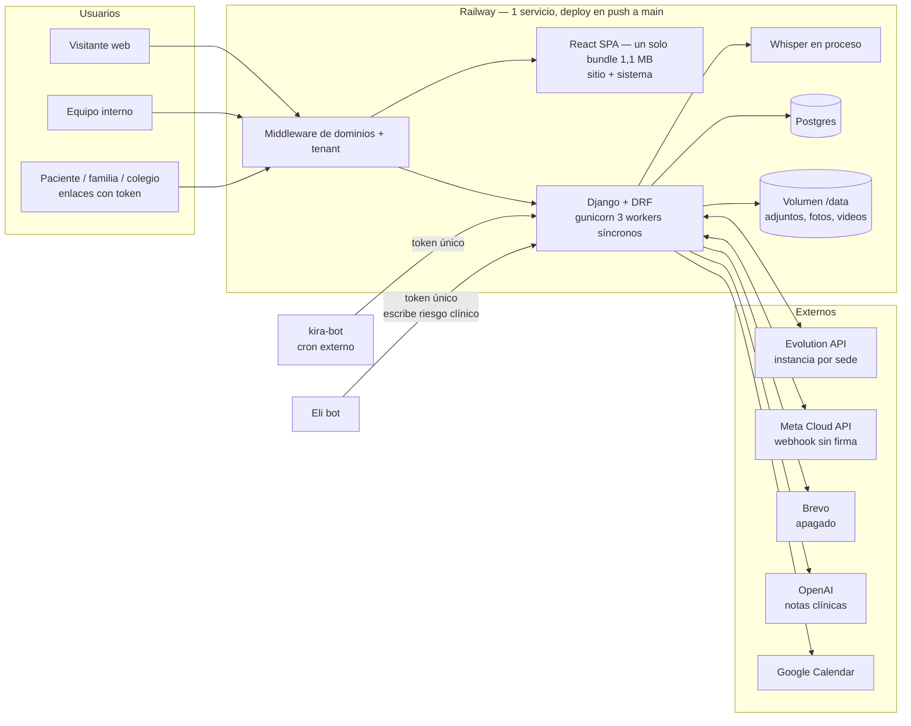
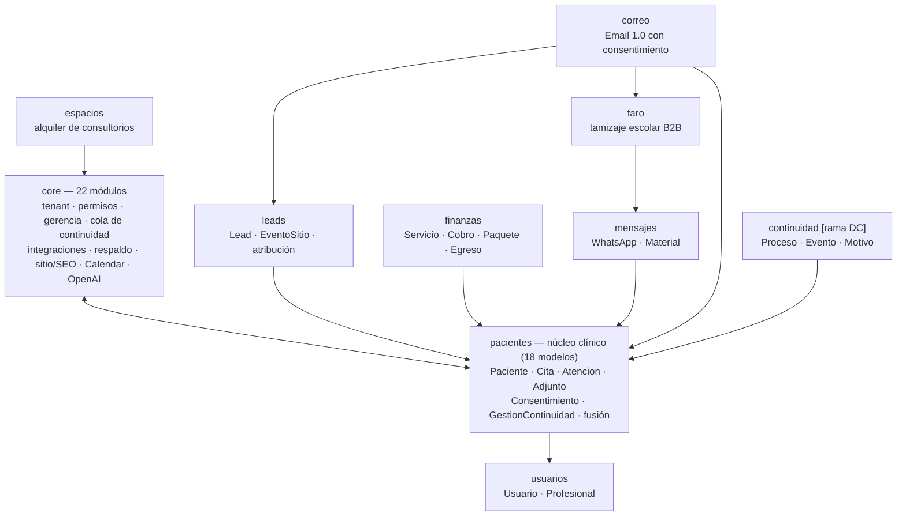
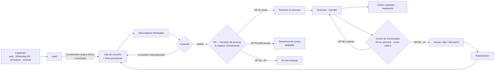
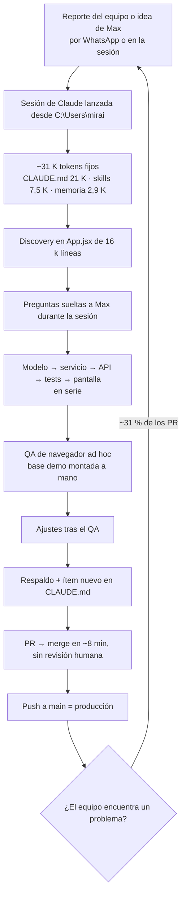
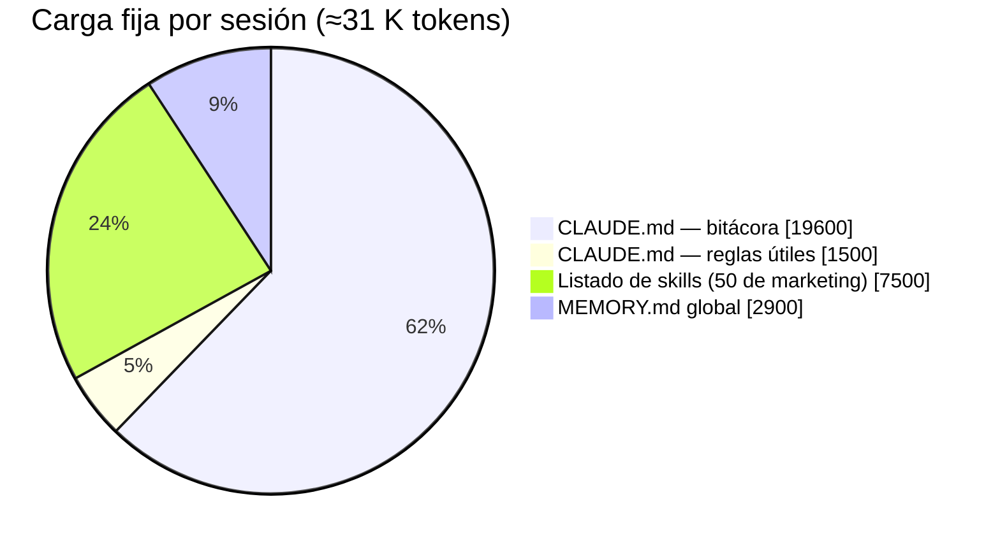
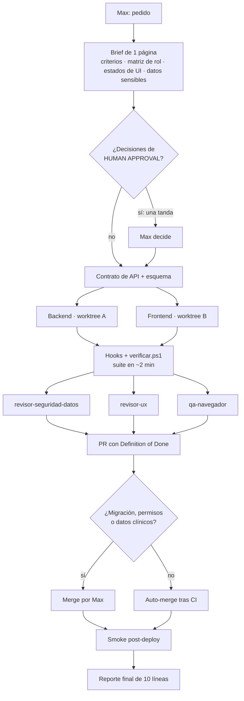
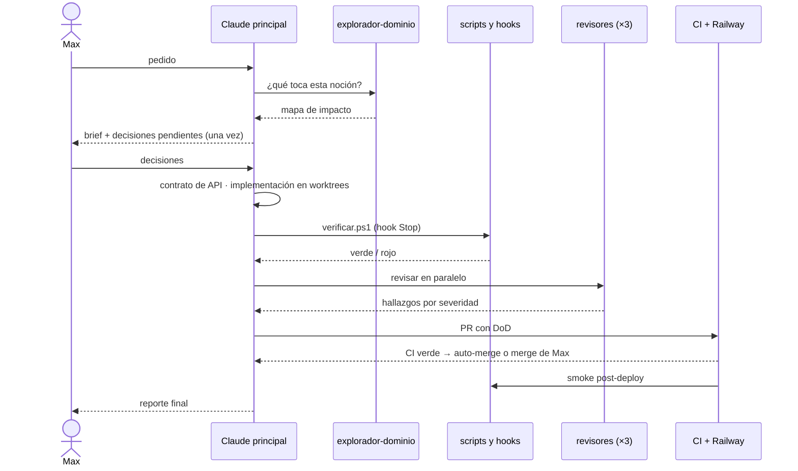
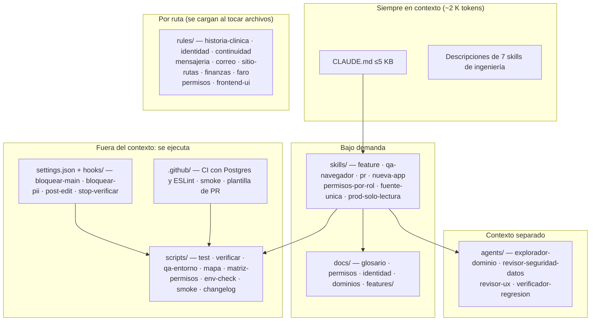
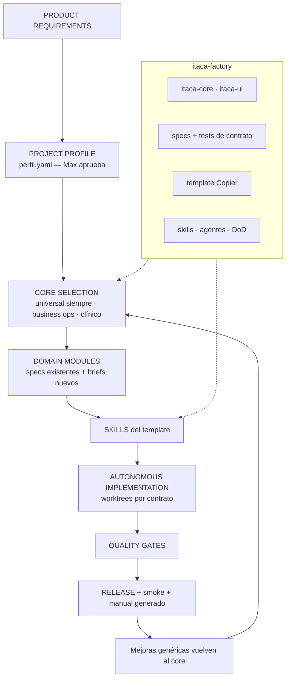
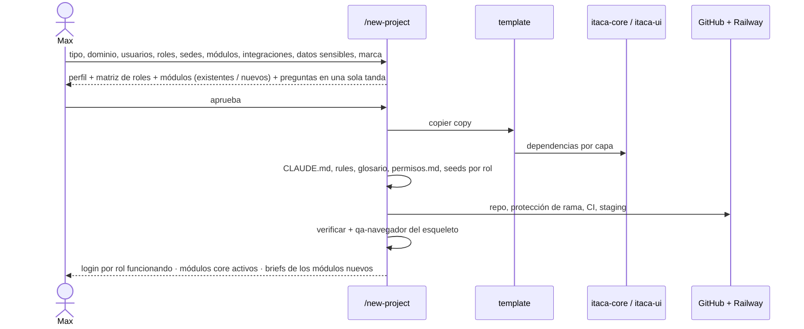

# Ítaca Conversemos — Software Factory Audit

> **Fecha de corte:** 1 de octubre de 2026 · **Rama analizada:** `origin/main` (commit `ae759b8`, exportada sin checkout) + `origin/feat/direccion-clinica` para Dirección Clínica y Continuidad fase 2 (marcado **[rama DC]**).
> **Método:** lectura de código, `git log --all` (432 commits), `gh pr list` (129 PR), ejecución de la suite de tests y de ESLint sobre una copia aislada, y comparación con 8 sistemas y 14 bots hermanos en `C:\projects`. No se modificó código productivo, ni ramas, ni configuración.
> **Detalle:** 18 documentos en [`docs/software-factory-audit/`](software-factory-audit/). Lo que no pudo verificarse está marcado **HIPÓTESIS**.

---

## 1. Executive Summary

Ítaca Conversemos es un sistema clínico-operativo **real, usado a diario y construido a una velocidad poco común**: 432 commits en 3,5 meses, ~16 PR por semana en septiembre, ~96 % del código co-escrito por Claude y 1.043 tests que pasan. El problema no es la capacidad de producir código. Hay tres problemas, y son de **sistema de producción**:

1. **Se paga dos veces casi un tercio del trabajo.** ~31 % de los PR mergeados son correcciones de algo ya mergeado. Seis patrones explican la mayoría: la identidad del paciente decidida por teléfono (≥10 PR), "sesión N" con varias fuentes de verdad (≥8), supuestos sobre terceros no verificados (≥11), reglas copiadas en varios sitios (≥9), tablas fuera del respaldo (3 + 11) y documentación que queda mintiendo (≥6).
2. **El contexto que recibe Claude es grande, viejo y en parte falso.** Cada sesión arranca con ~31 K tokens fijos. `CLAUDE.md` pesa 85 KB, el 93 % es bitácora y, para una tarea típica, sirve entre el 5 y el 7 %. Contiene instrucciones obsoletas que un agente podría obedecer (paleta de un prototipo que no existe, "Finanzas fuera de alcance", 6 ítems "sin desplegar" que están en producción).
3. **Nada de lo aprendido está empaquetado.** La reutilización se hace **copiando repos**: Conversemos nació de `clinica-saas`, Mont' Sinai de Conversemos, Bonos de Life. El drift ya está medido: el cliente de WhatsApp está reescrito ~17 veces, el límite de login se resolvió dos veces de forma distinta en 11 días y Mont' Sinai no tiene respaldo.

Además, la auditoría encontró **riesgos vivos en producción** que deben contenerse antes que cualquier mejora de proceso:

- Cualquier psicólogo o comercial puede descargar adjuntos clínicos de cualquier paciente.
- Los tokens de firma de consentimiento son visibles para roles que no deberían verlos.
- Un único token de integración abre el volcado completo de la base.
- El bot Eli escribe el campo clínico `Paciente.riesgo` con la salida de un LLM, sin revisión humana.
- En la operación diaria, una cita se cancela con solo cambiar un desplegable, sin confirmación.

**La palanca más barata encontrada:** la suite de tests tarda más de 55 minutos en local por el hasher de contraseñas. Con un hasher rápido **solo para tests**, los 1.043 tests pasan en **112 segundos**. Ese cambio de una línea convierte "verificar" de un evento caro en algo que puede correr al final de cada turno de Claude, y habilita casi todo el resto del roadmap.

**Respuesta a la pregunta principal:** el próximo sistema no debería volver a diseñar, programar ni descubrir auth, tenant, permisos con matriz por rol, auditoría, respaldo, identidad de la persona atendida, agenda, caja, mensajería (WhatsApp y correo con consentimiento), la máquina de procesos con eventos, los 8 componentes base de UI ni el tooling de verificación. Conceptualmente, **≈70–80 % de un próximo sistema clínico y ≈60–70 % de uno de servicios ya se sabe construir** (HIPÓTESIS razonada, ver §15). Pero hoy ese conocimiento vive en código acoplado, en un `CLAUDE.md` de 85 KB y en la memoria de Max, así que cada sistema nuevo lo vuelve a pagar.

---

## 2. Qué tenemos actualmente

| Dimensión | Estado |
|---|---|
| Stack | Django 5.2 + DRF + React 19/Vite; Postgres en Railway; deploy automático con push a `main` |
| Backend | 9 apps (`core`, `usuarios`, `pacientes`, `finanzas`, `leads`, `mensajes`, `espacios`, `faro`, `correo`) + `continuidad` [rama DC]; 54 modelos; 124 migraciones; ~95 vistas; 37 management commands |
| Frontend | `App.jsx` de **16.075 líneas y 134 componentes** (tocado en 255 commits) + `Sitio.jsx`; sin router (navegación por `useState`), sin componentes base, 1.927 estilos inline, 851 colores hex |
| Tests | 1.043 tests de backend, todos verdes; 0 de frontend; CI con `makemigrations --check`, tests (en SQLite) y build |
| Roles | admin, medico (psicólogo/a), asistente (recepción/coordinación), comercial, analista |
| Integraciones | Evolution API por sede, Meta Cloud API, Brevo (apagado por banderas), SMTP, OpenAI, Google Calendar, Whisper en proceso, kira-bot como cron, Eli vía token |
| Calidad del código | Bien probado en reglas de dinero, continuidad y mensajería; débil en permisos (3 mecanismos mezclados, 57 comparaciones de rol en línea), validación (0 `is_valid()`, 282 lecturas a mano de `request.data`) y paginación (ninguna) |

### Diagrama 1 · Arquitectura actual

### Diagrama 2 · Mapa de módulos

Detalle: [01-current-system.md](software-factory-audit/01-current-system.md).

### Diagrama 3 · Flujo operativo principal

Huecos donde el proceso **sale del sistema**: líneas oficiales de sede que solo escuchan (se responde por WhatsApp personal), contabilidad en una hoja externa, pagos a psicólogos sin modelar, DP decidido por teléfono, tamizaje Brújula en Apps Script, colegios de Faro solo desde el admin de Django. Detalle de 16 procesos en [03-business-processes.md](software-factory-audit/03-business-processes.md).

---

## 3. Cómo estamos construyendo actualmente

### Diagrama 4 · Workflow actual de desarrollo

Rasgos medidos:

- Mediana de **8 minutos** de PR abierto a merge; 113 de 121 se mergean el mismo día.
- La secuencia de una feature grande se repite sin plantilla: modelo → servicio → API → pruebas → pantallas → "ajustes tras el QA en navegador" → "respaldo, documentación e ítem N".
- PR apilados (Email 1.0: 7 PR) que se mergean en serie sin aprovechar la revisión por partes.
- 7 worktrees en paralelo (3 huérfanos), coordinados por una memoria que ya no se carga porque las sesiones arrancan fuera del repo.
- `CLAUDE.md` editado en 40 commits; es el punto de conflicto garantizado entre ramas paralelas.

Evolución completa en [02-evolution.md](software-factory-audit/02-evolution.md).

---

## 4. Dónde estamos perdiendo tiempo

| Categoría | Desperdicio | Evidencia |
|---|---|---|
| **REWORK** | **VERY HIGH** | ~31 % de los PR son correcciones; "Sesión N" necesitó ≥8 PR, identidad ≥10 |
| **DISCOVERY** | **HIGH** | `App.jsx` de 16 mil líneas tocado en el 60 % de los commits; reglas en 5 a 11 lugares |
| **CONTEXT RELOADING** | **HIGH** | 31 K tokens fijos por sesión, 93–95 % irrelevantes; se recargan tras cada compactación |
| **QA** | **HIGH** | Suite de >55 min en local; QA de navegador montado a mano cada vez; script de auditoría fuera del repo |
| **BUGFIXING** | **HIGH** | Fugas y 500 por rol descubiertos en producción; 3 intentos para la fecha "hoy" |
| **DOCUMENTATION** | MEDIUM | Ítems de bitácora en cada PR; documentación corregida dos veces (#94, #100) |
| **HUMAN APPROVAL** | MEDIUM | Preguntas dispersas en la sesión, no agrupadas; a la vez, **ninguna** aprobación donde sí hacía falta (permisos, datos clínicos) |
| **WAITING** | LOW–MEDIUM | CI de 8,4 min; PR abiertos semanas (#118 desde el 19 sep, #127) |
| **IMPLEMENTATION** | LOW | Escribir código no es el cuello de botella |

---

## 5. Qué estamos repitiendo

| Escala | Ejemplos medidos |
|---|---|
| Dentro del backend | 6 `_es_admin` idénticos, 6 `_solo_admin`, 57 comparaciones de rol en línea; 7 `solo_digitos` + 14 usos de "últimos 9 dígitos" como identidad; "cita realizada" definida en 11 lugares; 9 enums `Sede`; 2 `_rango` que divergen |
| Dentro del frontend | 40 modales a mano; 286 falsas etiquetas; 34 ciclos de carga copiados; 278 toasts que deciden si son error por el prefijo del texto; 5 caminos para mandar WhatsApp; 5 buscadores de paciente |
| En QA | Cada archivo de test arma sus datos a mano; permisos probados uno por bug; QA de navegador sin receta versionada |
| En el proceso con Claude | Investigar, leer `CLAUDE.md`, decidir convenciones, recordar el respaldo, repetir el ritual "Verificado: …", montar el QA, escribir el ítem de bitácora |
| Entre proyectos | Cliente de Evolution ×17; auth y roles en 8 de 8 sistemas; agenda ≥7; caja ≥7; respaldo 5 versiones; ojito en 8 PR en 3 minutos; dos manuales de recepción hechos a mano el mismo día |

Detalle en [05-repetition-analysis.md](software-factory-audit/05-repetition-analysis.md).

---

## 6. Qué errores estamos pagando varias veces

| # | Patrón | Categoría | Señales | Prevención temprana | Automatizable |
|---|---|---|---|---|---|
| 1 | El teléfono decide quién es el paciente | DATABASE · LOGIC | ≥10 PR | Modelo de identidad (persona / contacto / tutor) y una sola función | Test de contrato sobre todos los puntos de alta; detector nocturno |
| 2 | "Sesión N" con varias fuentes de verdad | LOGIC · REGRESSION | ≥8 | Una noción, una función; borrar el campo legado | Guard que prohíba leer `n_sesion` fuera del resolver |
| 3 | Supuestos sobre terceros sin verificar | INFRA · VALIDATION | ≥11 | "Aceptado ≠ entregado"; smoke real | Smoke post-deploy; fixtures reales |
| 4 | Regla de negocio copiada | ARCHITECTURE | ≥9 | Fuente única; contrato de API | Matriz endpoint × rol; ESLint |
| 5 | Tablas fuera del respaldo | DATABASE | 3 + 11 tablas | Lista derivada | Ya hay test; falta derivar |
| 6 | Documentación que miente / PR mergeado con versión vieja | DOCUMENTATION | ≥6 | `CLAUDE.md` sin bitácora; merge solo tras CI | Auto-merge; registro generado |
| 7–11 | Fecha "hoy", N+1, fugas de privacidad, UX visible solo al usarla, importaciones mal marcadas | varias | 3–6 c/u | Helpers únicos, `assertNumQueries`, tests de serializer por rol, checklist de estados, dry-run | Sí |

Detalle y hashes en [13-recurrent-errors.md](software-factory-audit/13-recurrent-errors.md).

---

## 7. Qué contexto desperdiciamos

| Problema | Evidencia |
|---|---|
| Bitácora en lugar de reglas | 46 ítems; 33 fechas; 16 "Verificado"; párrafos casi literales a cuerpos de commit |
| Información falsa | Ruta `clinica-saas`; deploy "a definir"; `clinica-mvp.jsx` inexistente; paleta verde salvia (la real es turquesa `#0A7D92`); "sin tests"; "Finanzas/Marketing/IA fuera de alcance"; 6 ítems "⏳ sin desplegar" ya en producción; "identidad real: Mont' Sinai" |
| Contradicciones | Puerto 8000 vs 8001; historia clínica append-only vs editable; quién consolida duplicados; Python 3.14 vs 3.12; repo de GitHub distinto en `DEPLOY.md` |
| Datos de personas | Nombres del equipo, 3 teléfonos, rutas de backups con PII, contraseña demo |
| Skills ajenas | 50 de marketing (duplicadas en repo y perfil global) usadas 7 veces en total; el listado excede su presupuesto y ~25 aparecen sin descripción |
| Memoria que no llega | Las sesiones arrancan en `C:\Users\mirai`; la memoria operativa del repo (worktrees, Railway) no se carga |

Ahorro posible: **≈28 K de ≈31 K tokens por sesión (−90 %)**, y lo importante: contexto **verdadero**. Detalle en [06-context-audit.md](software-factory-audit/06-context-audit.md).

---

## 8. Qué debería permanecer en `CLAUDE.md`

Solo lo **permanente**, en ≤5 KB (~1,2 K tokens):

1. Qué es Ítaca Conversemos y mapa de apps (3 líneas + lista).
2. Invariantes: multitenant por `clinica_id`; Ley 29733 (sin URL pública de media, sin PII en repo ni chat); historia clínica auditada; push a `main` = producción, siempre PR.
3. Cómo correr: `scripts/dev.ps1`, `scripts/test.ps1`, `scripts/verificar.ps1`.
4. Mapa de `docs/` y `.claude/rules/`.
5. Ritmo de trabajo (mostrar el esquema antes de migrar) y "no escribir bitácora aquí".
6. Español peruano y zona `America/Lima`.

| Sección actual | Veredicto |
|---|---|
| §2a Multitenant, §2b Ritmo, §3a Cómo correr, §3b Roles, §6 Español | MANTENER |
| Título, §1 Qué es, §3 Stack | REDUCIR y corregir |
| §3c Mensajería; ítems 7, 8, 24–25, 34, 36 (invariantes) | MOVER A RULE por ruta |
| Ítems 9, 11, 20–23, 26–33, 38–45, 46–48 | MOVER A DOCUMENTACIÓN (`docs/<dominio>.md`) |
| Ítem 42 (cómo correr la suite) y el ritual "Verificado" | MOVER A SCRIPT |
| §2c Fuera de alcance, §4 Diseño, §5 Especialidades, ítems 1–6, 10, 12–19, 37 | ELIMINAR |

---

## 9. Qué debería convertirse en Skills

| Prioridad | Skill | Problema real que resuelve |
|---|---|---|
| **P0** | `feature` | Secuencia brief → contrato → implementación → tests → QA → revisión → PR; hoy reinventada, con ~31 % de retrabajo |
| **P0** | `qa-navegador` | Base demo, seeds, Playwright, recorrido por rol y ancho; hoy en 6 ítems de bitácora y un script fuera del repo |
| **P0** | `pr` | Convención, apilado, auto-merge, DoD, sin bitácora en `CLAUDE.md` |
| P1 | `nueva-app` | Esqueleto con tenant, permisos, respaldo y tests (3 olvidos del respaldo) |
| P1 | `permisos-por-rol` | Matriz endpoint × rol; fugas confirmadas |
| P1 | `fuente-unica` | Listar todos los consumidores de una noción antes de tocarla |
| P1 | `prod-solo-lectura` | Consultas a producción sin escribir, con aprobación |
| P2 | `importador`, `manual-operativo`, `integracion-externa` | Onboarding de clientes, manuales, proveedores |

Descartadas a propósito: `new-crud`, `release-notes` (es un script), `ux-review` genérica, `security-review` propia (mejor un subagente). Detalle en [08-skills.md](software-factory-audit/08-skills.md).

---

## 10. Qué debería convertirse en Agents

Cuatro, no más:

| Subagente | Por qué contexto separado | Cuándo |
|---|---|---|
| `explorador-dominio` | Lee el monolito y devuelve un mapa de ≤40 líneas | Inicio de feature o de bugfix multicapa |
| `revisor-seguridad-datos` | Mirada adversarial; las fugas actuales pasaron 121 PR sin revisión | PR que toque API, serializers, permisos, datos personales, integraciones |
| `revisor-ux` | Mirada de "operadora a las 6 de la tarde" | Pantallas nuevas o cambiadas |
| `verificador-regresion` | Absorbe logs largos y devuelve 10 líneas | Antes del PR, en segundo plano |

Los tres revisores corren **en paralelo**. Descartados: arquitecto permanente, agentes frontend/backend que implementen, documentador. Detalle en [09-agents.md](software-factory-audit/09-agents.md).

---

## 11. Qué debería convertirse en Hooks

| Momento | Hook | Bloquea |
|---|---|---|
| PRE-EDIT | `bloquear-pii` (xlsx, sqlite, datos reales, teléfonos/DNI en docs, `.env`) · `bloquear-main` (push a `main`, `--force`, checkout en carpeta compartida) | Sí |
| PRE-EDIT | Aviso al editar `CLAUDE.md` o listas a mano (`respaldo.py`, `urls.py`) | No |
| POST-EDIT | `ruff` en `.py` · `makemigrations --check` al tocar `models.py` · ESLint del archivo | No (avisa) |
| PRE-COMMIT | Escaneo de PII y ruff sobre lo staged | Sí |
| PRE-PUSH | No a `main` · `verificar -Rapido` | Sí |
| STOP | `verificar -Rapido` si hay cambios sin verificar | Sí |
| CI | Postgres, ESLint con baseline, `check --deploy`, matriz por rol, env vars, protección de rama + auto-merge | Sí |
| POST-DEPLOY | Smoke en cada host | Alerta en el PR (nunca por WhatsApp) |

Detalle con comandos y costos en [10-hooks-and-scripts.md](software-factory-audit/10-hooks-and-scripts.md).

---

## 12. Qué debería convertirse en Scripts

| Hoy lo razona Claude | Script |
|---|---|
| "Verificado: check, migraciones, tests, build, ESLint igual a main" | `scripts/verificar.ps1` |
| Trampas de la suite en Windows (sin `--parallel`, build antes, a archivo) | `scripts/test.ps1` + **hasher rápido en tests** |
| Montar QA | `scripts/qa-entorno.ps1` |
| ¿Quién lee este campo? | `scripts/mapa.py --consumidores` |
| ¿Qué ve cada rol? | `scripts/matriz-permisos.py` |
| Lista del respaldo | Derivada de `apps.get_models()` |
| `.env.example` (56 variables leídas, 23 documentadas) | `scripts/env-check.py` |
| Changelog / bitácora | `scripts/changelog.py` desde git |
| Estado de producción | `scripts/estado-prod.ps1` |
| Worktrees | `scripts/nuevo-worktree.ps1`, `limpiar-worktrees.ps1` |
| Auditoría de enlaces del sitio | Versionar el script que vive en un scratchpad |
| Smoke post-deploy | `scripts/smoke.ps1` |

---

## 13. Qué debería convertirse en Templates

| Template | Apariciones | Riesgo de sobre-abstracción |
|---|---|---|
| App Django de dominio | 9 apps + continuidad | Bajo si es esqueleto |
| Endpoint con alcance por rol | ≥5 esqueletos idénticos, 57 checks | Bajo (mixin) |
| Factories de test + matriz por rol | 49 archivos de test | Bajo |
| Máquina de estados auditada (patrón `continuidad`) | Falta en `Cita`, `Lead`, Faro | Medio: no hacer motor configurable |
| Pantalla de lista | ~12 | Medio: composición, no JSON |
| Modal de formulario | 40 | Bajo |
| Integración externa | 6 en Conversemos, ~17 clientes de WhatsApp en la agencia | Bajo como checklist |
| Importador con dry-run | 5 | Bajo |
| Repo nuevo (Copier) | 8 arranques distintos | El template envejece: usar "update" |
| PR + brief de feature | 0 hoy, 129 PR sin plantilla | Bajo |

Detalle en [11-templates.md](software-factory-audit/11-templates.md).

---

## 14. Qué debería convertirse en Core

| Capa | Piezas |
|---|---|
| **CORE UNIVERSAL** | Auth + throttle + ojito · tenant por fila · RBAC declarativo con test de matriz · auditoría append-only · respaldo derivado + restaurar · fecha de negocio del servidor · UI base (8 componentes + tokens) · tooling (CI, scripts, hooks, smoke) |
| **CORE BUSINESS OPS** | Sedes como dato · agenda + slots + bloqueos + reserva pública · persona + identidad + duplicados + fusión · catálogo + paquetes + caja + liquidación · WhatsApp con una sola puerta · correo con consentimiento · captación + embudo + atribución · recordatorios · exportes |
| **CORE CLÍNICO** | Historia clínica auditada · adjuntos privados · consentimiento informado por token · instrumentos con puntos de corte · máquina de proceso de continuidad · reglas de menores y tutor |
| **CORE CONVERSEMOS** (no extraer) | DP-01…16, bloque de 6 y S3 · Dirección Clínica · Faro · Brújula · Mentalidad Ítaca y gamificación · espacios · KPIs de gerencia a medida |

Lo que vale más que el código son **nueve lecciones de dominio ya pagadas**, que deben viajar como especificaciones con tests: el teléfono no identifica a una persona; "sesión N" se deriva y la consulta no es sesión; aceptado ≠ entregado; la fecha la da el servidor; toda tabla entra al respaldo; la sede es filtro de trabajo, no puerta; nada clínico va a calendarios ni a logs; las rutas del sitio salen de una sola fuente; un LLM no escribe campos clínicos sin revisión. Detalle en [07-reusable-core.md](software-factory-audit/07-reusable-core.md).

---

## 15. Repeatability Matrix

| Módulo / patrón | Conversemos | Clínico | Comercial | SaaS | Universal |
|---|---|---|---|---|---|
| Auth, tenant, RBAC, auditoría, respaldo, UI base, tooling | HIGH | HIGH | HIGH | HIGH | **HIGH** |
| Correo con consentimiento, exportes | HIGH | HIGH | HIGH | HIGH | **HIGH** |
| Agenda, reserva pública, recordatorios | HIGH | HIGH | HIGH | HIGH | MEDIUM |
| Identidad y fusión, catálogo, caja | HIGH | HIGH | HIGH | MEDIUM | MEDIUM |
| WhatsApp con una puerta | HIGH | HIGH | HIGH | MEDIUM | MEDIUM |
| Proceso con eventos (continuidad) | HIGH | HIGH | MEDIUM | HIGH | MEDIUM |
| Historia clínica, adjuntos, consentimiento informado | HIGH | HIGH | LOW–MEDIUM | HIGH | LOW–MEDIUM |
| Liquidación a profesionales | HIGH | HIGH | HIGH | LOW | LOW |
| Panel de gerencia | HIGH | MEDIUM | MEDIUM | LOW | LOW |
| Espacios, DP/S3, Dirección Clínica, Faro, Brújula | PRODUCT SPECIFIC | LOW–MEDIUM | LOW | LOW | — |

**Cuánto de un próximo producto ya se sabe construir** (HIPÓTESIS razonada sobre la matriz, no medición): sistema clínico ≈70–80 %, centro de servicios ≈60–70 %, SaaS de profesionales ≈55–65 %, sistema empresarial no clínico ≈35–45 %. Matriz completa (37 filas) en [12-repeatability-matrix.md](software-factory-audit/12-repeatability-matrix.md).

---

## 16. Propuesta de trabajo paralelo

| Trabajo | Clasificación |
|---|---|
| Brief, plan de QA, explorador de dominio | **PARALLEL SAFE** |
| Backend y frontend de la misma feature | **PARALLEL WITH CONTRACT** (contrato de API congelado; frontend con mocks) |
| Tres revisores + QA de navegador | **PARALLEL SAFE** |
| Dos features en apps distintas | **PARALLEL SAFE** si nadie edita `CLAUDE.md` |
| Dos features que tocan `App.jsx` | **WITH CONTRACT** hoy; **SAFE** cuando se parta por módulo |
| Dos features sobre el mismo modelo; migración → datos → pantalla | **MUST BE SEQUENTIAL** |
| `respaldo.py`, `settings.py`, `urls.py` | **SEQUENTIAL** hoy; **SAFE** cuando se deriven |

Lo que hoy impide paralelizar: el monolito `App.jsx`, `CLAUDE.md` editado en cada PR, listas a mano, falta de contrato de API (#125: "el panel no mostraba lo que la API ya devolvía") y coordinación de worktrees por memoria.

---

## 17. Propuesta de autonomía

| Nivel | Qué incluye |
|---|---|
| **CLAUDE CAN DECIDE** | Nombres, estructura interna, refactor local, tests, extraer componentes, índices, arreglar un bug con test, mensajes de error, estilos dentro de los tokens, worktrees, correr scripts |
| **CLAUDE DECIDES + REPORTS** | Cambios de UX dentro del checklist, endpoints de lectura nuevos, dependencias de desarrollo, añadir confirmaciones, deprecar campos legados sin borrarlos, PR apilados |
| **HUMAN APPROVAL** | Migraciones de esquema; matriz de permisos; reglas de negocio (sesión, alta, abandono, precios, liquidación); datos clínicos o de menores; textos legales; integraciones nuevas; comunicaciones a pacientes; merge a producción de lo anterior; elección de stack |
| **ALWAYS BLOCK** | Push a `main`; `--force` compartido; escribir en la BD de producción; borrar datos de pacientes; fusiones masivas; leer `.env`; PII en repo, docs o chat; enviar WhatsApp o correo real desde desarrollo; LLM escribiendo campos clínicos; desactivar hooks o tests para pasar el CI |

**Cómo baja el ping-pong:** todas las decisiones HUMAN APPROVAL se agrupan en el brief y se preguntan **una vez**. Lo demás se ejecuta y se reporta al final.

---

## 18. Workflow futuro

### Diagrama 5 · Workflow propuesto

### Diagrama 6 · Flujo de una nueva feature (actores)

**Definition of Done** (resumen; completa por tipo en [14-future-workflow.md](software-factory-audit/14-future-workflow.md) §6):

- **Feature:** criterios del brief cumplidos; tests con matriz por rol; `verificar` verde; QA de navegador por rol a 390 y 1366 px; checklist de factores humanos; sin CRÍTICO de seguridad; documentación de dominio solo si cambió una regla.
- **Bugfix:** test que reproduce el bug; todos los consumidores de la noción arreglados juntos.
- **Database change:** esquema aprobado; migración probada en Postgres; rollback descrito; respaldo previo.
- **Release:** CI verde, smoke verde en todos los hosts, banderas documentadas.

**Quality gates:** post-edit (aviso) → Stop (bloquea) → pre-push (bloquea) → CI (bloquea el merge) → revisores (CRÍTICO bloquea) → merge (humano en los casos de §17) → smoke (alerta).

---

## 19. Arquitectura `.claude/`

### Diagrama 7 · Arquitectura Claude propuesta

Fuera del repo: las skills de marketing a una carpeta propia; el perfil personal conserva solo método (`criterio-de-diseno`, `listo-para-produccion`, `cuidar-uso-semanal`) y reglas transversales (tuteo peruano, "la Psicóloga Mirai", no leer `.env`, no alertas por WhatsApp). Ficha de cada pieza en [15-claude-architecture.md](software-factory-audit/15-claude-architecture.md).

---

## 20. ITACA SOFTWARE FACTORY V1

Cuatro artefactos versionados más un procedimiento:

1. **Core** en paquetes (`itaca-core`, `itaca-ui`).
2. **Specs de dominio** con tests de contrato, independientes del stack.
3. **Template de proyecto** (Copier) con CI, scripts, hooks, `.claude/` y docs base.
4. **Método**: skills, agentes y Definition of Done.

El procedimiento es `/new-project`.

### Diagrama 8 · System Factory

**Qué vive fuera de Conversemos:** las piezas de las capas Universal, Business Ops y Clínica, las specs, el template y el método. **Qué se queda:** DP, S3, Dirección Clínica, Faro, Brújula, gamificación, espacios, KPIs a medida, textos y marca.
**Template o paquete:** si un arreglo debe llegar a todos los clientes (seguridad, bugs de dominio), es paquete. Si cada proyecto lo adaptará, es template.
**Decisión de Max, no de Claude:** el stack base de la fábrica.

- **A favor de Django:** sistema más maduro, con tests, CI y respaldo; 3 sistemas clínicos en producción.
- **A favor de Next.js:** los 4 sistemas más nuevos; el mejor modelo de datos de negocio es el de Aldanna; las skills de método asumen Next.

Mantener dos cores duplica el problema que la fábrica quiere resolver.

### Diagrama 9 · Flujo de un nuevo proyecto

`/new-project` **no** genera reglas de negocio nuevas, textos legales, decisiones clínicas ni precios: esos quedan como briefs pendientes de Max. Detalle en [16-system-factory.md](software-factory-audit/16-system-factory.md).

---

## 21. Métricas

| Métrica | Línea base | Valor actual | Meta (HIPÓTESIS) |
|---|---|---|---|
| Rework (% de PR que corrigen) | AVAILABLE | **~31 %** | ≤15 % |
| Build failure rate | AVAILABLE | **2/30 corridas**, mediana 8,4 min | <5 %, ~3 min |
| Tiempo de suite local | AVAILABLE | **>55 min** (112 s con hasher de test) | ≤2 min |
| Context reuse (tokens fijos / % útil) | AVAILABLE | **≈31 K / 5–7 %** | ≈3 K |
| Code reuse | AVAILABLE (por copia) | 7 % heredado; 75 % de Mont' Sinai copiado con drift | ≥40 % por dependencia, 0 % por copia |
| Time to feature | AVAILABLE (parcial) | PR → merge: mediana 8 min | Medir primer commit → merge |
| QA automation rate | AVAILABLE (tests) | Archivos de test tocados: jul 0 · ago 43 · sep 102 | 100 % con tests; 100 % de UI con QA |
| ESLint | AVAILABLE | **74 errores + 38 avisos** | No sube nunca |
| Fugas críticas abiertas | AVAILABLE | **3 críticas** (14 hallazgos en total) | 0 |
| Prompts / feature, interrupciones, decisiones humanas, autonomous completion, time to fix | **NOT AVAILABLE** | — | Empezar a medir lanzando Claude desde el repo + brief con decisiones |

Detalle e instrumentación en [17-metrics.md](software-factory-audit/17-metrics.md).

---

## 22. Roadmap P0

**P0-S · Contención en producción** (requiere aprobación de Max porque toca código productivo):

| # | Acción | Riesgo que cierra |
|---|---|---|
| S1 | Mergear #138 (`ALLOWED_HOSTS`) | Host de Railway en 400 |
| S2 | Acotar `AdjuntoViewSet` por rol | **Crítico**: adjuntos clínicos de cualquier paciente |
| S3 | Ocultar tokens de firma y contacto a roles sin contacto | **Crítico**: firmar en nombre del paciente |
| S4 | Token de integración por uso + comparación en tiempo constante | **Crítico**: volcado completo con un token |
| S5 | Eli deja de escribir `Paciente.riesgo` | Campo clínico escrito por IA |
| S6 | Alcance de `CobroViewSet`; firma del webhook de Meta | Cobros visibles; PII en log |
| S7 | Mergear #118 | Alertas de Faro por la línea equivocada |
| S8 | Confirmar al cancelar cita | Cancelaciones accidentales |

**P0 · Fábrica (2–3 semanas, riesgo bajo):**

| # | Iniciativa | Beneficio |
|---|---|---|
| P0.1 | **Hasher rápido en tests** | Suite de >55 min a ~2 min |
| P0.2 | `scripts/test.ps1` + `verificar.ps1` | Fin del ritual manual |
| P0.3 | Hooks `bloquear-main` y `bloquear-pii` + protección de rama + auto-merge | Producción y Ley 29733 sin depender de memoria |
| P0.4 | `CLAUDE.md` ≤5 KB + rules + `docs/` (después de mergear #127/#139) | −19 K tokens por sesión; contexto verdadero |
| P0.5 | Skills de marketing fuera; lanzar desde el repo; limpiar memoria | −7 K tokens en todos los proyectos |
| P0.6 | Respaldo derivado | Fin de tablas olvidadas |
| P0.7 | ESLint, `check --deploy`, `env-check` en CI | Defaults inseguros y variables sin documentar |
| P0.8 | Hook Stop con `verificar -Rapido` | "Terminado" = verificado |
| P0.9 | Plantilla de PR con DoD + skill `pr` | Done explícito |
| P0.10 | Smoke post-deploy | Caídas detectadas en minutos |

---

## 23. Roadmap P1

| # | Iniciativa | Beneficio |
|---|---|---|
| P1.1 | RBAC declarativo + test de matriz endpoint × rol | Fin de fugas y 500 por rol |
| P1.2 | 8 componentes UI base desde `DireccionClinica.jsx` | Las 8 fricciones graves corregidas una vez para todas las pantallas |
| P1.3 | Partir `App.jsx` + router con URL | El hotspot nº 1 deja de bloquear el paralelismo |
| P1.4 | Skills `feature` y `qa-navegador` | Fin del QA ad hoc y de "ajustes tras el QA" |
| P1.5 | Los 4 subagentes | Revisión independiente en cada PR |
| P1.6 | Glosario ejecutable + `fuente-unica` | Fin de los patrones 1 y 2 |
| P1.7 | Postgres en CI | Se prueba lo que se despliega |
| P1.8 | Serializers de entrada | Fin de 282 lecturas a mano |
| P1.9 | Máquina de estados de `Cita` y `Lead` | Fin de transiciones arbitrarias |
| P1.10 | Dos entradas de Vite | La landing no descarga el sistema |

---

## 24. Roadmap P2

| # | Iniciativa |
|---|---|
| P2.1 | Repo `itaca-factory` con template Copier |
| P2.2 | `itaca-core` empezando por mensajería (~17 clientes), auth+RBAC y respaldo — tras la decisión de stack |
| P2.3 | `itaca-ui` |
| P2.4 | Specs de dominio con tests de contrato |
| P2.5 | `/new-project` |
| P2.6 | Reconectar Mont' Sinai al core |
| P2.7 | `scripts/metricas.py` + tablero mensual |
| P2.8 | Skills `importador`, `manual-operativo`, `integracion-externa` |
| P2.9 | Cola de tareas propia y observabilidad (LOGGING, Sentry) |

Dependencias, impacto, esfuerzo y riesgo de cada una en [18-roadmap.md](software-factory-audit/18-roadmap.md).

---

## 25. Qué NO automatizar

La línea divisoria es: **automatización del flujo de software** (sí, agresivamente) frente a **decisiones de negocio o clínicas** (no, o solo asistidas).

| No automatizar | Sí automatizar alrededor |
|---|---|
| Riesgo clínico, DP, alta, abandono | Mostrar señales, ordenar la cola, recordar lo que falta decidir |
| Fusión de fichas de pacientes | Detectar candidatos, preparar el dry-run |
| Alertas e informes de Faro a familias y colegios | Borrador y lista para revisión |
| Comunicaciones reales a pacientes desde desarrollo | Simulación en staging |
| Matriz de permisos | Generar la matriz real y el diff |
| Precios, liquidación, reglas de cobro | Calcular y mostrar |
| Textos legales y consentimientos | Detectar que faltan |
| Migraciones destructivas, borrados, escritura en producción | Dry-run, respaldo previo verificado |
| Elección de stack de la fábrica | Reunir la evidencia |

**Regla:** Claude automatiza todo lo **verificable y reversible**. Lo que afecta a una persona atendida, al dinero o a la ley pasa por una persona.

---

## 26. Recommended First Implementation

**Una semana, en este orden, cada paso en su propio PR:**

1. **Contención (P0-S1 a S3 y S5)**: cerrar adjuntos, tokens de firma y la escritura de `riesgo` por Eli; mergear #138. Es lo único urgente por riesgo real.
2. **Hasher rápido en tests (P0.1)**: un archivo. Medir antes y después.
3. **`scripts/test.ps1` y `scripts/verificar.ps1` (P0.2)**: con ESLint contra la baseline de 74 errores.
4. **Hooks `bloquear-main` y `bloquear-pii` + protección de rama + auto-merge (P0.3)**.
5. **Hook Stop con `verificar -Rapido` (P0.8)**.
6. **Sacar las skills de marketing del perfil de ingeniería y lanzar Claude desde el repo (P0.5)**.

Con esos seis pasos se obtiene:

- verificación continua y barata;
- producción y datos personales protegidos por herramienta, no por memoria;
- −7 K tokens en todas las sesiones.

No hay que tocar todavía la arquitectura del producto. La reescritura de `CLAUDE.md` (P0.4) va **justo después de mergear #127/#139**, para no pelear con esas ramas.

**Métrica de éxito de la semana:**

- la suite corre en ≤3 minutos;
- 0 pushes posibles a `main`;
- 0 fugas críticas abiertas;
- tokens fijos por sesión por debajo de 25 K (por debajo de 5 K tras P0.4).

---

## 27. Conclusión

Respuestas al criterio final de éxito:

1. **¿Qué porcentaje conceptual de un próximo producto ya sabemos construir?** Clínico ≈70–80 %; servicios ≈60–70 %; SaaS de profesionales ≈55–65 %; empresarial no clínico ≈35–45 % (HIPÓTESIS razonada sobre la matriz).
2. **¿Qué estamos reconstruyendo innecesariamente?** Auth y roles (8/8 sistemas), cliente de WhatsApp (~17), agenda (≥7), caja (≥7), recordatorios (≥8), respaldo (5), manuales de recepción, y dentro de Conversemos: permisos, identidad, "realizada", modales, campos, ciclos de carga y toasts.
3. **¿Qué debería convertirse en infraestructura?** Las capas Universal, Business Ops y Clínica de §14, las specs de las nueve lecciones caras, el template y el método.
4. **¿Qué tareas debería dejar de hacer Max?** Revisar convenciones, recordar pasos de verificación, coordinar worktrees, contestar preguntas dispersas, propagar arreglos a mano a N repos, redactar manuales desde cero. Debe **seguir** haciendo: decidir negocio, clínica, permisos, stack y merges con migraciones o datos sensibles, en una sola tanda por feature.
5. **¿Qué debería dejar de razonar Claude?** El ritual de verificación, el respaldo, las convenciones de PR, el montaje del QA, la búsqueda de consumidores, el changelog, el estado de producción, el `.env.example`: todo eso son scripts y hooks.
6. **¿Qué conocimiento debería dejar de enviarse por prompts?** La bitácora de 46 ítems, las especificaciones de dominio (pasan a rules por ruta y a `docs/`), lo generable (apps, roles, endpoints, paleta) y las 50 skills de marketing.
7. **¿Cómo reducimos el ping-pong?** Con un brief que junta todas las decisiones HUMAN APPROVAL en una sola tanda, niveles de autonomía explícitos y la memoria operativa en rules versionadas en vez de en una memoria que no se carga.
8. **¿Cómo reducimos correcciones tardías?** Shift left: suite de 2 minutos en el hook Stop, matriz por rol en CI, contrato de API antes de implementar, checklist de factores humanos en el brief, `fuente-unica` antes de tocar una noción, smoke post-deploy y revisores independientes.
9. **¿Cómo conseguimos paralelismo?** Contrato de API para separar backend y frontend, `App.jsx` partido por módulo, `CLAUDE.md` fuera del flujo de cada PR, listas derivadas, revisores y QA en paralelo, y scripts para crear y limpiar worktrees.
10. **¿Cómo hace el próximo sistema para nacer con ventaja desde el minuto uno?** Naciendo de `/new-project`: template con CI, hooks, scripts y `.claude/`; core como dependencia versionada, no como copia; specs con las lecciones ya pagadas; y Max decidiendo solo lo que es suyo.

Conversemos ya demostró que se puede construir muy rápido con Claude. La siguiente ganancia no viene de escribir más rápido. Viene de **no volver a pagar** lo que ya se aprendió.
