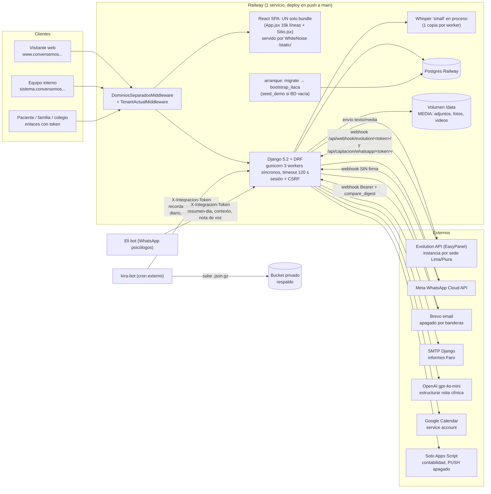

# 01 · Sistema actual: arquitectura y producto

## 0. Alcance y fuente

- **Fuente**: snapshot de solo lectura de `origin/main`, último commit `ae759b8` (merge del PR #137, 1 oct 2026).
- **Rama Dirección Clínica**: lo que solo existe en `origin/feat/direccion-clinica` (14 commits por delante de main, 13 por detrás, merge-base `87523f8` del 29 sep) va marcado **[rama DC]**. Esa rama no está desplegada.
- **Método**: lectura de código y de `git log`. No se tocó el repo ni la base de datos y no se leyó ningún `.env`. Las rutas son relativas a la raíz del repo; `App.jsx:N` se refiere a `frontend/src/App.jsx` en main.
- **Fuera de alcance**: los factores humanos y la UX de las tareas diarias (fricciones, accesibilidad, confirmaciones) van en otro documento. Aquí solo se trata la arquitectura del frontend y la repetición de UI.
- Lo que no se pudo verificar en el código va marcado **HIPÓTESIS**.

---

## 1. Resumen en 10 líneas

1. Un monolito **Django 5.2 + DRF 3.17** con 9 apps propias (core, usuarios, pacientes, finanzas, leads, mensajes, espacios, faro, correo), más `continuidad` [rama DC].
2. **54 modelos** concretos en main (+3 en la rama), **124 migraciones** (+2) y **37 management commands**, 25 de ellos en `pacientes`.
3. Unas **~95 clases de vista** y **33 serializers**. Hay **0 llamadas a `is_valid()`** y **282 lecturas a mano de `request.data`**. No hay paginación DRF.
4. Hay **1.043 tests** de backend. La CI los corre **sobre SQLite**, mientras producción usa Postgres en Railway.
5. El frontend es **React 19 + Vite 8** sin router, y un único `App.jsx` de **16.075 líneas** contiene **134 componentes**. El sitio público y el sistema van en el mismo bundle.
6. Hay **5 roles** reales (admin, medico, asistente, comercial, analista). Los permisos se aplican con **3 mecanismos mezclados** y hay **fugas de acceso confirmadas** a adjuntos clínicos, contacto, tokens de firma y cobros.
7. Un **único token de integración**, comparado con `==`, abre el volcado completo de la BD, la escritura clínica y los envíos masivos.
8. Las integraciones son Evolution (una instancia por sede), Meta Cloud API, Brevo (apagado), SMTP, OpenAI, Whisper dentro del proceso web, Google Calendar y Soto. Los jobs dependen de un **cron externo (kira-bot)**.
9. No hay `LOGGING`, ni Sentry, ni cola de tareas. El código lee 56 variables de entorno y `.env.example` documenta 23.
10. El mejor código del repo está en `correo/` (main) y en `continuidad/` + `DireccionClinica.jsx` [rama DC]. Son la plantilla de lo que debería ser el resto.

`CLAUDE.md` mide 85.671 bytes / 1.089 líneas en main (≈21 K tokens) y el 93 % es bitácora. En la rama DC sube a 1.198 líneas. El detalle está en `06-context-audit.md`.

---

## 2. Arquitectura actual



Notas:
- Los dos dominios (`www` y `sistema`) los atiende **un solo servicio**. La separación es solo de servidor (`core/dominios.py`, commit `bee2541`). `/admin/` y `/api/` responden en ambos.
- Los webhooks de Evolution y Meta, el cron de kira-bot y el webhook de Brevo todavía apuntan a la URL de Railway, no al dominio propio.
- No hay cola de tareas. Lo asíncrono va por `transaction.on_commit`, por cron externo o por `time.sleep` dentro del request (`mensajes/services.py:257-261`).

---

## 3. Mapa de módulos

```mermaid
flowchart TB
  subgraph Backend["Apps Django"]
    CORE["core (7 modelos, 22 módulos)<br/>Clinica, tenant, permisos, gerencia,<br/>continuidad (cola), integraciones, respaldo,<br/>sitio/seo, gcalendar, transcripción, OpenAI"]
    USR["usuarios (3)<br/>Usuario, Profesional, DocumentoLegal"]
    PAC["pacientes (18) — núcleo clínico<br/>Paciente, Cita, Atencion, Adjunto,<br/>Consentimiento, GestionContinuidad, fusión"]
    FIN["finanzas (4)<br/>Servicio, Cobro, Paquete, Egreso"]
    LEA["leads (4)<br/>Lead, Anuncio, EventoSitio, SolicitudInstitucional"]
    MSG["mensajes (3)<br/>Mensaje, Material, PlantillaMensaje"]
    ESP["espacios (5)<br/>alquiler de consultorios"]
    FARO["faro (4)<br/>tamizaje escolar B2B"]
    COR["correo (6)<br/>Email 1.0: consentimiento, envío, Brevo"]
    CON["continuidad (3) [rama DC]<br/>ProcesoContinuidad, EventoContinuidad"]
  end

  CORE <--> PAC
  CORE --> USR
  CORE --> FIN
  CORE --> LEA
  CORE --> MSG
  PAC --> USR
  PAC --> FIN
  PAC --> MSG
  LEA --> PAC
  MSG --> PAC
  FARO --> MSG
  FARO -. "SMTP directo" .-> FARO
  COR --> PAC
  COR --> LEA
  COR --> FARO
  ESP --> CORE
  FIN --> PAC
  CON --> PAC
  CON --> CORE

  subgraph Front["Pantallas (App.jsx salvo indicación)"]
    HOY[Hoy] --> CC[Centro de Continuidad<br/>sin entrada en menú]
    AG[Agenda] 
    PACS[Pacientes → Ficha ~18 secciones]
    MK[Marketing / Leads]
    FINS[Finanzas / Liquidación]
    GER[Indicadores: gerencia, histórico,<br/>reporte, ocupación]
    MSGS[Mensajes / WhatsApp]
    FAROS[Faro interno]
    ADM[Admin: equipo, legal, espacios, whatsapp]
    DUP[Duplicados.jsx]
    DC[DireccionClinica.jsx [rama DC]]
    PUB[Sitio.jsx + AgendarPublico +<br/>ConsentimientoPublico + Faro público]
  end

  AG --> PAC
  PACS --> PAC
  CC --> CORE
  MK --> LEA
  FINS --> FIN
  GER --> CORE
  MSGS --> MSG
  FAROS --> FARO
  DC --> CON
  PUB --> PAC
  PUB --> FARO
```

Lectura del mapa:
- `core` **depende de todas las apps y todas dependen de `core.models`**. Las dependencias circulares se esquivan con imports dentro de funciones (por ejemplo, `from usuarios.models import Usuario` dentro de cada `_es_admin`).
- `Cita.post_save` tiene **dos receptores** en main (`pacientes.signals` y `correo.signals`) y la rama DC añade un tercero (`continuidad.signals`).

---

## 4. Producto

### 4.1 Módulos y submódulos

| Módulo | Submódulos / pantallas | Backend principal |
|---|---|---|
| Operación diaria | Hoy, Agenda (día/semana/mes/terapeutas), Centro de Continuidad, Buzón | `core/gerencia.py`, `pacientes/api.py`, `core/continuidad.py` |
| Clínico | Pacientes, Ficha, Historia clínica (`Atencion` append-only), escalas, objetivos, tareas, adjuntos, consentimiento, dictado por voz | `pacientes/*`, `core/transcripcion.py`, `core/estructurar_nota.py` |
| Comercial | Marketing (pauta, embudo, fuentes, anuncios, captación), Leads, autoagenda web | `leads/*`, `pacientes/agendamiento.py` |
| Comunicación | Mensajes WhatsApp (5 caminos de envío en el front), plantillas, materiales, Email 1.0 (apagado) | `mensajes/*`, `correo/*` |
| Finanzas | Cobros, paquetes, egresos, caja, liquidación de honorarios, Soto | `finanzas/*`, `core/soto.py` |
| Gerencia | Indicadores, histórico, reporte semanal, ocupación, métricas mensuales | `core/gerencia.py`, `reportes.py`, `metricas.py`, `ocupacion.py` |
| Faro (B2B) | Aplicaciones, autorización de apoderados, cuestionario, panel del colegio, alertas, informes PDF | `faro/*` |
| Espacios | Consultorios, interesados, contratos, reservas, pagos de alquiler | `espacios/api.py` |
| Admin | Equipo, profesionales, legal, WhatsApp/instancias, duplicados | `usuarios/api.py`, `pacientes/api_duplicados.py` |
| Dirección Clínica [rama DC] | Panel de indicadores clínicos, ficha de continuidad | `continuidad/*` |

### 4.2 Roles reales y qué ve cada uno

Fuente: `usuarios/models.py:43-51` y el menú de `App.jsx:790-829`. El frontend **solo oculta**; la seguridad real tendría que estar en el backend (§7).

| Pantalla | admin (Gerencia) | asistente (Coordinación) | medico (Psicólogo) | comercial | analista (Dir. Clínica, lectura) |
|---|---|---|---|---|---|
| Hoy, Mentalidad | ✓ | ✓ | ✓ | ✓ | ✓ |
| Indicadores | ✓ | | | | ✓ |
| Agenda | ✓ | ✓ | solo la suya | | ✓ |
| Pacientes | ✓ | ✓ | ✓ (sus pacientes) | | ✓ sin contacto |
| Profesionales | ✓ | ✓ | | | |
| Herramientas | ✓ | ✓ | ✓ | | ✓ |
| Mensajes | ✓ | ✓ | | ✓ | |
| Marketing | ✓ | ✓ | | ✓ | ✓ |
| Finanzas | ✓ | | | | ✓ |
| Admin (liquidación, espacios, equipo, legal, whatsapp) | ✓ | | | | |
| Duplicados | ✓ | ✓ | | | |
| Faro | ✓ | | ✓ | | |
| Buzón | ✓ | ✓ | ✓ | ✓ | |
| Dirección Clínica [rama DC] | ✓ | | | | ✓ |

Gerencia ve 20 ítems sin agrupar. El Centro de Continuidad, que es la cola diaria de Coordinación, no está en el menú: solo se llega desde la tarjeta de Hoy (`App.jsx:3898, 3937`).

### 4.3 Entidades núcleo por app

| App | Migr. | Modelos clave | Estados / enums relevantes |
|---|---|---|---|
| core | 20 | `Clinica` (22 campos, incluye tokens y `wa_access_token` legado en claro), `NumeroWhatsapp`, `InstanciaEvolution`, `MetricaMensual`, `ReporteSemanal` (29 campos `*_lima/*_piura`), `Sugerencia`, `Recurso` | `Sugerencia.Estado` nueva/vista/atendida; `InstanciaEvolution.Entorno` oficial/prueba |
| usuarios | 14 | `Usuario` (email como login, `rol`, `sede`, `clinica`), `Profesional` (26 campos), `DocumentoLegal` | `Rol` ×5; `Sede` ×2 enums |
| pacientes | 38 | `Paciente` (43 campos), `Cita` (18), `Atencion` (20), `EdicionAtencion`, `Adjunto`, `Consentimiento`, `GestionContinuidad`, `HistorialContinuidad`, `RegistroFusionPaciente`, `RegistroEliminacion` + 8 más | `Cita.Estado` 10 valores (`por_confirmar` legado); `Cita.Decision` DP-01…DP-16; `Paciente.Frecuencia` semanal/quincenal/esporadico/**en_pausa/alta** (mezcla frecuencia y estado); `Atencion.Tipo` 8 |
| finanzas | 12 | `Servicio`, `Cobro`, `Paquete`, `Egreso` | `Cobro.Estado` pagado/pendiente/anulado; `Medio` 7 (yape, plin, mercado_pago…) |
| leads | 19 | `Lead` (43 campos), `Anuncio`, `EventoSitio`, `SolicitudInstitucional` | `Fuente` **21 valores solapados**; `Estado` 13; `TipoServicio` 8 |
| mensajes | 11 | `Mensaje` (23 campos, 3 índices + 1 Unique), `Material`, `PlantillaMensaje` | `Estado` 8; `Proveedor` meta/evolution/manual |
| espacios | 1 | `Consultorio`, `InteresadoAlquiler`, `ContratoAlquiler`, `ReservaEspacio`, `PagoAlquiler` | contrato activo/pausado/finalizado |
| faro | 7 | `Aplicacion` (3 tokens), `Respuesta`, `Alerta`, `Autorizacion` | preparando → autorizando → en_curso → analizando → cerrada |
| correo | 2 | `ConsentimientoComunicacion`, `PreferenciaCorreo`, `PlantillaCorreo` (global), `CorreoEnviado`, `EventoCorreoProveedor`, `EnvioProgramadoCorreo` | enums **en MAYÚSCULAS** (el resto del sistema va en minúsculas); `CorreoEnviado` 11 estados |
| continuidad [rama DC] | 2 | `ProcesoContinuidad`, `EventoContinuidad` (append-only), `MotivoContinuidad` | `Estado` sin_registro/activo/pausa/alta/abandono/cerrado; `Frecuencia` 5 valores distintos de los de Paciente |

---

## 5. Backend

### 5.1 Arquitectura: vistas gordas frente a servicios

**FINDING**: la lógica de negocio vive sobre todo en las vistas. La capa de servicios existe solo en algunas apps y cada una la hace a su manera.
**EVIDENCE**:
- `core/gerencia.py` tiene 1.323 líneas y 12 vistas, y `pacientes/api.py` tiene 1.218 líneas y 12 vistas.
- Hay 16 funciones de más de 100 líneas: `GerenciaResumenView.get` (342, `core/gerencia.py:982`), `HoyResumenView.get` (232, `:159`), `MiPanelView.get` (125), `NotaVozView.post` (107) y `AgendamientoReservarView.post` (101, `pacientes/agendamiento.py:273`).
- Tienen servicios limpios `correo/services/` (10 módulos + `flujos/`), `mensajes/services.py` (con `registrar_y_enviar`) y `continuidad/servicios.py` [rama DC]. `pacientes` reparte la lógica entre `api.py`, `fusion.py` (700 líneas), `duplicados.py` y `core/*`.

**WHY IT MATTERS**: los KPIs de gerencia, hoy, mi-panel, ocupación y liquidación recalculan cada uno por su cuenta qué es una "cita realizada", el rango de fechas y la sede. Por eso los números de dos pantallas pueden no coincidir. La rama DC añade una capa de métricas más (`continuidad/metricas.py`).
**PROPOSED MECHANISM**: un módulo de métricas de dominio (consultas puras con un "realizada" único) del que tiren todas las vistas. Además, la regla de que una vista nueva no supere unas N líneas sin pasar por un servicio, verificada en revisión.
**EXPECTED BENEFIT**: una sola definición de cada KPI y vistas testeables por partes.

**FINDING**: no hay validación de entrada con serializers.
**EVIDENCE**: hay 0 `is_valid()` en todo el backend, 282 `request.data.get(`/`d.get(`, 18 `isinstance(request.data, dict)` en 12 archivos y 61 recortes `.strip()[:N]`. `UsuarioViewSet.create` valida a mano y su `update` usa el serializer.
**WHY IT MATTERS**: las reglas de validación se duplican y se escapan entre caminos. Los errores llegan al front como JSON crudo.
**PROPOSED MECHANISM**: serializers de entrada por acción, con un test de contrato por endpoint de escritura.
**EXPECTED BENEFIT**: validación en un solo sitio y errores por campo que el front puede mostrar.

Otros rasgos:
- **Sin paginación DRF**: no hay ningún `pagination_class` ni `PAGE_SIZE`. Leads (7.677) y cobros (5.842) se traen completos, y algunos listados se truncan a mano (`faro/api.py:344 [:300]`).
- **`atender` no es atómico**: crea la `Atencion`, cambia el estado de la cita, llama a Google Calendar por HTTP y sincroniza el paquete sin `transaction.atomic` (hay 0 usos en `pacientes/api.py` y `ATOMIC_REQUESTS` no está activo).
- **HTTP externo y `sleep` dentro del request** (Google Calendar, Evolution, OpenAI, Whisper) con 3 workers síncronos.
- No hay marcadores TODO/FIXME reales. La deuda se anota con `OJO` (25) y en CLAUDE.md. Hay 20 `except Exception`.

### 5.2 APIs

- 33 registros de router y ~70 `path()` explícitos en `config/urls.py` (227 líneas). Solo `correo` tiene su propio `urls.py`.
- 24 vistas públicas (AllowAny o sin autenticación). Las que **no tienen throttle** son el webhook de Meta, `ConsentimientoPublicoView`/`AceptarConsentimientoView`, el cuestionario de Faro (a propósito, porque un aula sale por una sola IP), `HoraServidorView` y Foto/Video (a propósito).
- Las integraciones (`api/integraciones/*` y `api/correo/tareas/*`) usan `TokenIntegracion` (§7).

### 5.3 Jobs y cron

Todos los dispara un cron externo (kira-bot) o Eli, con el mismo token compartido:

| Endpoint | Qué hace | Frecuencia |
|---|---|---|
| `POST /api/integraciones/recordatorios/` | `enviar_recordatorios` por WhatsApp | diaria |
| `GET /api/integraciones/respaldo/` | volcado JSON.gz de toda la BD | diaria |
| `POST /api/correo/tareas/procesar-pendientes/` | despacha `EnvioProgramadoCorreo` | cada 15 min |
| `GET /api/integraciones/resumen-dia/` | agenda del día de cada psicólogo para Eli | mañana |

`recordatorios.ps1` (una tarea de Windows) es legado. Si kira-bot cae, no se envían recordatorios ni se hacen respaldos, y ningún sistema avisa (no hay monitoreo; ver §9).

### 5.4 Integraciones

| Integración | Código | Observación |
|---|---|---|
| Evolution | `mensajes/evolution.py`, `webhook_evolution.py`, `leads/captacion.py` | dos webhooks entrantes distintos (captación con FAQ y operativo); token en la URL |
| Meta Cloud API | `mensajes/cloud_api.py`, `core/whatsapp_cloud.py` | el webhook POST no procesa nada: `_capturar_leads` y `_capturar_nps` son código muerto |
| Brevo | `correo/services/brevo.py` | apagado con `CORREO_HABILITADO`, `CORREO_RESERVA_HABILITADO` y `CORREO_DP02_HABILITADO` |
| SMTP | `faro/informes.py:198` | segundo camino de correo, aunque `correo/services/envio.py:1-7` dice que no hay otro |
| OpenAI | `core/estructurar_nota.py:73` | manda notas clínicas fuera del país |
| Whisper | `core/transcripcion.py` | se carga una vez por worker (hasta 3 copias en RAM) |
| Google Calendar | `core/gcalendar.py` | IDs por sede escritos a mano en `settings.py:322-325` |
| Soto | `core/soto.py` | PUSH apagado (`SOTO_PUSH_ENABLED`) |

Cuatro adaptadores (estructurar_nota, gcalendar, soto, transcripcion) siguen el patrón "`disponible()` + degradación elegante", aunque cada uno lo implementa a su manera. WhatsApp tiene una puerta (`registrar_y_enviar`) y un desvío: `faro/registro.py:52` llama a `evolution.enviar_texto` directo y no deja fila en `Mensaje`.

### 5.5 Señales

**FINDING**: las señales sobre `Cita` manejan los errores de formas opuestas.
**EVIDENCE**: `pacientes/signals.py` (post_save y post_delete de `Cita`, post_save de `Paciente`) llama a `core.gestion_continuidad.reconciliar` de forma síncrona, dentro de la transacción y sin try/except. En cambio, `correo.signals` y `continuidad.signals` [rama DC] usan `on_commit` con try/except.
**WHY IT MATTERS**: si falla la reconciliación de continuidad, falla el guardado de la cita. Y con la rama habrá tres receptores por cada guardado.
**PROPOSED MECHANISM**: una sola convención para los efectos secundarios (`on_commit` + try/except + log estructurado), verificada por un test que recorre los receptores registrados.
**EXPECTED BENEFIT**: guardar una cita deja de depender de módulos secundarios.

---

## 6. Datos

### 6.1 Modelo y relaciones

- **Multitenant por fila**: `core.Clinica` es la raíz y `ModeloTenant` añade `clinica` (FK PROTECT) y `creado_en` (`core/models.py:121-139`). **El manager por defecto no filtra**: el aislamiento depende de que cada vista llame a `.del_tenant_actual()` (102 llamadas) o a `get_clinica_actual()` (69).
- **Fugas entre tenants por diseño** (hoy hay una sola clínica): `_psicologo_por_telefono` (`core/integraciones.py:60`) y `ResumenDiarioView` (`:343`) recorren todas las clínicas; `PlantillaCorreo` y `EventoCorreoProveedor` son globales; `RespaldoView` vuelca todas las clínicas.
- `Paciente` concentra 43 campos (identidad, `tutor_*`, antecedentes, riesgo, `brujula_*` ×8, `n_sesion` manual) y `Lead` otros 43. `Cita` enlaza paciente, psicólogo, servicio y `paquete` (FK a finanzas).
- `correo.ConIdentidad` usa CheckConstraints para exigir exactamente una identidad (paciente, lead o autorización). Es el modelado más riguroso del repo.

### 6.2 Enums y conceptos duplicados

| Concepto | Repeticiones | Evidencia |
|---|---|---|
| `Sede` | **9 enums** distintos (core ×3, espacios, leads ×2, pacientes, usuarios ×2), con `ambas`/"Ambas sedes"/"Todas las sedes" y en distinto orden | más 88 literales `lima`/`piura` fuera de tests y migraciones (33 en `core/reportes.py`) |
| `Frecuencia` | **3 incompatibles** | Paciente (5, mezcla estado), Lead (2), continuidad (5 distintos) [rama DC] |
| "Cita realizada" (asistio + atendida) | **11 sitios**: 3 constantes + 8 listas en línea | `core/continuidad.py:17`, `pacientes/api.py:74`, `finanzas/liquidacion.py:60`; en línea `core/gerencia.py:222`, `core/mi_panel.py:64,115`, `core/ocupacion.py:68`, `pacientes/serializers.py:187`, 2 commands |
| Estado "pausa" de un paciente | 3 representaciones (4 formas de estado de continuidad) | `Paciente.frecuencia`, `GestionContinuidad.Resultado`, `ProcesoContinuidad.estado` [rama DC] |
| Normalización de teléfono | 7 `solo_digitos`, 24 joins en línea, 14 sufijos `[-9:]` y 2 normalizadores oficiales que divergen | `leads.identidad.norm_tel` (9 dígitos) frente a `mensajes.evolution.normalizar_numero` (E.164 con 51) |
| `_rango(periodo)` | 2 copias que divergen | `core/gerencia.py:33` frente a `finanzas/api.py:38` |

**FINDING**: los conceptos de negocio centrales no tienen una sola definición.
**EVIDENCE**: la tabla anterior. En git se ve el efecto: `n_sesion` manual equivocado en 22 de 22 profesionales (`core/tests.py:245`), fusiones masivas de 84 y 76 fichas por identidad telefónica y `fix(agenda): la consulta inicial deja de contar como la sesión 1`.
**WHY IT MATTERS**: cada pantalla nueva vuelve a decidir qué es "realizada", "pausa" o "la misma persona", y los errores vuelven en lotes.
**PROPOSED MECHANISM**: un módulo `dominio/` con constantes y funciones canónicas (`ESTADOS_REALIZADA`, `Sede`, `norm_tel`), más un test o lint que falle si aparecen literales `"asistio","atendida"` o `[-9:]` fuera de ese módulo.
**EXPECTED BENEFIT**: corregir un concepto pasa a ser un cambio en un solo sitio.

### 6.3 Constraints e índices

- Hay constraints en los modelos nuevos: `InstanciaEvolution` (2 Unique), `MetricaMensual` (Unique por clínica/sede/año/mes), `GestionContinuidad` (Unique), `Mensaje` (3 índices + 1 Unique), `Autorizacion` (Unique), `correo` (CheckConstraints) y `continuidad` [rama DC] (Check + Unique de idempotencia).
- Las migraciones incluyen 10 `RunPython` y 1 `RunSQL`, todas probadas solo en SQLite en la CI (§9).
- HIPÓTESIS: los modelos antiguos (`Paciente`, `Cita`, `Lead`) no tienen índices compuestos acordes a los filtros reales (clínica + fecha + psicólogo). No se midió con `EXPLAIN` sobre Postgres de producción.

### 6.4 Auditoría

- Existe: `EdicionAtencion` (correcciones de la historia clínica campo a campo; `create`/`destroy` de `Atencion` devuelven 405, `pacientes/api.py:891-923`), `RegistroEliminacion` (borrado de cita, pago o paciente), `HistorialContinuidad` (14 tipos), `RegistroFusionPaciente`, la bitácora `Mensaje`, `CorreoEnviado`/`ConsentimientoComunicacion`, `Alerta.atendida_por` y `EventoContinuidad` append-only [rama DC].
- **Huecos**: no se auditan las ediciones de `Paciente` (antecedentes, riesgo, resumen clínico), `Cobro` (solo el borrado), `Lead`, `Usuario` ni `Profesional`. **No queda registro de quién lee una historia clínica ni de quién descarga un adjunto.**

### 6.5 Respaldo

**FINDING**: el respaldo depende de una lista de apps escrita a mano y deja fuera los archivos.
**EVIDENCE**:
- `core/respaldo.py:25-26`: `APPS = [...]` a mano.
- Las tablas se quedaron fuera tres veces: 11 tablas entre agosto y septiembre, Faro (`06f96c4`, 19 sep) y correo (`e6142d0`, 1 oct).
- En main la lista termina en `"faro","correo"` y en la rama DC en `"faro","continuidad"`: **es un conflicto de merge seguro en la misma línea**.
- Arma el volcado en RAM dentro de un worker con timeout de 120 s. Incluye hashes de contraseña y `wa_access_token` en claro. No incluye `MEDIA_ROOT=/data` y no lleva versión de esquema.
- DEPLOY.md solo "recomienda" los backups de Postgres en Railway.

**WHY IT MATTERS**: cada app nueva nace sin respaldo hasta que alguien se acuerda. Los adjuntos clínicos no tienen copia (HIPÓTESIS: salvo que el volumen de Railway tenga snapshots, cosa que no consta). El volcado guardado en el bucket concentra secretos.
**PROPOSED MECHANISM**: derivar `APPS` de `INSTALLED_APPS` (las propias), excluir o cifrar los campos secretos, versionar con la última migración, hacer streaming y respaldar el volumen por separado. Ensayar una restauración periódica sobre una BD vacía.
**EXPECTED BENEFIT**: un respaldo completo por construcción y una restauración probada.

---

## 7. Seguridad

### 7.1 Autenticación

- Sesión de Django + CSRF, sin JWT. Throttle de login por IP (30/min) y por cuenta (8/min por email). Cambiar la contraseña exige la actual y el mínimo es de 8 caracteres.
- No hay 2FA, la sesión no tiene caducidad propia (Django usa 2 semanas por defecto) y no hay bloqueo de cuenta más allá del throttle.
- `ALLOWED_HOSTS` y `CSRF_TRUSTED_ORIGINS` siguen aceptando `*.trycloudflare.com` en producción (`settings.py:30, 210`).

### 7.2 RBAC: tres mecanismos mezclados

1. **Clases DRF** en `core/permisos.py` (200 líneas): listas `ROLES_*` y las clases `BloqueoEscrituraAnalista` (global), `PuedeGestionarContinuidad`, `PuedeContactarPacientes`, `PuedeRevisarDuplicados`, `PuedeFusionarPacientes`, `PuedeVerFaro` y `EsAdmin`.
2. **Helpers copiados**:
   - `_es_admin` ×6, con cuerpo idéntico.
   - `_solo_admin` ×6. El de `mensajes/api.py:51` también deja pasar a asistente.
   - `_solo_clinico` ×4 en `pacientes/api.py`, más `_es_medico` y `_es_comercial`.
3. **Comparaciones de rol en línea**: 57 fuera de tests (17 en `pacientes/api.py`, 10 en `core/gerencia.py`).

Además:
- Una vista que declara `permission_classes` propias **pierde `BloqueoEscrituraAnalista`**.
- La regla de sede se aplica como muro en Continuidad y Hoy (`pacientes_del_rol`, `core/continuidad.py:525`) y como simple filtro de pantalla en el resto (`core/permisos.py:141-145`).
- En el frontend hay ~45 ternarios de rol dispersos.

**FINDING**: no existe una matriz de permisos única. Cada endpoint decide por su cuenta y las fugas se corrigen pantalla por pantalla.
**EVIDENCE**: lo anterior y el historial (`fix(roles): el psicologo ve solo lo clinico`, 22 jun; `562440b` y `56872e4`, permisos ajustados tras la capacitación). Las fugas de §7.3 siguen abiertas.
**WHY IT MATTERS**: con datos de salud mental y de menores, una fuga por rol es un incidente de protección de datos.
**PROPOSED MECHANISM**: una matriz declarativa `recurso × acción × rol` (y alcance: propios / sede / clínica) aplicada por un único `RolPermission` y un mixin de `get_queryset`. Un test parametrizado recorre todos los endpoints con los 5 roles y compara contra la matriz.
**EXPECTED BENEFIT**: añadir una vista sin declarar su permiso pasa a fallar en la CI y la matriz se convierte en documentación ejecutable.

### 7.3 Fugas de acceso confirmadas

| # | Fuga | Severidad | Evidencia | Mecanismo propuesto (sin implementar) |
|---|---|---|---|---|
| S1 | Psicólogo y comercial listan y descargan **los adjuntos clínicos de todos los pacientes** de la clínica | **CRÍTICA** | `AdjuntoViewSet.get_queryset`, `pacientes/api.py:935-940`, no acota por rol, a diferencia de `PacienteViewSet`/`AtencionViewSet`/`_HijoPacienteViewSet` | heredar el esqueleto de `_HijoPacienteViewSet` (médico → sus pacientes; comercial → `none()`), cubierto por el test de matriz |
| S2 | Médico y comercial reciben **los tokens de firma de consentimiento** de todos los pacientes; con un token se acepta a nombre del paciente | **CRÍTICA** | `ConsentimientoViewSet`, `pacientes/consentimiento.py:85-98` (solo excluye a analista; el propio comentario lo explica en `:88-91`) | no serializar el token salvo a los roles que lo envían; token de un solo uso con caducidad |
| S3 | Un **token de integración único**, comparado con `==`, da el volcado total de la BD, la escritura clínica (`NotaVozView`), el contexto clínico, la agenda de todos y el envío masivo. La identidad del psicólogo sale de un teléfono que manda el cliente | **CRÍTICA** | `core/integraciones.py:40-51` (`==`), `:57-60` (`_psicologo_por_telefono`, todas las clínicas), sin throttle en `_Base` | un token por integración y por alcance (respaldo ≠ Eli ≠ correo), `hmac.compare_digest`, rotación, throttle; Eli autenticado por psicólogo, no por teléfono |
| S4 | Contacto del paciente o lead visible al médico pese a `ROLES_SIN_CONTACTO` | **ALTA** | `leads/serializers.py:64-73` (solo enmascara para analista: 7.677 leads con teléfono); `mensajes/api.py:16-27` | aplicar el enmascarado en un mixin de serializer basado en la matriz, no por serializer |
| S5 | **Cobros visibles para todos los roles** | **ALTA** | `CobroViewSet`, `finanzas/api.py:120`, sin acotar | mismo mixin de alcance; finanzas solo para `ROLES_VEN_FINANZAS` |
| S6 | La **sede no se aplica** como muro en Pacientes, Citas, Leads y Cobros (solo con `?sede=` desde el front), pero sí en Continuidad y Hoy | **MEDIA** | `core/permisos.py:141-145` frente a `core/continuidad.py:525` | decidir una regla y declararla en la matriz (alcance "sede") |
| S7 | Webhook de Meta **sin verificación de firma** `X-Hub-Signature-256`, sin throttle, y vuelca el payload (`str(data)[:1000]`) al log: **PII en logs** | **ALTA** | `core/whatsapp_cloud.py:247` | verificar la firma con el app secret; loguear solo IDs; o desactivar la ruta mientras sea un stub |
| S8 | `DEBUG` vale **True** por defecto y `SECRET_KEY` cae a `"django-insecure-cambiar"`. Todo el endurecimiento depende de `DEBUG=False` | **ALTA** | `config/settings.py:26-27, 336-342` | fallar al arrancar si falta `SECRET_KEY` o si `DEBUG` no está explícito en producción; `check --deploy` en la CI |
| S9 | `bootstrap_itaca` se ejecuta en cada arranque y, **si la BD está vacía, recrea cuentas demo con `demo1234`** | **ALTA** | `Dockerfile` CMD; `pacientes/management/commands/bootstrap_itaca.py`; `seed_demo.py:21`; DEPLOY.md:52-58 lo da por normal | sacar los seeds del arranque de producción; bandera explícita `PERMITIR_SEED_DEMO` |
| S10 | **Notas clínicas enviadas a OpenAI** (transferencia internacional de datos de salud, Ley 29733) sin consentimiento específico registrado | **ALTA** | `core/estructurar_nota.py:73` | consentimiento específico o desactivar por defecto; minimizar y seudonimizar el texto |
| S11 | **Nombres reales de 108 pacientes en el historial git** de un repo que fue público desde el 18 jun | **ALTA** | commit `1bebc31` (lo reconoce); los datos siguen en commits anteriores | reescribir el historial (`git filter-repo`) y rotar; HIPÓTESIS: el repo hoy es privado (no verificado en esta auditoría) |
| S12 | Credenciales en claro en la BD (`Clinica.wa_access_token` legado, `NumeroWhatsapp.wa_access_token`) que además viajan en el respaldo | **MEDIA** | `core/models.py:21-27`; `core/respaldo.py` | cifrado de campo o gestor de secretos; borrar las columnas legado; excluirlas del volcado |
| S13 | Endpoints públicos de consentimiento sin throttle | **MEDIA** | `pacientes/consentimiento.py:161,183` | throttle por IP y por token |
| S14 | Cualquier psicólogo ve **todas las alertas de Faro** (menores) de la clínica | **MEDIA** | `AlertasView`, `faro/api.py:338-344`; `ROLES_FARO` | asignar un responsable por aplicación y acotar a él |

Lo que está bien hecho y se puede reutilizar como patrón: `BrevoWebhookView` (Bearer con `hmac.compare_digest`), la descarga de adjuntos por API con tope de 25 MB y lista blanca (lo que falla es solo el alcance por rol), `Atencion` append-only con `EdicionAtencion`, y los throttles de login.

---

## 8. Frontend

### 8.1 Stack y estructura

- **React 19.2 + Vite 8**, JavaScript sin TypeScript. ESLint está configurado (no corre en la CI). Las únicas dependencias de runtime son `lucide-react` y los exportadores (`exceljs`, `docx`, `pptxgenjs`, con `import()` dinámico).
- Sin router, sin librería de estado, sin cliente HTTP (usa un `fetch` propio en `api.js`), sin librería de componentes, sin librería de formularios y sin tests.
- Archivos: `App.jsx` **16.075** líneas, `Sitio.jsx` 2.126, `exportGerencia.js` 901, `Duplicados.jsx` 633, `api.js` 494 (~130 endpoints en un único objeto). `App.css` (184 líneas) es un residuo de la plantilla de Vite que no se importa.
- `App.jsx` contiene **134 componentes**, se tocó en 205 de los 339 commits de main y además lleva unas ~1.300 líneas de CSS en template strings. `ClinicaApp` ocupa 1.372 líneas y tiene ~45 `useState`, 14 de ellos flags de modal.

### 8.2 Navegación

**FINDING**: la navegación interna no tiene URL.
**EVIDENCE**: `useState("hoy")` (`App.jsx:595`) más un `if (view === …)` por pantalla. `main.jsx:23-56` elige el árbol leyendo `pathname` una sola vez. El sitio público usa un router casero (`rutas.js`). El token público de agendamiento está fijo en el código (`rutas.js:25`).
**WHY IT MATTERS**: no hay deep links, F5 devuelve a "Hoy" y Atrás saca del sistema. Una ficha no se puede compartir.
**PROPOSED MECHANISM**: un router mínimo `/gestion/:vista/:id`, siguiendo el precedente de la rama DC (`?vista=direccion` y filtros en la URL).
**EXPECTED BENEFIT**: orientación, enlaces compartibles y pantallas testeables de forma aislada.

### 8.3 Menú por rol, estado y cliente API

- El menú se arma con ~45 ternarios `usuario?.rol === …` y props condicionales (`App.jsx:1708`). No hay un mapa central de permisos en el front.
- Prop drilling: `Agenda` recibe 27 props y `CitaRow` 18, y `showToast` aparece 278 veces.
- No hay caché: `api.medicos()` se llama en 5 lugares, y después de cada acción se vuelve a pedir **la lista entera de pacientes**.
- `api.js:8-37`: cuando hay error lanza `Error(detail || JSON.stringify(data))`, así que los errores de campo llegan como JSON crudo al toast.

### 8.4 Design system inexistente

| Indicador | Valor |
|---|---|
| Modales escritos a mano (`ca-modal-bg`) | **40**, 22 con la cabecera copiada literalmente |
| Líneas con `style={{…}}` | **1.927** en App.jsx |
| Colores hex literales | **851** (2 rojos de "peligro" distintos en uso: `#B4564E` y `#9C4646`) |
| Juegos de tokens CSS paralelos | **4** (`--accent` del sistema, `--wa-*` duplicado, `--acento/--t-*` del público, `const C` en Login y PreferenciasCorreo) |
| Estilos de tabla | 2 (`ca-table` ×12, `ca-tbl` ×8) |
| `<select>` / `<input>` / `<textarea>` | 108 / 214 / 53 |
| Falsas etiquetas `<div className="ca-label">` | 286 (0 `htmlFor`) |
| Ciclos de carga copiados (`useState(cargando) → useEffect → "Cargando…"`) | ~34; 45 `.catch(() => {})` silenciosos |
| Variantes de tarjeta KPI | 5 (`StatCard`, `RepCard`, `NumeroConEtiqueta`, `RecordCard`, `Stat` [rama DC]) |
| Caminos para mandar WhatsApp | 5 (uno, `RecordarModal`, es código muerto) |
| Componentes reutilizables reales | `Tag`, `ExportBtns`, `StatCard`, `ConfirmModal` (1 uso), `InputClave` |

Las clases `ca-*` se definen en un `<style>` dentro del render de `ClinicaApp` (`App.jsx:1176-1619`): se reinyectan en cada render e importan Google Fonts desde ese mismo string.

**FINDING**: no hay componentes base, así que cada corrección de UI se hace pantalla por pantalla.
**EVIDENCE**: la tabla anterior. En git, el toast se corrigió 3 veces (`5360d7d`, `744c519`, `f293943`), el modal "angosto" reaparece y el resumen de la agenda llevó 4 iteraciones.
**WHY IT MATTERS**: el costo de cada pantalla nueva crece y los errores de UX vuelven.
**PROPOSED MECHANISM**: extraer primero `<Modal>`, `<Campo>`, `toast.ok/error`, `useConfirm`, `useRecurso` y `<BotonGuardar>`, y `tokens.css` como fuente única de color. Una regla de lint que prohíba los hex literales y los `ca-modal-bg` nuevos fuera de los componentes base.
**EXPECTED BENEFIT**: una corrección por componente en vez de 40 y consistencia visual sin esfuerzo.

### 8.5 Bundle único sitio + sistema

- `Sitio.jsx:23-26` importa de `App.jsx` (`AGENDA_CSS`, `AgendaTop`, `AgendaPie`…), y `main.jsx:4-5` importa `App` y `Sitio` de forma estática. No hay ningún `React.lazy`.
- Resultado: el visitante de la landing descarga las ~16 k líneas del sistema interno (con la lista de ~130 endpoints) y el equipo descarga el sitio.
- HIPÓTESIS: el impacto en Core Web Vitals de la landing es significativo. No se midió el tamaño del chunk ni el LCP.
- Mecanismo: mover la agenda pública a su propio módulo y usar `lazy()` para `App`, `Sitio` y `AgendarPublico`.

### 8.6 El código nuevo de la rama DC como mejor patrón

`DireccionClinica.jsx` (811 líneas) y `ContinuidadFicha.jsx` (355) [rama DC] son **las primeras pantallas que salen de `App.jsx`**. Usan `<label>`, `aria-label` y `role="dialog"`/`"alert"`, tienen un modal que no se cierra mientras guarda (`ContinuidadFicha.jsx:137`), llevan los filtros en la URL y muestran la base de cada porcentaje. Es la plantilla natural para extraer los componentes de §8.4 y el router de §8.2.

---

## 9. Infraestructura

| Aspecto | Estado | Evidencia |
|---|---|---|
| Hosting | Railway, un servicio, despliegue automático en push a `main` | DEPLOY.md §1 |
| Imagen | Multi-stage: `node:20-slim` (Vite) → `python:3.12-slim` (`collectstatic`). `faster-whisper` + ctranslate2 engordan la imagen | `Dockerfile`, `requirements.txt` |
| Arranque | `migrate --noinput && bootstrap_itaca && gunicorn --workers 3 --timeout 120` | `Dockerfile` CMD |
| BD | Postgres Railway (`DATABASE_URL`, SSL si `not DEBUG`) | `settings.py:97-118` |
| Media | `FileSystemStorage` en el volumen `/data`, sin bucket | settings |
| Estáticos | WhiteNoise, `max-age` de 1 año | settings |
| CI | `tests.yml`: `makemigrations --check --dry-run` → `manage.py test` **sobre SQLite** → `npm ci && npm run build` | `.github/workflows/tests.yml` |
| CI: lo que falta | ESLint, tests de frontend, lint de Python, cobertura, `check --deploy`, tests sobre Postgres | idem |
| Agente | `claude.yml`: `claude-code-action` con `contents: write` y `pull-requests: write` cuando se menciona `@claude` (issues creados por Mia desde WhatsApp). Abre PRs y no hace merge | `.github/workflows/claude.yml` |
| Variables de entorno | El código lee **56** y `.env.example` documenta **23**. Faltan `ITACA_INTEGRACION_TOKEN`, `BREVO_*`, `CORREO_*`, `SOTO_*`, `SITIO_*`, `EMAIL_*`, `DJANGO_DB_SSL` y `WHATSAPP_CLOUD_API_VERSION` | grep sobre el código |
| Observabilidad | **Sin `LOGGING` configurado y sin Sentry**. 15 módulos usan `logging.getLogger`, que solo escribe al stdout de Railway | settings |
| Cron | Externo (kira-bot); nada vigila que se ejecute | `core/integraciones.py:357-380` |
| Throttle en tests | Parche sobre `sys.argv` en settings (`:251-253`, commit `604532e`) | settings |
| DNS | Namecheap/cPanel, lo gestiona un tercero (Soto) | `docs/dominios.md` |

**FINDING**: la CI no prueba el sistema que corre en producción.
**EVIDENCE**: los tests corren con `DATABASE_URL: sqlite:///db.sqlite3` mientras producción usa Postgres. Hay 10 migraciones `RunPython` y 1 `RunSQL`, y la restauración del respaldo depende de que Postgres difiera los FK (`restaurar.py:52-54`). No corre ESLint ni hay tests de frontend.
**WHY IT MATTERS**: las diferencias de motor (constraints diferidos, `select_for_update` [rama DC], tipos, orden) solo aparecen en producción, y el frontend, que concentra la UX, no tiene ninguna red de seguridad.
**PROPOSED MECHANISM**: un servicio Postgres en el workflow, más `check --deploy`, ESLint y un smoke test de build en el frontend.
**EXPECTED BENEFIT**: los fallos de motor y los de configuración se detectan antes del merge.

**FINDING**: no hay observabilidad.
**EVIDENCE**: sin `LOGGING`, sin Sentry, con 20 `except Exception` y 45 `.catch(() => {})` en el front. El incidente `6a5fe11` (13 sep: "Hoy" daba 500 a todos los psicólogos) se conoció por el uso, no por una alerta.
**WHY IT MATTERS**: los errores en producción solo se descubren cuando un usuario los reporta.
**PROPOSED MECHANISM**: `LOGGING` estructurado, un captador de errores (Sentry o similar) en back y front, y un registro de ejecución de los crons con aviso si faltan. Las alertas no deben ir por WhatsApp (decisión del negocio).
**EXPECTED BENEFIT**: detección en minutos en vez de días.

---

## 10. Deuda estructural priorizada

| # | Deuda | Evidencia | Impacto | Costo de no hacerlo |
|---|---|---|---|---|
| 1 | Fugas de acceso por rol (S1, S2, S4, S5) | `pacientes/api.py:935`, `pacientes/consentimiento.py:85-98`, `leads/serializers.py:64`, `finanzas/api.py:120` | Datos clínicos, de contacto y financieros expuestos a roles que no deben verlos; firma de consentimiento suplantable | Incidente de protección de datos (Ley 29733) y pérdida de confianza de pacientes y psicólogos |
| 2 | Token de integración único (S3) | `core/integraciones.py:40-60` | Un solo secreto filtrado da el volcado total y la escritura clínica | Pérdida total de la confidencialidad de la BD |
| 3 | RBAC sin matriz (3 mecanismos, 57 checks en línea) | `core/permisos.py`, 6 `_es_admin`, 6 `_solo_admin` | Cada vista nueva puede abrir una fuga | Las fugas reaparecen después de cada feature (patrón ya visto en git) |
| 4 | Respaldo con lista manual, sin archivos y con secretos | `core/respaldo.py:25-26`; conflicto con la rama DC | Apps nuevas sin respaldo; adjuntos sin copia | Pérdida irrecuperable de datos clínicos ante un incidente de volumen o de BD |
| 5 | Defaults inseguros: `DEBUG=True`, `SECRET_KEY`, `bootstrap_itaca` con `demo1234`, trycloudflare | `settings.py:26-30, 210`; `seed_demo.py:21` | Un error de configuración deja el sistema abierto | Exposición de trazas o acceso con una contraseña conocida |
| 6 | Conceptos de negocio duplicados (sede ×9, frecuencia ×3, "realizada" ×11, teléfono ×7) | §6.2 | KPIs inconsistentes, duplicados de fichas, conteo de sesiones erróneo | Más fusiones masivas y correcciones de datos; la liquidación y los indicadores pierden confianza |
| 7 | `App.jsx` monolítico sin componentes base ni router | §8 | Cada cambio de UI toca un archivo de 16 k líneas; no se puede probar | Velocidad decreciente; las regresiones de UX vuelven en lotes |
| 8 | CI en SQLite, sin lint ni tests de front, sin observabilidad | §9 | Fallos de motor y de UI llegan a producción sin aviso | Incidentes descubiertos por los usuarios |
| 9 | Vistas gordas y KPIs recalculados en cada vista; `atender` no atómico; HTTP en el request | §5.1 | Estados a medias (atención creada y cita sin actualizar), latencia, workers bloqueados | Datos inconsistentes y saturación con 3 workers síncronos |
| 10 | Multitenancy "de palabra" (manager sin filtro, integraciones entre tenants, sedes y calendarios escritos a mano) | §6.1, `settings.py:322-325` | Abrir un segundo cliente exige un refactor | La promesa de SaaS no es vendible sin reescribir |
| 11 | Webhook de Meta sin firma, con PII en el log y código muerto | `core/whatsapp_cloud.py:247` | Ruta pública inútil y con riesgo | PII acumulándose en los logs de Railway |
| 12 | Bundle único sitio + sistema | `main.jsx:4-5`, `Sitio.jsx:23-26` | La landing descarga el sistema interno y expone la lista de endpoints | Peor SEO y conversión (HIPÓTESIS: sin medir) y más superficie expuesta |
| 13 | Variables de entorno sin documentar (33 de 56) | `.env.example` | Despliegues y restauraciones dependen de memoria humana | Una reinstalación falla o arranca con valores por defecto inseguros |
| 14 | Señales síncronas sin manejo de errores sobre `Cita` | `pacientes/signals.py` | Un fallo de continuidad impide guardar la cita | Bloqueo de la operación diaria por un módulo secundario |

Orden sugerido: primero 1, 2 y 5 (contención, días); después 3 y 4 (mecanismo, para que no reaparezcan); luego 8 (red de seguridad); y 6, 7 y 9 como refactor incremental guiado por los patrones de `correo/` y de la rama DC.
