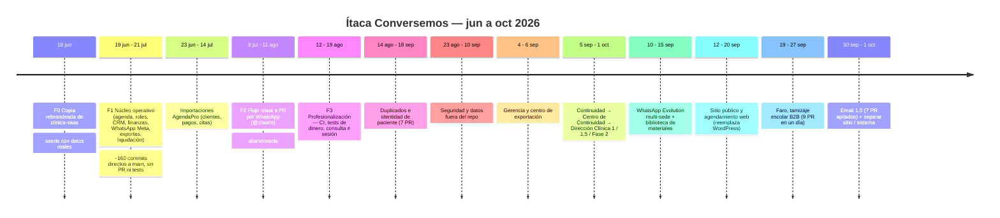
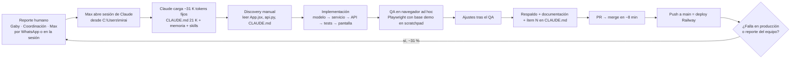

# 02 · Evolución del producto y del modo de construirlo

> Auditoría forense, solo lectura. Corte: 1 oct 2026.
> Fuentes: `git log --all` (432 commits, 375 sin merge, 57 merges), `gh pr list` (129 PR: 121 mergeados, 6 abiertos, 2 cerrados), `git worktree list`, historia de `CLAUDE.md`, comparación con repos hermanos en `C:\projects`.
> Lo que no pudo verificarse se marca **HIPÓTESIS**.

---

## 1. Cifras base

| Métrica | Valor | Lectura |
|---|---|---|
| Vida del repo | 18 jun → 1 oct 2026 (3,5 meses) | Producto joven con ritmo muy alto |
| Commits | 432 en todas las ramas | jun 63 · jul 97 · ago 78 · **sep 161** · oct 33 (solo el día 1) |
| Co-autoría Claude | 416/432 (~96 %), 5 modelos distintos (Opus 4.8, Opus 5, Opus 5.5, Fable 5/5.1, Sonnet 5) | Prácticamente todo el código lo escribe Claude |
| Autores humanos | Una sola persona con dos cuentas (`Mirai Nishimura`, `mirainishimura-maker`) + `conversemositaca-tech` + `claude[bot]` | No hay segundo revisor humano |
| PR mergeados | ago 38 · sep 72 · oct 11 (en un día) → ~16 PR/semana en septiembre | Velocidad de una pequeña organización |
| Tiempo PR abierto → merge | **mediana ~8 min**, p90 12 h; 113 de 121 el mismo día | No existe ventana de revisión |
| Tamaño de PR | mediana +199 líneas; máximos +5.893 (#127), +3.683 (#139), +3.511 (#73) | Las features grandes llegan como bloques de miles de líneas |
| PR que son correcciones | ~38 de 121 (**~31 %**); en septiembre 1 de cada 4 commits es un arreglo | La proporción de arreglos sube con la velocidad |
| Cuerpo de commit (promedio) | jun 8,7 → sep 27,1 líneas | Los commits se volvieron la bitácora real (muy buena para forense) |
| `CLAUDE.md` | 40 commits lo tocan; 252 → 1.198 líneas (×4,75) | Funciona como changelog, no como reglas |
| Archivos de test tocados | jul 0 · ago 43 · sep 102 | La disciplina de tests nace en agosto |
| Worktrees | 7 (4 en `C:\projects`, 3 huérfanos en un scratchpad temporal, ramas ya mergeadas) | Paralelismo real, pero sin higiene |
| `main` local vs `origin/main` | 13 commits atrasado | La carpeta principal no refleja producción |

---

## 2. Timeline

### 2.1 Tabla FASE → CAMBIO → MOTIVO → IMPACTO → CORRECCIONES

| Fase / fecha | Cambio | Motivo | Impacto | Correcciones posteriores |
|---|---|---|---|---|
| **F0 · Base clínica rebrandeada** (18 jun, `20d43e4`…) | Copia de `clinica-saas` (psicología, celeste, "sesión"); directorio de 14 psicólogos; histórico de marketing de 60 meses; 103 pacientes reales sembrados; Dockerfile | Arrancar rápido sobre una base existente | 8 commits en un día | Rebrandeo incompleto: "médico → psicólogo" recién el 24 jun (`f1f68aa`); íconos de medicina general (#26, 12 ago); `CLAUDE.md` sigue titulado "Clínica SaaS"; seeds con nombres reales que luego hubo que sacar del repo (#48, #72) |
| **F1 · Núcleo operativo** (19 jun–21 jul) | Agenda tipo AgendaPro, roles (psicólogo, comercial, coordinación), CRM de leads v2, consentimiento, facturación y paquetes, WhatsApp Cloud API (Meta), exportes CSV/Excel/PDF, liquidación de honorarios, ficha "centro de trabajo del terapeuta", escalas, NPS | Pedidos de la dirección y de coordinación | ~160 commits directos a `main`, sin PR ni tests | Fugas de privacidad hacia el psicólogo (`d839894`); "auditoría adversarial" (`6e82ec2`, `2424a89`); doble conteo de leads (`7b231df`); el bug de la fecha "hoy" se arregló tres veces en cuatro días |
| **Importaciones AgendaPro** (23 jun–14 jul) | Importadores de clientes, pagos, citas y reservas | Migrar Piura y Lima | Base real cargada, deduplicación por DNI | Cortes de proxy (`bulk_create`), encoding de consola Windows, numeración de sesión acumulada de AgendaPro vs por proceso (`ce3f723`), 217 citas importadas marcadas como "web" (`a99cf04`), duplicados por teléfono |
| **F2 · Issue → PR por WhatsApp** (9 jul–11 ago) | Workflow `@claude` en issues (#2–#10), "Corrección #N" (#15–#20) | Que el equipo reporte correcciones sin pasar por Max | PR pequeños con squash | Abandonado tras ~10 PR; #2 y #4 cerrados sin merge. **HIPÓTESIS:** se abandonó porque el reporte llegaba sin contexto suficiente y la conversación directa era más rápida |
| **F3 · Profesionalización** (12–19 ago) | Tests de liquidación y choque de horarios (#24), **CI en cada PR (#25)**, agenda por tramo, lead → cita, consulta ≠ sesión (#34), paquete descuenta una vez, performance de la lista de pacientes | "Las dos reglas que cuestan plata" | Primer CI; 38 PR en agosto | Base de la disciplina actual |
| **Duplicados e identidad** (14 ago–18 sep) | `fusionar_por_telefono` (#32) → lead cerrado duplica (#65) → "el teléfono no decide" (#86) → reserva web una sola vez (#90) → consolidar sin perder nada (#93, +3.135) → menores y teléfono corto (#99) → coordinación consolida por sede (#103) | Historias mezcladas y doble registro reportados por Coordinación Lima | 140 teléfonos compartidos por 307 fichas (19 %) | `5ebd73a`, `6cfcf60`; documentación del estado corregida dos veces (#94, #100) |
| **Seguridad y datos** (23 ago–10 sep) | Datos fuera del repo (#48, 17 días abierto), límite de intentos de login (#51), Google Calendar sin datos clínicos (#63), retiro de datos de pacientes (#72) | Datos reales comprometidos en git | −626 líneas de datos; purga de historial (`itaca-purga-2026-09-10`) | — |
| **Gerencia y exportables** (4–6 sep) | Diagnóstico de adopción, centro de exportación Excel/PDF/Word/PPT (#55, +1.862), marca, rol analista | Dirección y gerencia | — | PDF sin colores al imprimir (#54) |
| **Continuidad** (5 sep–1 oct) | S3 / fin de bloque (#57) → sesión real desde citas (#67–#69) → cola priorizada (#70) → #71 (arreglos que "se quedaron fuera") → Centro de Continuidad (#73, +3.511) → contactabilidad y compositor WhatsApp (#75) → sede y recencia, vista del psicólogo, DP desde continuidad (#91, #92, #104) → **Dirección Clínica** fase 1 (#127, abierto) → 1.5 (#128) → Fase 2 modelo formal (#139) | Cola de 391 pacientes sin prioridad; números de sesión falsos | Base de Dirección Clínica | Consulta ≠ sesión 1 (#89); máximo histórico de sesión (`ce8c3c6`, 81 de 391 pacientes mal); "ajustes tras el QA en navegador" (`aeea09a`) |
| **WhatsApp Evolution multi-sede** (10–15 sep) | Instancia por sede, webhook que solo escucha (#74, +1.714), compositor (#75), biblioteca de materiales (#76, +2.801) | Dejar Meta Cloud API; una línea por sede | — | JPEG de 64 bytes (#77), TypeError ante línea caída (#78), "aceptado ≠ enviado" (#84), extensión multimedia (#85), sede "Lima" con mayúscula (#118, **sin mergear**) |
| **Sitio público y agendamiento web** (12–20 sep) | Reserva con el look del sitio, 5 páginas en la misma app, dirección visual, origen de la reserva, SEO técnico, embudo, vía Brújula, video, domingo, paso "qué reservar" | Reemplazar WordPress | `/` pasa a ser la portada | `/gestion` quedó tapado al publicar el sitio (#81, al día siguiente); rutas escritas a mano (`b5a8333`); WhatsApp a un celular personal (#87, #88); enlaces muertos (#119); favicon de Vite (#120, abierto) |
| **Faro, tamizaje escolar** (19–27 sep) | Landing, motor de 4 instrumentos (#113, +1.934), crear colegio, alcance por estudiante y autorización en línea (#121), un criterio de rol (#122), ECIP-Q (#123), informes por correo y consentimiento v4 (#124), panel con lista nominal (#125) | Servicio B2B para colegios | 9 PR en un solo día (19 sep) | Tablas fuera del respaldo (`06f96c4`); "no había resultados" habiendo (#117); panel que no mostraba lo que la API ya devolvía (#125) |
| **Email 1.0** (30 sep–1 oct) | 7 PR apilados #129 → #135 (modelos → captura → servicio Brevo → webhooks → reserva → DP-02 → docs/DNS) + #136 para llevar a `main` | Canal de correo con consentimiento | +3.342 líneas, banderas apagadas | Tablas de correo fuera del respaldo (`e6142d0`); test con límite de captación 429 (`604532e`) |
| **Separar sitio y sistema** (1 oct) | Middleware de dominios, `noindex` en el sistema (#137) | Dominios propios | — | **El mismo día**: Railway cambió `RAILWAY_PUBLIC_DOMAIN` → `ALLOWED_HOSTS` → 400 en todo el sistema (`66ff1b4`, #138 **abierto, urgente**) |

---

## 3. Cambios de arquitectura relevantes

| Momento | Decisión | Consecuencia |
|---|---|---|
| 18 jun | Copiar un repo entero en vez de partir de una base compartida | 7 % del código de Conversemos viene de `clinica-saas`; el resto se construyó encima. A mediados de julio Conversemos se copió a su vez para Mont' Sinai (75 % del backend de Mont' Sinai es Conversemos de julio). Las tres copias siguen vivas y divergen |
| jun–jul | Todo el frontend del sistema en un solo `App.jsx` | Hoy 16.075 líneas; tocado en 255 commits (~60 % del total). Es el principal cuello de botella técnico |
| 12 ago | CI con `makemigrations --check`, tests y build | Antes de esto no había red de seguridad automatizada |
| 10 sep | Meta Cloud API → Evolution por sede | Nueva familia de errores de integración (entrega real vs aceptado) |
| 12 sep | Sitio público dentro de la misma app React | Conflicto de rutas con el panel (`/gestion`), luego `SITE_ROUTES` como fuente única |
| 19 sep | Faro como app Django dentro del mismo sistema | Producto B2B distinto viviendo en el mismo despliegue clínico |
| 30 sep–1 oct | PR apilados (Email) y Fase 2 de continuidad como app propia (`continuidad`) | Primer modelo formal de proceso con eventos y transiciones validadas, todavía fuera de `main` |
| 1 oct | Separación sitio / sistema por dominio | Primer cambio de infraestructura con caída total el mismo día |

---

## 4. Cómo se construye hoy (workflow real reconstruido)

Rasgos observados:

- **Secuencia típica de una feature grande** (Faro #113, Fase 2 #139, Email): modelo → servicio y transiciones → API → métricas → pruebas → pantallas → "ajustes tras el QA en navegador" → "respaldo, documentación e ítem N". Backend y frontend van en serie dentro de la misma sesión.
- **Origen de los cambios:** el uso real. 15 commits citan "Reportado por <persona>". El ciclo es uso → reporte → arreglo con test.
- **PR apilados** (Email 1.0: 7 PR + 1 para llevar a `main`; Dirección Clínica: #127 abierto con #128 y #139 encima). Bien para revisar por partes, pero hoy nadie revisa por partes: se mergea en minutos.
- **Varias sesiones en paralelo** en worktrees (continuidad, continuidad-2, email). Coordinación por memoria ("nunca dos agentes en la misma carpeta"), no por herramienta.
- **Sin revisión humana visible** en ningún PR. La red de seguridad es el CI y, de forma puntual, una "revisión adversarial de 3 agentes".

---

## 5. Pendientes reales a la fecha del corte

| PR / rama | Estado | Riesgo |
|---|---|---|
| #138 `fix/railway-host` | Abierto | **Urgente**: la dirección `.up.railway.app` respondía 400 tras añadir dominios propios |
| #118 `fix/sede-escrita-a-mano` | Abierto desde el 19 sep | En `origin/main`, `instancia_para` todavía compara `"lima"/"piura"` sin normalizar: una alerta de Faro con sede "Lima" cae a la línea de respaldo |
| #127 Dirección Clínica (+ #128, #139 apilados) | Abierto; 14 commits fuera de `main` | Conflicto seguro en `CLAUDE.md` (el ítem 46 significa cosas distintas en cada rama) |
| #71 | Abierto, ya portado vía #73 | Ruido: se puede cerrar |
| #102, #120 | Abiertos | Limpieza de marca y favicon |
| 3 worktrees huérfanos en scratchpad | Ramas ya mergeadas | Ocupan ramas y confunden `git worktree list` |

---

## 6. Lecciones de la evolución (para la fábrica)

1. **El producto se definió por uso, no por especificación.** Eso es una fortaleza (todo lo construido se usa) y la causa de buena parte del retrabajo: identidad del paciente, "sesión N" y reglas de rol se descubrieron en producción.
2. **La calidad mejoró cuando se automatizó, no cuando se escribió más contexto.** CI (#25) y el test de respaldo (`RespaldoTests`) eliminaron clases enteras de errores. El `CLAUDE.md` creció ×4,75 y los errores de documentación siguieron (patrón 6 de [13-recurrent-errors.md](13-recurrent-errors.md)).
3. **La copia como mecanismo de reutilización ya mostró su costo:** tres sistemas Django divergentes, el cliente de Evolution reescrito ~17 veces en total, el límite de login resuelto dos veces y de dos formas distintas en 11 días.
4. **La velocidad ya no está limitada por escribir código**, sino por discovery (monolito de 16 mil líneas), reglas duplicadas y verificaciones que dependen de la memoria (respaldo, `ALLOWED_HOSTS`, sede normalizada).
