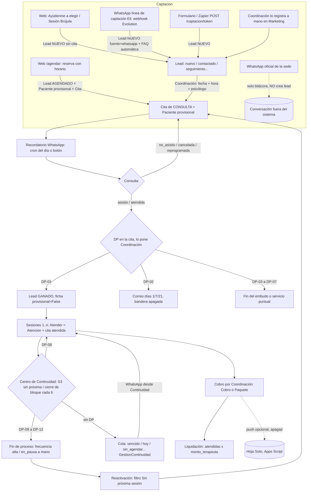

# 03 · Procesos operativos del negocio

## Fuente y alcance

- **Snapshot auditado:** `origin/main` al **1 oct 2026**. Las rutas son relativas a la raíz del repo (`pacientes/api.py:737` = archivo:línea).
- **Rama adicional:** `origin/feat/direccion-clinica` (HEAD `832a754`, **sin mergear**). Contiene la continuidad fase 2 (app `continuidad/`) y `core/direccion_clinica.py`. Todo lo que solo existe en esa rama va marcado **[rama DC]**.
- **Método:** lectura forense del código, sin ejecutar nada ni consultar la base de datos. Las cifras de producción que aparecen (95 % de cierres sin DP, 676 citas vencidas sin cerrar) vienen de `CLAUDE.md` y están marcadas **[CLAUDE.md, no verificado]**. Lo que el análisis no pudo confirmar va marcado como **HIPÓTESIS**.
- **Fuera de alcance:** el código de Eli (`eli-whatsapp-bot`), el tamizaje Brújula (Apps Script), la hoja de Soto y AgendaPro. Aquí solo aparecen como puntos donde el proceso sale del sistema.

---

## 1. Mapa de actores y roles reales

| Rol (`usuarios/models.py:43-51`) | Persona real (CLAUDE.md §44) | Qué puede hacer según el código | Qué NO puede hacer |
|---|---|---|---|
| `admin` | Gerencia (Gabriela) | Todo. Borrar pacientes, leads y citas (`pacientes/api.py:318`, `leads/api.py:437`), liquidación (`finanzas/liquidacion.py:43`), egresos, espacios, Faro, fusión | — |
| `medico` | Unos 15 psicólogos activos | Ver solo sus pacientes (`core/continuidad.py:533-536`). Registrar atenciones (`pacientes/api.py:628`). Operar Faro (`core/permisos.py:186`) | Ver el contacto del paciente (`core/permisos.py:18`; `pacientes/api.py:334-337`). Escribir DP o reasignar citas (`pacientes/api.py:483-485`). Gestionar continuidad (`core/permisos.py:49`) |
| `asistente` | Coordinación: Yazmín (Piura), Ayvi (Lima) | Agenda, leads, DP, cobro, continuidad, contacto a pacientes (`core/permisos.py:81`), revisar y **fusionar** duplicados (`core/permisos.py:125,139`). Alcance: los pacientes de su `sede` (`core/continuidad.py:539-541`) | Liquidación, egresos, espacios |
| `comercial` | Sin persona asignada | Marketing / leads | Ver pacientes (`core/continuidad.py:537-538`) |
| `analista` | Dirección Clínica | Lectura global sin contacto (`core/permisos.py:13,103`), finanzas (`:22`). Única escritura: gestión de continuidad (`:49`) | Cualquier otra escritura |
| Público con token, sin cuenta | Paciente, lead, familia, colegio, estudiante | Reserva (`/agendar/<token>`), consentimiento (`/consentimiento/<token>`), Faro (`/faro/<t>`, `/faro/t/<t>`, `/faro/a/<t>`), preferencias y baja de correo (`correo/urls.py:16-17`) | — |
| Sistemas | Eli, Evolution, Meta Cloud, Brevo, Google Calendar, Soto, cron externo | `X-Integracion-Token` compartido (`core/integraciones.py:1-13`) o token en la URL | — |

La sede del usuario es un **alcance** que se aplica en `pacientes_del_rol` (`core/continuidad.py:525-542`). La excepción es la pantalla Duplicados, donde la sede es solo un filtro (CLAUDE.md §44).

---

## 2. Flujo principal extremo a extremo

**Aclaración estructural.** En `main` no hay ninguna entidad "Proceso", "Episodio" ni "Alta". El proceso se **infiere** de la numeración de las citas (`core/continuidad.py:110-252`). El alta solo existe como valor de `Paciente.frecuencia` o como un código DP, y esos dos datos no se sincronizan. [rama DC] introduce `ProcesoContinuidad`, que es la entidad que falta (§3.9).

### 2.1 Huecos donde el proceso sale del sistema

| # | Hueco | Dónde vive | Evidencia |
|---|---|---|---|
| H1 | Conversación comercial en las líneas oficiales de sede | WhatsApp de las coordinadoras. El sistema solo escucha y registra acuses | `mensajes/webhook_evolution.py:1-17` |
| H2 | Respuesta humana a los leads de la línea de captación (Eli) | WhatsApp personal, vía el botón wa.me "Responder" | `leads/captacion.py:198-245`; CLAUDE.md §29 |
| H3 | Respaldo wa.me cuando fallan Evolution o Meta | Envío a mano. El estado queda `no_configurado`/`fallido` y no hay confirmación | `mensajes/services.py:224` |
| H4 | El webhook de Meta Cloud no está conectado con la captación | — | CLAUDE.md §29. **HIPÓTESIS** en lo que toca a `core/whatsapp_cloud.py` (ver también F5) |
| H5 | Contabilidad real | Hoja de **Soto** (Apps Script). El push está apagado por defecto; el pull calcula una regalía del 2,5 % | `core/soto.py:1-23`, `finanzas/models.py:82-83` |
| H6 | Pagos adelantados a psicólogos | Excel. No están modelados | CLAUDE.md §21/§23 **[no verificado]** |
| H7 | Comprobantes SUNAT | Fuera del sistema. Solo se registra el tipo y el número | `finanzas/models.py:55-59,75-77` |
| H8 | Histórico de AgendaPro y Excel de leads | Comandos `importar_*`. Las citas de AgendaPro llevan `agendado_web=True` sin serlo y no traen DP | `pacientes/management/commands/importar_*`; CLAUDE.md §43 |
| H9 | Pago de la reserva web | Sin pasarela. Existe el estado manual `agendo_espera_pago` | `leads/models.py:85-86`; `pacientes/agendamiento.py:349-356` |
| H10 | Definir el DP | Llamada telefónica entre Coordinación y el psicólogo | `pacientes/api.py:480-482`; CLAUDE.md §45 |
| H11 | Tamizaje Brújula | Google Apps Script, fuera del repo | `pacientes/agendamiento.py:392-398,445` (solo el tipo de solicitud) |
| H12 | Seguimiento comercial del colegio (Faro), avance de la `Aplicacion`, ítem 5 del ASQ y llamada a la familia | Admin de Django / texto libre | `leads/admin.py:15-21`; `faro/api.py:471-518` |
| H13 | Notas clínicas por voz | Eli (servicio externo) escribe por API | `core/integraciones.py:407-523` |
| H14 | Calendario por sede | Google Calendar. No hace nada si no hay credenciales | `core/gcalendar.py`; `pacientes/api.py:610,686,740,749` |
| H15 | Exportes CSV de cobros, leads, pacientes y resultados de Faro (con nombres de menores) | Archivos locales del usuario | CLAUDE.md §12; Faro `ExportBtns` |

---

## 3. Procesos uno por uno

### 3.1 Captación de leads

| Campo | Detalle |
|---|---|
| ACTOR | Interesado sin cuenta (web), webhook de Evolution (Eli), Zapier/formularios, Coordinación (alta manual) |
| TRIGGER | `POST /api/agendamiento/<token>/reservar/` (`pacientes/agendamiento.py:268-373`) · `.../solicitar/` (`:411-491`) · `POST /api/captacion/<token>/` (`leads/captacion.py:131-167`) · `POST /api/captacion/whatsapp/<token>/` (`:198-245`) · Marketing |
| INPUT | Nombre, teléfono (≥9 dígitos en la web, `agendamiento.py:293`), documento, email, servicio, modalidad, sede, turno, tipo `consulta`/`brujula`, `atribucion` UTM/gclid/fbclid (`leads/atribucion.py`) |
| PASOS | 1) Reserva: revalida el slot en `transaction.atomic` (`:315-318`), busca la ficha con `ficha_que_calza` (`:320`), crea un Paciente provisional (`:324-331`) y la Cita (`:336-342`), crea **siempre** un Lead `agendado` (`:349-356`) y registra el consentimiento de comunicaciones RESERVA_WEB (`:363-365`). 2) Solicitud: si existe un lead abierto con ese teléfono en ≤30 días, le añade una nota; si no, crea un Lead `nuevo` sin cita ni paciente (`:417-421, 464-473`). 3) WhatsApp: ignora mensajes salientes y de grupos (`captacion.py:181-186`); si el número ya es paciente, no hace nada (`:213-214`); si hay un lead de ≤60 días, añade una nota; si no, crea un Lead `nuevo`. Después ejecuta `whatsapp_auto.procesar_lead` |
| DECISIONES | ¿Persona conocida? → la cita entra `agendada`, si no `pendiente` (`agendamiento.py:339`). ¿Pidió "ayúdenme a elegir"? → nota de verificación de idoneidad (`:309-310`). Para Brújula, se confirma con quien la atiende (`:392-394`) |
| ESTADOS | Lead: `nuevo`, `agendado`. Cita: `agendada`, `pendiente`. Bandeja "Solicitudes por WhatsApp": leads en `espera_respuesta` (CLAUDE.md §29) |
| OUTPUT | Lead (+ Cita + Paciente provisional en la reserva). FAQ automática por la línea de captación, como mucho una vez cada 12 h y sin IA (`mensajes/services.py:143-151`). Correo de reserva si las banderas están encendidas |
| EXCEPCIONES | Slot tomado → 409. Psicólogo inactivo o teléfono corto → 400. Un paciente que escribe a la línea de captación queda **ignorado sin registro**. La web no pide fecha de nacimiento ni tutor |

**Manual vs automático:** la entrada del lead, el dedupe, la ficha provisional y la FAQ son automáticos. El contacto humano, la confirmación y el pago son manuales.
**Evidencia:** `pacientes/agendamiento.py:268-491`, `leads/captacion.py:34,131-245`, `leads/whatsapp_auto.py`.

### 3.2 Conversión lead → paciente

| Campo | Detalle |
|---|---|
| ACTOR | Coordinación (Marketing y Agenda) |
| TRIGGER | `LeadViewSet.perform_create/perform_update` (`leads/api.py:409-431`), acción `convertir` (`:442-453`), DP-01 en la cita (`pacientes/api.py:509-512`) |
| INPUT | Lead con `agendo_consulta` + fecha + hora + médico; DP de la cita |
| PASOS | 1) `sincronizar_cita_del_lead` crea o mueve la cita de consulta. Elige el servicio con "consulta" en el nombre (`:122-146`), toma la sede del psicólogo (`:149-163`) y crea la ficha provisional (`:54-86`). El número del tutor va a `tutor_telefono` (`:74-78, 94-106`). 2) Si el lead pasa a `ganado`, `convertir_lead_en_paciente` (`:245-265`). 3) DP-01 en la cita → `sincronizar_inicio_de_proceso` (`:279-307`) |
| DECISIONES | Solo DP-01 confirma el inicio; DP-02 y DP-03 no (`leads/api.py:268-276`). La sincronización va en un solo sentido: marcar `ganado` en Marketing NO escribe un DP (`:288-289`) |
| ESTADOS | Lead: `nuevo, contactado, seguimiento, recontacto, agendado, agendo_no_pago, agendo_espera_pago, consulta_realizada, no_realizada, evaluando, pendiente_pago, ganado, perdido` (`leads/models.py:79-92`). Paciente: `provisional` True → False |
| OUTPUT | Paciente definitivo y lead `ganado` |
| EXCEPCIONES | Número repetido con otro nombre → avisa y no bloquea (`:358-383`). Solo admin borra leads. `_aplicar_fecha_llegada` permite reescribir `creado_en` (`:395-407`). Pasar a GANADO **no llena `fecha_cierre`** (`leads/reporte.py:85,103`) |

**Manual vs automático:** los estados del lead son un PATCH libre, sin validar la transición. Solo hay dos automatismos: reserva → `agendado` y DP-01 → `ganado`.
**Evidencia:** `leads/api.py:54-307, 358-453`; `pacientes/api.py:509-512`.

### 3.3 Identidad y duplicados

| Campo | Detalle |
|---|---|
| ACTOR | Coordinación y admin (fusión, `core/permisos.py:139`). El sistema detecta |
| TRIGGER | Alta manual (`PacienteViewSet.create`, `pacientes/api.py:274-304`), reserva y lead (`leads/identidad.ficha_que_calza`), pantalla Duplicados (`pacientes/duplicados.coincidencias`) |
| INPUT | Documento, nombre, teléfono, teléfono del tutor, sede, fecha de nacimiento |
| PASOS | 1) Coincidencia MEDIA o mayor → **409** con `posibles_duplicados`. 2) `confirmar_nuevo` fuerza la creación. 3) Fusión: `analizar_fusion` (dry-run) → `fusionar_pacientes` atómico (`pacientes/fusion.py`), uno por uno |
| DECISIONES | ALTA = mismo documento, o nombre + teléfono ≥9 + sede compatible. El teléfono del tutor es una pista, no identidad. Se descartan: documento o nacimiento distinto, familiares con el mismo celular, expedientes de pareja |
| ESTADOS | Sin estado propio. Constancias: `RevisionDuplicado`, `RegistroFusionPaciente` (`pacientes/models.py:1110/1066`) |
| OUTPUT | Ficha única con los textos clínicos unidos y constancia de la fusión |
| EXCEPCIONES | Bloquean la fusión: clínicas distintas, documento o nacimiento distinto. Una sede distinta exige un flag. El webhook de WhatsApp identifica **solo por teléfono** (`leads/captacion._lead_existente`, `_es_paciente`) |

**Manual vs automático:** la detección es automática y la fusión, manual (sin "fusionar todos").
**Evidencia:** `leads/identidad.py`, `pacientes/duplicados.py`, `pacientes/fusion.py`, `pacientes/api.py:274-304`. El detalle de la fusión viene de CLAUDE.md §38.

### 3.4 Agenda y reserva

| Campo | Detalle |
|---|---|
| ACTOR | Coordinación o psicólogo. Interesado (web) |
| TRIGGER | Crear cita (`pacientes/api.py:543-614`), `mover` (`:721-741`), `cancelar` (`:743-751`), eliminar (`:526-541`), `BloqueoAgenda` (`pacientes/models.py:365`, `api.py:786`) |
| INPUT | Paciente, `medicoId`, inicio, servicio/especialidad, categoría (`general, adultos, infantojuvenil, parejas, constancias`) |
| PASOS | Si la crea un psicólogo, la cita es suya. Si la crea otro rol, se asigna con `medicoId`; **por defecto va al "primer médico de la clínica"** (`:571`). Choque de horario → 409 salvo `forzar`. Sincroniza Google Calendar |
| DECISIONES | ¿Choque? `_choque_de_horario` excluye `cancelada` y `reprogramada` con una ventana de ±1 h (`:145`). Los slots web solo excluyen `cancelada` y miden por hora entera (`agendamiento.py:105`) |
| ESTADOS | `agendada, confirmada, en_espera, pendiente, asistio, no_asistio, atendida, reprogramada, cancelada, por_confirmar` (legado) (`pacientes/models.py:245-256`) |
| OUTPUT | Cita y evento de calendario |
| EXCEPCIONES | `mover` deja la **misma** cita en `reprogramada` (`:736-739`) y deja de bloquear el horario, con riesgo de sobrecupo. Cancelar devuelve la sesión del paquete. Solo asistente o admin pueden eliminar, con `RegistroEliminacion` |

**Manual vs automático:** todo es manual salvo la sincronización del calendario.
**Evidencia:** `pacientes/api.py:145, 526-786`; `pacientes/agendamiento.py:105, 339`.

### 3.5 Recepción, recordatorio y asistencia

| Campo | Detalle |
|---|---|
| ACTOR | Cron externo, Coordinación |
| TRIGGER | `enviar_recordatorios(fecha=hoy)` (`pacientes/recordatorios.py:32-80`) por comando o endpoint (`core/integraciones.py:357`). Botón `recordar` (`pacientes/api.py:695-719`), `confirmar` (`:753-760`) y selector `estado` (`:762-783`) |
| INPUT | Citas del día con `recordatorio_enviado=False` |
| PASOS | Recordatorio automático por `canal_contacto` (paciente → tutor); solo marca la cita si el envío salió. Es idempotente. La confirmación es manual. La asistencia se registra con el selector libre, que además sincroniza el paquete |
| DECISIONES | No hay check-in. No hay confirmación bidireccional: el texto pide "Responde SÍ", pero nada procesa esa respuesta |
| ESTADOS | `confirmada`, `en_espera`, `asistio`, `no_asistio` (los tres últimos solo se alcanzan por `POST /estado/`) |
| OUTPUT | `Mensaje` tipo `recordatorio`, cita marcada como recordada |
| EXCEPCIONES | El automático no excluye `no_asistio`, `reprogramada` ni `asistio`. El manual marca la cita como recordada aunque solo se haya generado el wa.me, y usa `paciente.telefono` a pelo (`:706`), así que no llega al tutor. El texto dice "hoy" aunque el recordatorio sea para mañana (`pacientes/api.py:~178-184`). Un no-show no tiene penalidad, aviso ni regla |

**Manual vs automático:** solo el recordatorio del día es automático, y además depende de un cron externo (no hay cron dentro de la app).
**Evidencia:** `pacientes/recordatorios.py:32-80`; `pacientes/api.py:695-783`.

### 3.6 Sesión clínica

| Campo | Detalle |
|---|---|
| ACTOR | Psicólogo o admin (`pacientes/api.py:628`). Eli (por API) |
| TRIGGER | `POST /citas/<id>/atender/` (`:616-693`). `NotaVozView` de Eli (`core/integraciones.py:407-523`) |
| INPUT | `tipo` (`evolucion, historia, continuidad, informe_continuidad, informe, derivacion, evaluacion, otro`, `pacientes/models.py:432-440`). Historia: motivo, aspectos históricos, objetivos, diagnóstico. Evolución: nota, puntos importantes, próximos pasos, indicaciones. Al menos un campo con texto (`:647-654`) |
| PASOS | Crea la `Atencion`, pone la cita en `atendida` y consume la sesión del paquete. **No cobra** (`:680-682`). Correcciones solo por PATCH, auditadas en `EdicionAtencion` (`pacientes/models.py:461`) |
| DECISIONES | Voz en la app: `TranscribirView` + `estructurar_nota` **no guardan**; el terapeuta revisa (`pacientes/api.py:820`). Voz por Eli: **guarda directamente**, y si es historia pisa `resumen_clinico`, `objetivo_principal` y `riesgo` |
| ESTADOS | Cita → `atendida`. `Paciente.riesgo`: `sin_evaluar, bajo, moderado, alto` (`pacientes/models.py:104-108`) |
| OUTPUT | Historia clínica, escalas (`phq9, gad7, dass21, isi, pss10, pcl5, otra`, cortes en `:188-209`), objetivos, tareas, NPS |
| EXCEPCIONES | `atender` no valida el estado previo: se puede atender una cita `cancelada`. La nota de Eli no se enlaza a ninguna cita, y el psicólogo se identifica solo por los últimos 9 dígitos de su número y el token compartido (`core/integraciones.py:54-63`) |

**Manual vs automático:** el registro es manual. La estructuración por IA es asistida en la app y **automática sin revisión** por Eli.
**Evidencia:** `pacientes/api.py:616-693, 820`; `core/integraciones.py:151-171, 407-523`.

### 3.7 Cierre de bloque y DP

| Campo | Detalle |
|---|---|
| ACTOR | Coordinación (único rol que escribe DP; `pacientes/api.py:483-484`) |
| TRIGGER | Selector de decisión en la cita (Agenda) o en el Centro de Continuidad, **por cierre, nunca masivo** |
| INPUT | Código `DP-01…DP-16` (`pacientes/models.py:269-296`) |
| PASOS | Se registra el DP firmado (`decision_registrada_por/en`, `pacientes/api.py:495-503`). DP-01 convierte el lead. DP-02 programa la secuencia de correo (apagada) |
| DECISIONES | Clínico-administrativa, a menudo tras una llamada con el psicólogo (H10). Constantes: `DP_CIERRE=("DP-04","DP-09","DP-10","DP-11","DP-12")`, `DP_INICIO=("DP-01","DP-02","DP-03")` (`core/continuidad.py:44,47`) |
| ESTADOS | `Cita.decision` (DP-xx o vacío) |
| OUTPUT | Cierre o continuación del proceso inferido. Efectos en el lead y en el correo |
| EXCEPCIONES | Según CLAUDE.md §42/§45, el 95 % de los cierres no tienen DP **[CLAUDE.md, no verificado]**. El DP no sincroniza `Paciente.frecuencia`. `core/notas_operativas.py:10-20` prohíbe sugerir un DP a partir de las notas |

**Manual vs automático:** 100 % manual y deliberado.
**Evidencia:** `pacientes/api.py:480-512`; `core/continuidad.py:44-47`; `core/notas_operativas.py:10-20`.

### 3.8 Continuidad, legado (fase 1, en `main`)

| Campo | Detalle |
|---|---|
| ACTOR | Coordinación y analista (gestión, `core/permisos.py:49`). Admin y asistente (contacto, `:81`). El sistema (reconciliación) |
| TRIGGER | Centro de Continuidad. Señales `post_save/post_delete` de Cita y Paciente (`pacientes/signals.py:25-41`) |
| INPUT | Citas numeradas, DP, `frecuencia`. `SESION_RIESGO_ABANDONO=3`, `BLOQUE_POR_DEFECTO=6`, `GAP_REFUERZO_DIAS=60`, `DIAS_PROXIMOS=7`, `DIAS_BACKLOG=90` (`core/continuidad.py:9-50, 380-383`) |
| PASOS | `segmentar_procesos` corta los tramos cuando baja `n_sesion` con respaldo (`:110-252`). `proxima_meta` calcula cada 6 (`:329-343`). `evaluar_paciente` clasifica (`:655`). `reconciliar()` cierra o reabre gestiones sin tocar la cita ni el paciente. Contacto por plantilla, `HORAS_ENTRE_CONTACTOS=24`, `MAX_CONTACTOS=10`, solo Lima y Piura (`core/contacto_continuidad.py:46-85`) |
| DECISIONES | Prioridad: hoy > riesgo_s3 > sin_agendar > vencido (`:465-470`). `alta`/`en_pausa` silencian la cola (`:11`) |
| ESTADOS | Cola: `vencido, hoy, riesgo_s3, sin_agendar, proximo, continuo_sin_decision, dato_incompleto, backlog, proceso_anterior` (`:386-402`). Revisión: `sin_revisar, en_seguimiento, resuelto`. Resultado: `pendiente_real, ya_actualizado, requiere_correccion, requiere_confirmar, paciente_continua, pausa_temporal, no_continuara, sin_respuesta` (`pacientes/models.py:915-928`). Responsable: `coordinacion, psicologo, direccion_clinica, sistema_soporte` |
| OUTPUT | Cola priorizada, `GestionContinuidad` + `HistorialContinuidad`, mensajes de tipo `continuidad` |
| EXCEPCIONES | Numeración sin respaldo → `numeracion_inconsistente`. Una resolución manual no se pisa (CLAUDE.md §30). "Resuelto" no silencia la cola. La reactivación es solo un filtro: la lista no se exporta (CLAUDE.md §43) |

**Manual vs automático:** el cálculo y la reconciliación son automáticos. La gestión, el contacto y el DP, manuales.
**Evidencia:** `core/continuidad.py`, `core/gestion_continuidad.py:139-338`, `core/contacto_continuidad.py`, `pacientes/signals.py`.

### 3.9 Continuidad fase 2 [rama DC]

| Campo | Detalle |
|---|---|
| ACTOR | Admin y asistente registran. Admin, asistente y analista revisan. El médico ve (`core/permisos.py:203-217` [rama DC]) |
| TRIGGER | `ContinuidadFicha.jsx` (transiciones). Señal de Cita → `reconciliar_en_segundo_plano` en `on_commit` (`continuidad/signals.py:17-27`, `reconciliacion.py:209-217`) |
| INPUT | Evento, motivo (catálogo de 30, `continuidad/motivos.py:26-57`), fecha, `fecha_revision` (en pausa), detalle ≤280 caracteres, `estado_esperado` |
| PASOS | Valida la fecha (no futura, ni anterior al inicio ni al último evento), el motivo activo y aplicable, y la concurrencia con `select_for_update` (409 si no coincide) (`servicios.py:111-188`). Escribe un `EventoContinuidad` solo de agregado e idempotente (`models.py:203-261`) |
| DECISIONES | Matriz `servicios.py:28-38`: `pausa → alta` está prohibido (hay que reactivar). Pausa, abandono y cierre exigen motivo. El `origen` lo fija el servidor según el rol |
| ESTADOS | `sin_registro, activo, pausa, alta, abandono, cerrado` (`continuidad/models.py:35-43`). Frecuencia: `no_definida, semanal, quincenal, mensual, personalizada`. Eventos: `inicio_proceso, continuacion_confirmada, pausa_iniciada, reactivacion, alta, abandono_confirmado, cierre, cambio_profesional, cambio_frecuencia, correccion_motivo`. Inferencia: `activo_con_proxima_cita, activo_sin_proxima_cita, abandono_inferido, no_aplica` |
| OUTPUT | `ProcesoContinuidad` con historial inmutable. `cambio_profesional` actualiza `Paciente.profesional` |
| EXCEPCIONES | La reconciliación crea un proceso `activo` solo si la S1 es posterior o igual a `CONTINUIDAD_REGISTRO_FORMAL_DESDE`. **No está en settings, así que vale "2026-10-01"**; lo anterior nace `sin_registro`. El abandono inferido (>45 días) nunca se confirma solo. El histórico se carga con `migrar_continuidad_historica` (dry-run por defecto; DP-09, DP-11 y DP-04 no se migran, `historico.py:44-74`). Si la reconciliación falla, solo se registra en el log |

**Manual vs automático:** las transiciones son manuales; el emparejamiento y la inferencia, automáticos. **No propaga** el estado a `Paciente.frecuencia` (F2).
**Evidencia:** `continuidad/models.py`, `continuidad/servicios.py`, `continuidad/inferencia.py`, `continuidad/historico.py` [rama DC].

### 3.10 Dirección Clínica [rama DC]

| Campo | Detalle |
|---|---|
| ACTOR | Admin y analista (roles escritos a mano en `core/direccion_clinica.py:772-774`, no en `permisos.py`) |
| TRIGGER | Tablero de Dirección Clínica |
| INPUT | Citas asistidas (sin consulta ni pacientes provisionales, `:194, :205`), próxima cita (sin `cancelada` ni `no_asistio`, `:213-217`), procesos y estados formales. Filtros: periodo, sede, psicólogo de la S1, categoría, etapa, modalidad y días de abandono (15-365) |
| PASOS | `clasificar` (`:305-339`): estado formal → legado (DP-10, ficha, DP_CIERRE) → inferencia (próxima cita o ≤45 días) |
| DECISIONES | Ninguna clínica. Solo agrega datos |
| ESTADOS | Usa los de §3.9 más `abandono_inferido` y `reinicio` |
| OUTPUT | KPIs con numerador, denominador, pct, n y `muestra_pequena` (<10) (`kpi()`, `:133-149`): paso S1→S2/S3/S6, abandono inferido y confirmado, conteos, medias y medianas, embudo S1-S6 y desgloses. KPIs formales (`continuidad/metricas.py:84-205`), con `sin_continuidad_registrada` en vez de "abandono" |
| EXCEPCIONES | No hay alertas de riesgo clínico ni usa diagnóstico, escalas o notas (`docs/continuidad.md` §7). La lista de revisión "no es una alerta" (`metricas.py:22-23`) |

**Manual vs automático:** cálculo 100 % automático, de solo lectura.
**Evidencia:** `core/direccion_clinica.py`, `continuidad/metricas.py` [rama DC].

### 3.11 Finanzas y liquidación

| Campo | Detalle |
|---|---|
| ACTOR | Coordinación (cobro). Admin (egresos, liquidación) |
| TRIGGER | Botón "Cobrar" (cita atendida o Finanzas), venta de un `Paquete`, pantalla de liquidación (`finanzas/liquidacion.py:43`) |
| INPUT | Monto, medio (`efectivo, yape, plin, tarjeta, transferencia, mercado_pago, otro`), comprobante (`boleta, factura, recibo, nota_venta`), rango de fechas |
| PASOS | El Cobro evita el doble cobro con `CitaSerializer.cobrada` [CLAUDE.md §11]. El paquete se consume una vez por cita y se devuelve al cancelar o marcar falta (`finanzas/models.py:136-155`). Liquidación = Σ citas `atendida`/`asistio` × `Servicio.monto_terapeuta`, emparejando por **nombre exacto** (`liquidacion.py:55-90`) |
| DECISIONES | La liquidación no es un % de lo cobrado: los descuentos los asume la clínica (`:3-11`). Se liquida aunque la cita no se haya cobrado, y es intencional |
| ESTADOS | Cobro: `pagado, pendiente, anulado`. Paquete: `activo, agotado, anulado`. Egreso: `insumos, sueldos, alquiler, equipos, marketing, otro` |
| OUTPUT | Caja = cobrado − egresos [CLAUDE.md §14]. Liquidación como consulta. Push a Soto (apagado) |
| EXCEPCIONES | Si se renombra un servicio, se liquida S/0 (`sin_monto`). `porcentaje_liquidacion` es un campo muerto. No se guarda el periodo liquidado ni el pago. `CobroViewSet` no comprueba el rol (`finanzas/api.py:134-229`). `marcar_pagado` reescribe `fecha`. Anular un paquete no revierte su cobro |

**Manual vs automático:** el consumo del paquete es automático; todo lo demás, manual.
**Evidencia:** `finanzas/models.py`, `finanzas/liquidacion.py`, `finanzas/api.py:134-229`, `core/soto.py`.

### 3.12 Espacios (alquiler de consultorios)

| Campo | Detalle |
|---|---|
| ACTOR | Solo admin (`espacios/api.py:65-71`) |
| TRIGGER | Pantalla Espacios |
| INPUT | Interesado, consultorio, modalidad `por_horas`/`fijo`, horario, repetición (hasta 52 semanas) |
| PASOS | CRM de interesados → contrato (el interesado pasa solo a `activo`, `:127-132`) → `ReservaEspacio` con control de solape `[ini, fin)` (`:135-143`) → `PagoAlquiler` |
| DECISIONES | Reserva de tipo `externo` o `conversemos` |
| ESTADOS | Interesado: `interesado, visita, negociacion, activo, descartado`. Contrato: `activo, pausado, finalizado`. Pago: `pagado, pendiente` |
| OUTPUT | Ocupación de los consultorios y cobros de alquiler |
| EXCEPCIONES | No está ligada a `Cita` (no hay FK a consultorio). Los pagos no entran en Caja ni en Gerencia. Los FK de los serializers usan `.all()` y `update` acepta `consultorio_id` sin validar la clínica (`espacios/serializers.py`, `espacios/api.py:227`) |

**Manual vs automático:** manual, salvo el cambio del interesado a `activo` y el control de solape.
**Evidencia:** `espacios/models.py:1-224`, `espacios/api.py`.

### 3.13 Mensajería WhatsApp

| Campo | Detalle |
|---|---|
| ACTOR | Coordinación, el sistema (recordatorio, FAQ, continuidad, Faro) |
| TRIGGER | Cualquier envío pasa por `registrar_y_enviar` (`mensajes/services.py:115-225`) |
| INPUT | Paciente o lead, plantilla (`PlantillaMensaje`: recordatorio, nps, faq_*, continuidad_*), material de la biblioteca |
| PASOS | Rechaza a los roles de solo lectura (`:140-141`). La sede es la del paciente; si no tiene, la de la cita (`:80-85`). Cascada: Meta Cloud (HSM) → Evolution de la sede si Meta rechazó con código (`:176-196`) → wa.me. Las respuestas `AUTOMATICO` nunca salen por la línea de prueba (`:146-151`). La biblioteca envía en partes y se detiene en el primer fallo (`:228-250`) |
| DECISIONES | Una coordinadora y el bot no comparten línea |
| ESTADOS | `Mensaje.estado`: `enviado, fallido, no_configurado, pendiente, aceptado, recibido, entregado, leido`. Proveedor: `meta, evolution, manual`. Dirección: `saliente, entrante` |
| OUTPUT | Bitácora `Mensaje` con acuses del webhook (`mensajes/webhook_evolution.py`) |
| EXCEPCIONES | `cloud_api.numero_para` termina en `qs.first()`, así que el mensaje puede salir por **otra sede** (`mensajes/cloud_api.py:38`). El bloqueo de respuestas automáticas solo existe en Evolution (`evolution.py:219`). Los envíos de biblioteca no se reintentan solos. `recordar`, `mensaje` y `enviar_nps` no usan `canal_contacto` |

**Manual vs automático:** el envío es automático; el respaldo wa.me, manual y sin confirmación.
**Evidencia:** `mensajes/services.py`, `mensajes/cloud_api.py:38`, `core/models.py:382-402`.

### 3.14 Email 1.0

| Campo | Detalle |
|---|---|
| ACTOR | El sistema. La persona (preferencias y baja). Cron externo |
| TRIGGER | `post_save` de Cita y Lead (`correo/signals.py:30,41`). `POST /api/correo/tareas/procesar-pendientes/` (`correo/urls.py:13`). Webhook de Brevo (`:15`) |
| INPUT | Banderas `CORREO_HABILITADO`, `CORREO_RESERVA_HABILITADO`, `CORREO_DP02_HABILITADO` (apagadas, `correo/flujos/dp02.py:33-35`). `ConsentimientoComunicacion` (`OTORGADO`/`REVOCADO`, `MARKETING`/`ASISTENCIAL`) |
| PASOS | DP-02 → envíos los días 1, 7 y 21 (`dp02.py:24`) si el DP es de hace menos de 48 h (`:25`). La elegibilidad se evalúa al salir, no al programar |
| DECISIONES | SERVICE no exige consentimiento. CARE exige el ASISTENCIAL y pasar la exclusión. MARKETING exige OTORGADO, sin baja, y pasar la exclusión (`elegibilidad.py:77-122`). Exclusión clínica: riesgo moderado o alto, frecuencia alta o en_pausa, último NPS ≤6, alguna DP-16, última decisión DP-09/10 (`:50-74`). Menor de 14 → `tutor_correo` (`:40-47`) |
| ESTADOS | `CorreoEnviado`: `PENDIENTE, ENVIANDO, ENVIADO, ENTREGADO, REBOTE_SUAVE, REBOTE_DURO, BLOQUEADO, SPAM, DADO_DE_BAJA, CANCELADO_ELEGIBILIDAD, ERROR`. `EnvioProgramadoCorreo`: `PENDIENTE, PROCESANDO, ENVIADO, CANCELADO, ERROR` (`correo/models.py:231-242, 323-328`) |
| OUTPUT | Correo transaccional y bitácora |
| EXCEPCIONES | La secuencia se cancela si llega otro DP, una cita nueva o el lead pasa a ganado. Sin fecha de nacimiento se asume adulto (`destinatario.py:112-122`). Al reencender la bandera, lo programado y vencido sale de golpe. Un consentimiento nuevo levanta las bajas anteriores (`preferencias.py:46`). El pie legal sale con `[RAZÓN SOCIAL]` (`textos.py:32-35`). DP-01 no tiene secuencia |

**Manual vs automático:** automático y apagado por bandera. Depende de un cron externo.
**Evidencia:** `correo/services/elegibilidad.py`, `correo/flujos/dp02.py`, `correo/models.py`.

### 3.15 Faro (tamizaje escolar B2B)

| Campo | Detalle |
|---|---|
| ACTOR | Colegio (solicitud y panel), psicólogo o admin (`core/permisos.py:186`), familia (autorización), estudiante (cuestionario) |
| TRIGGER | `POST /api/sitio/faro/` (`core/sitio.py:145-197`), creación de la `Aplicacion`, enlaces con token `/faro/<t>`, `/faro/t/<t>`, `/faro/a/<t>` |
| INPUT | Autorización `2026-09-v4` (`faro/api.py:151`). Cuestionario de 60 ítems: EBIPQ 14, ECIP-Q 22, PHQ-A 9, GAD-7 7, ASQ 4 y contextuales 4 (`faro/instrumentos.py`) |
| PASOS | Solicitud → (admin de Django) → aplicación con 3 tokens permanentes (`faro/models.py:34-56`) → autorizaciones (se guarda también el NO) → respuestas → clasificación → alerta → atención → informe PDF a la familia por SMTP de Django (`faro/informes.py:211-241`) |
| DECISIONES | **Rojo**: PHQ-A ítem 9 > 0, PHQ ≥20 o cualquier "Sí" en el ASQ. **Ámbar**: PHQ 10-19, GAD ≥10, o acoso/ciberacoso con frecuencia ≥2. Lo que falta cuenta como 0 (`instrumentos.py:194-356`). El informe rojo espera a que la alerta esté atendida |
| ESTADOS | Solicitud: `nueva, contactada, reunion, propuesta, ganada, perdida`. Aplicación: `preparando, autorizando, en_curso, analizando, cerrada` (**no hay endpoint para avanzar**). Aviso de alerta: `pendiente, enviado, fallido, sin_canal` |
| OUTPUT | `Alerta` + WhatsApp **con nombre y motivos clínicos** a `avisar_whatsapp` (`faro/registro.py:27-66`). Panel del colegio con **lista nominal** (`faro/api.py:38-129`). Informe a la familia |
| EXCEPCIONES | El ámbar no genera nada. Atender una alerta exige ≥10 caracteres, sin plazo ni escalamiento (`faro/api.py:354-378`). Se evalúa y muestra a alumnos **sin autorización** (`registro.py:96-100`). No se registra el asentimiento. No hay throttle. Se puede emparejar solo por nombre (`registro.py:69-83`). No hay excepción intrafamiliar. No hay purga a los 2 años. Sin conversión a Lead ni a Paciente. La landing contradice el sistema (`frontend/src/sitio-textos.js:213-258`) |

**Manual vs automático:** la clasificación, la alerta y el aviso son automáticos. La gestión del colegio, el avance de estado, la atención y el informe, manuales.
**Evidencia:** `faro/*.py`, `core/sitio.py:145-197`, `leads/admin.py:15-21`.

### 3.16 Usuarios y roles

| Campo | Detalle |
|---|---|
| ACTOR | Admin |
| TRIGGER | Alta o edición de `Usuario` y `Profesional` |
| INPUT | `rol` (`admin, medico, asistente, comercial, analista`), `sede` (`lima, piura`). `Profesional`: `modalidad` (`presencial, virtual, ambas`), `contrato_estado` (`preparando, entregado, firmado`) |
| PASOS | Los permisos se resuelven por constantes en `core/permisos.py`. El alcance, por `pacientes_del_rol` |
| DECISIONES | `Usuario` (acceso) ≠ `Profesional` (directorio y contrato) (`usuarios/models.py:37/101`) |
| ESTADOS | Ver INPUT |
| OUTPUT | Acceso con alcance por sede |
| EXCEPCIONES | Hay permisos fuera de `permisos.py`: Dirección Clínica (`core/direccion_clinica.py:772-774` [rama DC]), `CobroViewSet` sin control de rol, `estado` de la cita sin control de rol. `_psicologo_por_telefono` y `ResumenDiarioView` recorren usuarios de **todas** las clínicas (`core/integraciones.py:54-63, 343`) |

**Manual vs automático:** manual.
**Evidencia:** `usuarios/models.py:37-184`, `core/permisos.py`.

---

## 4. Entidades núcleo y máquinas de estado

| Entidad | Archivo:línea | Estados exactos | ¿Máquina formal? |
|---|---|---|---|
| `Lead` | `leads/models.py:38, 79-92` | `nuevo, contactado, seguimiento, recontacto, agendado, agendo_no_pago, agendo_espera_pago, consulta_realizada, no_realizada, evaluando, pendiente_pago, ganado, perdido` | **No.** PATCH libre. Solo dos automatismos (reserva → agendado, DP-01 → ganado) |
| `Paciente` | `pacientes/models.py:11` | `provisional` bool. `frecuencia`: `semanal, quincenal, esporadico, en_pausa, alta`. `riesgo`: `sin_evaluar, bajo, moderado, alto` | **No.** Campos independientes. `n_sesion` es una foto manual (`:47-51`) |
| `Cita` | `pacientes/models.py:242, 245-256` | `agendada, confirmada, en_espera, pendiente, asistio, no_asistio, atendida, reprogramada, cancelada, por_confirmar` | **Parcial.** Hay acciones con transiciones, pero `POST /estado/` permite pasar de cualquier estado a cualquier otro (`pacientes/api.py:762-783`) |
| `Cita.decision` | `pacientes/models.py:269-296` | `DP-01…DP-16` | Manual, firmada |
| `Atencion` | `pacientes/models.py:391` | Tipos (ver §3.6) | Inmutable salvo PATCH auditado |
| `GestionContinuidad` | `pacientes/models.py:894` | `sin_revisar → en_seguimiento → resuelto`, con auto-cierre y reapertura por señal | Sí (fase 1) |
| `ProcesoContinuidad` [rama DC] | `continuidad/models.py:107-174` | `sin_registro, activo, pausa, alta, abandono, cerrado` | **Sí.** Matriz `servicios.py:28-38`, eventos solo de agregado |
| `Cobro` / `Paquete` | `finanzas/models.py:37/98` | `pagado, pendiente, anulado` / `activo, agotado, anulado` | No ("anulado" no tiene acción propia) |
| `Mensaje` | `mensajes/models.py:11` | `enviado, fallido, no_configurado, pendiente, aceptado, recibido, entregado, leido` | Por acuses |
| `CorreoEnviado` / `EnvioProgramadoCorreo` | `correo/models.py:231-242, 323-328` | Ver §3.14 | Sí |
| `Aplicacion` (Faro) | `faro/models.py:25` | `preparando, autorizando, en_curso, analizando, cerrada` | **No hay endpoint para avanzar** |
| `SolicitudInstitucional` | `leads/models.py:286` | `nueva, contactada, reunion, propuesta, ganada, perdida` | Solo en el admin de Django |
| Espacios | `espacios/models.py:34-224` | Ver §3.12 | No |
| `Consentimiento` | `pacientes/models.py:621` | Sin estado de revocación | No |

### 4.1 Misma noción calculada en varios lugares

| Noción | Nº de implementaciones | Archivos | Divergencia |
|---|---|---|---|
| **Asistencia ("asistió")** | 7 o más copias a mano del conjunto {asistio, atendida}, más 1 divergente | `core/continuidad.py:17`, `core/gerencia.py:222`, `core/mi_panel.py:64,115`, `core/ocupacion.py:68`, `finanzas/liquidacion.py:60`, `pacientes/serializers.py:187`, `auditar_*.py`. Divergente: `gerencia.py:~1013-1045` | El % de asistencia de Gerencia cuenta solo `atendida`/(atendida+cancelada) e ignora `asistio` y `no_asistio` (corregido en [rama DC]). El docstring de `ocupacion.py:3-5` contradice su código |
| **Sesión N** | 3 | `Paciente.n_sesion` (foto, `pacientes/api.py:375-408`), `Cita.n_sesion`, `continuidad.sesion_real` | La foto manual y el cálculo pueden divergir |
| **Riesgo de abandono / fin de bloque** | 3 | (a) `continuidad.evaluar()` (`core/continuidad.py:346-363`), usada por `gerencia.py:231` y `serializers.py:195`; (b) `evaluar_paciente()` (`:655`); (c) [rama DC] `continuidad/inferencia.py` + `servicios.py` | (a) no usa fechas y se apaga con **cualquier** DP (`:361`); (b) exige que la última sesión no tenga DP (`:761`). Según `docs/auditoria-continuidad.md:12-24`, (a) dio 391 alertas, de las cuales 32 eran reales |
| **Abandono** [rama DC] | 3 definiciones (la de >45 días, implementada 2 veces) | `direccion_clinica.py:50`, `inferencia.py:9`; riesgo S3; retención "rojo" | 45 días, S3 sin próxima cita y >15 días son tres criterios distintos |
| **Retención / reactivación** | 3 | `core/gerencia.py:1142-1162` (8/15 días desde la última `Atencion`), `PacienteSerializer.dias_sin_venir` (90 días desde la cita asistida), filtro "Sin próxima cita" | Base distinta (atención o cita) y cortes distintos. [rama DC] pasa Gerencia a cita asistida |
| **"Sin próxima cita"** | 3 o más | `gerencia.py:170-175, 1091-1104` (Hoy y Gerencia), Centro de Continuidad, Dirección Clínica (`:213-217`) | Hoy y Gerencia restan conjuntos distintos, con o sin provisionales, y el resultado sale por debajo de la realidad. DC excluye `no_asistio`; Gerencia y Centro no |
| **Paciente activo** | 3 | `reportes.sugerir` (no provisional), Continuidad (frecuencia ∉ {alta, en_pausa}), DC (proceso no terminado) | No existe una definición única |
| **Facturación** | 5 | Hoy, Gerencia, Caja, `cobros/resumen`, `reportes.sugerir` | `reportes` usa `date.today()` en vez de la hora de Lima |
| **Dedupe por teléfono** | 5 criterios | `leads/identidad.ficha_que_calza`, `pacientes/duplicados.coincidencias`, `leads/captacion._lead_existente`, `_es_paciente`, aviso de `leads/api.py:358-383` | La captación acepta desde 6 dígitos con sufijo de 9 y sin el teléfono del tutor; `identidad` exige 9 dígitos y el nombre |
| **Teléfono de contacto** | 2 caminos | `Paciente.canal_contacto()` (`pacientes/models.py:157-170`) frente a `paciente.telefono` a pelo en `pacientes/api.py:351,364,418,431,706` | Al menor sin número propio no le llegan ni el recordatorio manual, ni el NPS ni el mensaje libre |
| **Bloqueo de horario** | 2 | `_choque_de_horario` (`pacientes/api.py:145`), slots web (`agendamiento.py:105`) | Reprogramada sí o no, ±1 h frente a hora entera |
| **Precio de la primera consulta** | 3 heurísticas por nombre | Front `/agendar` (S/50 por defecto), `leads/api._servicio_de_consulta`, FAQ de WhatsApp | — |
| **NPS** | 2 | Hoy (índice NPS), `mi_panel` (% de promotores) | — |
| **Embudo de leads** | 3 | `leads/api.py:534`, `:591`, `leads/reporte.py:191` | "Tuvo consulta" y "agendado" se definen distinto |

---

## 5. Genérico vs específico por proceso

| Proceso | Genérico reutilizable | Específico Conversemos / salud mental |
|---|---|---|
| Captación de leads | Reserva web por slots, solicitud de callback, webhook WhatsApp con FAQ por palabras clave, atribución UTM, embudo anónimo (`EventoSitio`) | "Ayúdenme a elegir" como verificación de idoneidad, Sesión Brújula, tipos de servicio (pareja, niños, lenguaje, evaluación) |
| Conversión lead → paciente | Ficha provisional → cliente; CRM con embudo | Conversión disparada por DP-01 |
| Identidad y duplicados | Dedupe con dry-run y fusión auditada | El tutor como canal y no como identidad; expedientes de pareja |
| Agenda y reserva | 100 %: slots, choques, bloqueos, calendario | Categorías infantojuvenil, parejas y constancias |
| Recepción y asistencia | 100 %: recordatorio, confirmación, no-show, paquetes | — |
| Sesión clínica | Nota de atención con plantilla y auditoría de correcciones | Tipos de ficha, escalas PHQ/GAD/DASS/ISI/PSS/PCL, Brújula clínica, riesgo |
| Cierre de bloque y DP | Decisión de continuidad firmada | Catálogo DP-01…16, bloque de 6 sesiones |
| Continuidad (legado y fase 2) | Cola de retención priorizada; máquina activo/pausa/alta/abandono/cerrado con eventos solo de agregado y motivos | S3 como riesgo de abandono, motivos ligados a DP, "alta terapéutica" |
| Dirección Clínica | Tablero de KPIs con n y muestra pequeña | Paso S1→S2/S3/S6, abandono terapéutico |
| Finanzas y liquidación | Cobro, paquete, caja, liquidación por honorario fijo por sesión | Yape, Plin, comprobantes SUNAT, regalía Soto |
| Espacios | 100 % (coworking por horas o fijo) | — |
| Mensajería WhatsApp | Multi-línea por sede con cascada Meta/Evolution/wa.me, bitácora y biblioteca | La regla de que coordinadora y bot no comparten línea |
| Email | Consentimiento por finalidad, preferencias, baja, bitácora con webhook | Exclusión clínica (riesgo, DP-16, NPS, DP-09/10) y secuencia DP-02 |
| Faro | Formulario por token, consentimiento versionado, panel B2B por token, informe PDF | 100 % del núcleo (instrumentos, semáforo, alerta suicida) |
| Usuarios y roles | Multi-tenant, roles y sede como alcance | Rol `analista` = Dirección Clínica; el médico no ve el contacto |

---

## 6. Decisiones clínicas y sensibles que el sistema toca

| # | Decisión | Hoy lo hace | Riesgo | ¿Automatizable? |
|---|---|---|---|---|
| 1 | **Riesgo del paciente (`Paciente.riesgo`)** | **Eli escribe la salida de un LLM sobre `riesgo`** al guardar una historia, sin revisión humana (`core/integraciones.py:151-171, 470-479, 514-516`). El psicólogo se identifica solo por su número | Un riesgo alto o bajo mal asignado se propaga en silencio. Por ejemplo, cambia la exclusión clínica del correo (`correo/services/elegibilidad.py:62-63`) | **NO.** Solo asistido: la IA propone y el terapeuta confirma |
| 2 | **Alerta roja de Faro (ideación suicida)** | Detección y aviso automáticos por WhatsApp **con nombre y motivos clínicos** a un número escrito a mano (`faro/registro.py:27-66`). La gestión pide ≥10 caracteres, sin SLA ni escalamiento (`faro/api.py:354-378`) | Datos clínicos de menores en un canal externo. Una alerta sin atender no escala | Detección: **SÍ**. Gestión: **NO**. El aviso debe ir sin datos clínicos |
| 3 | **Lista nominal de Faro con ASQ positivo** | Panel del colegio público por token permanente, sin cuenta (`faro/api.py:38-129`) | Exposición de salud mental de menores con nombre. Contradice la landing (`sitio-textos.js:213-258`) | **NO.** Lo decide Dirección Clínica con asesoría legal |
| 4 | **Menores evaluados sin autorización** | Se guardan y se muestran (`faro/registro.py:96-100`). No se registra el asentimiento | Tamizaje sin consentimiento parental | **NO** (bloquear u ocultar, como regla) |
| 5 | **Informe a la familia con sospecha de violencia intrafamiliar** | Sin excepción (`faro/informes.py:211-241`). Emparejamiento solo por nombre posible (`registro.py:69-83`) | Riesgo para el menor; informe a la familia equivocada | **NO.** Lo frena manualmente el psicólogo |
| 6 | **Minoría de edad** | Se infiere solo de la fecha de nacimiento; si falta, se asume adulto (`correo/services/destinatario.py:112-122`). La web no la pide | Comunicación directa a un menor | Solo asistido (dato obligatorio en categoría infantojuvenil) |
| 7 | **Guardado de historia clínica por IA** | App: no guarda, revisa el humano (`pacientes/api.py:820`). Eli: **guarda directamente** (`core/integraciones.py:514`), sin enlazar a una cita | Contenido clínico no revisado en la historia | Solo asistido |
| 8 | **Código DP** | Manual, de Coordinación, firmado (`pacientes/api.py:483-503`). Nunca se sugiere desde las notas (`core/notas_operativas.py:10-20`) | Bajo como diseño. Alto por su ausencia (95 % de cierres sin DP **[CLAUDE.md, no verificado]**) | **NO** |
| 9 | **Alta / pausa / abandono confirmado** | Fase 1: `frecuencia` manual, sin sincronizar con DP-09/10. [rama DC]: transición formal con motivo; el abandono inferido nunca se confirma solo | Cola y retención con datos falsos (F2) | **NO** (la inferencia sí puede proponer) |
| 10 | **Consentimiento informado de menores** | Acepta cualquier nombre de ≥3 caracteres (`pacientes/consentimiento.py:180`). Sin firmante tutor ni revocación (`pacientes/models.py:621-662`) | Consentimiento sin validez probatoria | Solo asistido |
| 11 | **Fusión de fichas** | Manual, uno por uno, con dry-run | Mezclar historias clínicas | **NO** |
| 12 | **Exclusión clínica del marketing** | Automática y opaca (`elegibilidad.py:50-74`) | Bajo: es "automatizar el NO" | **SÍ** |
| 13 | **Contenido clínico en canales externos** | El correo lo prohíbe (`correo/render.py:20`). El WhatsApp de recordatorio incluye el servicio. El log del webhook de Meta guarda PII (`core/whatsapp_cloud.py:259-274`). OpenAI recibe el relato clínico (`core/estructurar_nota.py:67-83`) | Fuga de datos sensibles. Sin DPA verificado (**HIPÓTESIS**) | Solo con una política explícita |
| 14 | **Contacto de reactivación** | Uno por uno, tope de 24 h y 10 contactos (`core/contacto_continuidad.py:76-79`) | Presión comercial sobre pacientes vulnerables | Solo asistido; nada masivo |
| 15 | **KPIs por psicólogo** [rama DC] | Solo agregados, sin ranking ni alertas clínicas | Usarlos para evaluar el desempeño sin criterio clínico | Cálculo **SÍ**; interpretación **NO** |

---

## 7. Defectos operativos detectados

**F1 · El LLM de Eli sobrescribe el riesgo clínico**
- FINDING: `NotaVozView` guarda la historia estructurada por IA y pisa `resumen_clinico`, `objetivo_principal` y `riesgo` sin confirmación.
- EVIDENCE: `core/integraciones.py:151-171, 470-479, 514-516`; identificación por número en `:54-63`.
- WHY IT MATTERS: el riesgo gobierna la exclusión clínica del correo y la lectura de la ficha. Un error del modelo no deja rastro de quién decidió.
- PROPOSED MECHANISM: guardar la salida como borrador (`Atencion` pendiente + `riesgo_propuesto`). El terapeuta confirma desde la app. `riesgo` solo se escribe por acción humana, con auditoría.
- EXPECTED BENEFIT: el riesgo vuelve a ser una decisión clínica trazable.

**F2 · El estado formal de continuidad no se propaga [rama DC]**
- FINDING: `transicionar_proceso` no escribe `Paciente.frecuencia`. El Centro de Continuidad y Gerencia siguen leyendo `frecuencia ∈ {alta, en_pausa}`.
- EVIDENCE: `continuidad/servicios.py:209-213`; `core/continuidad.py:11, 846`; `gestion_continuidad.py:270`; `gerencia.py:205`.
- WHY IT MATTERS: un paciente con alta, pausa o abandono formal sigue generando `riesgo_s3`, casos en la cola y retención roja.
- PROPOSED MECHANISM: que la cola y Gerencia consulten `ProcesoContinuidad.estado` como fuente de verdad (con `frecuencia` como respaldo legado) antes del merge.
- EXPECTED BENEFIT: una sola verdad de "proceso terminado" y una cola sin falsos positivos.

**F3 · La cita no tiene máquina de estados**
- FINDING: `POST /citas/<id>/estado/` acepta cualquier transición y no valida el rol. `atender` no valida el estado previo. Un PATCH directo se salta el paquete y el calendario.
- EVIDENCE: `pacientes/api.py:616-693, 762-783`.
- WHY IT MATTERS: se puede atender una cita cancelada y descontar o devolver sesiones de paquete de forma incoherente. `asistio` y `atendida` conviven como sinónimos en todo el sistema.
- PROPOSED MECHANISM: una tabla de transiciones permitidas por estado y rol en un único servicio, que sea el único punto que sincroniza paquete y calendario.
- EXPECTED BENEFIT: asistencia y consumo de paquetes consistentes y auditables.

**F4 · La cita reprogramada no bloquea el horario y las citas vencidas no se cierran**
- FINDING: `_choque_de_horario` excluye `reprogramada`. No hay ningún proceso que cierre o marque inasistencia en las citas pasadas. Las citas sin `medicoId` van al "primer médico".
- EVIDENCE: `pacientes/api.py:145, 571, 736-739`. CLAUDE.md §42 reporta 676 citas pasadas en agendada/confirmada **[no verificado]**.
- WHY IT MATTERS: riesgo de sobrecupo. Asistencia y continuidad se calculan sobre citas en un limbo.
- PROPOSED MECHANISM: tratar `reprogramada` como activa en los choques. Una cola diaria de "citas vencidas sin cerrar" para Coordinación. Hacer `medicoId` obligatorio.
- EXPECTED BENEFIT: agenda fiable y métricas de asistencia con base real.

**F5 · El NPS por WhatsApp nunca se registra**
- FINDING: `_capturar_leads` y `_capturar_nps` no tienen llamadores. El webhook de Meta solo escribe en el log hasta 1000 caracteres del payload con PII y no verifica `X-Hub-Signature`.
- EVIDENCE: `core/whatsapp_cloud.py:259-274`; `nps_pendiente_desde` queda marcado (`pacientes/api.py:367`).
- WHY IT MATTERS: se envían encuestas cuyas respuestas se pierden, y además se registra PII en los logs.
- PROPOSED MECHANISM: conectar el webhook a la captura de NPS, verificar la firma y quitar el payload del log.
- EXPECTED BENEFIT: un NPS real y menos exposición de datos.

**F6 · Los envíos manuales no llegan al tutor**
- FINDING: `recordar`, `mensaje` y `enviar_nps` usan `paciente.telefono` y no `canal_contacto()`.
- EVIDENCE: `pacientes/api.py:351,364,418,431,706` frente a `pacientes/models.py:157-170`.
- WHY IT MATTERS: los menores sin número propio no reciben el recordatorio manual ni el NPS. El botón `recordar` marca "recordada" aunque solo se haya generado el wa.me.
- PROPOSED MECHANISM: que todo envío resuelva el destino solo vía `canal_contacto()`, y marcar como recordada solo cuando haya confirmación del proveedor.
- EXPECTED BENEFIT: cobertura correcta para pacientes infantojuveniles y un indicador de recordatorio honesto.

**F7 · WhatsApp por Meta puede salir por la línea de otra sede**
- FINDING: `numero_para` termina en `qs.first()`. El bloqueo de respuestas automáticas solo existe en Evolution.
- EVIDENCE: `mensajes/cloud_api.py:38`; `evolution.py:219`.
- WHY IT MATTERS: un paciente de Piura podría recibir un mensaje desde la línea de Lima, y la FAQ automática podría salir por una línea oficial.
- PROPOSED MECHANISM: fallar en cerrado si no hay número de esa sede, y aplicar `respuestas_automaticas` en ambos proveedores.
- EXPECTED BENEFIT: respetar la regla coordinadora ≠ bot y la identidad por sede.

**F8 · Captación: pacientes y familiares ignorados, fechas de cierre vacías**
- FINDING: el webhook ignora a quien ya es paciente comparando solo `Paciente.telefono`, sin dejar registro. Pasar a GANADO (incluido el camino por DP-01) no llena `fecha_cierre`. `whatsapp_auto` no actualiza `ultimo_contacto`.
- EVIDENCE: `leads/captacion.py:48, 213-214`; `leads/reporte.py:85,103`.
- WHY IT MATTERS: una madre que es paciente y escribe por su hijo no genera un lead, y nadie se entera de que un paciente escribió. El reporte de conversión pierde la fecha de inicio de proceso.
- PROPOSED MECHANISM: registrar el mensaje entrante del paciente en la bitácora y avisar a Coordinación. Llenar `fecha_cierre` en `convertir_lead_en_paciente`.
- EXPECTED BENEFIT: no se pierde demanda y el embudo es medible.

**F9 · Finanzas sin control de rol ni cierre de liquidación**
- FINDING: `CobroViewSet` no comprueba el rol: médico y comercial pueden crear y modificar `monto` y `estado` sin auditoría y ver ingresos. `marcar_pagado` reescribe la fecha. La liquidación empareja por nombre exacto y no guarda el periodo ni el pago. `porcentaje_liquidacion` es un campo muerto.
- EVIDENCE: `finanzas/api.py:134-229`; `finanzas/liquidacion.py:55-90`; `usuarios/serializers.py:35,94`.
- WHY IT MATTERS: los ingresos se pueden alterar sin rastro. Renombrar un servicio liquida S/0. Los pagos a psicólogos siguen en Excel (H6).
- PROPOSED MECHANISM: aplicar `ROLES_VEN_FINANZAS` y auditar los cambios de cobro. Enlazar con el FK `Cita → Servicio`. Crear una entidad `Liquidacion` (periodo, monto, pagado).
- EXPECTED BENEFIT: caja confiable y liquidación cerrada dentro del sistema.

**F10 · Faro expone datos clínicos de menores**
- FINDING: hay un panel público con lista nominal y ASQ positivo, menores sin autorización visibles, aviso de WhatsApp con motivos clínicos, ámbar sin acción, sin excepción intrafamiliar, sin purga a los 2 años, emparejamiento por nombre y tokens permanentes.
- EVIDENCE: `faro/api.py:38-129, 354-378`; `faro/registro.py:27-100`; `faro/informes.py:211-241`; `faro/models.py:34-56`.
- WHY IT MATTERS: es el proceso de mayor sensibilidad legal y clínica del sistema, y la landing promete lo contrario.
- PROPOSED MECHANISM: panel con cuenta y caducidad. Ocultar a quien no tiene `autoriza=True`. Aviso sin datos clínicos. SLA y escalamiento de las alertas. Bandera de violencia intrafamiliar que frene el informe. Tarea de purga.
- EXPECTED BENEFIT: un servicio B2B defendible ante colegios, familias y reguladores.

**F11 · Email: riesgos al encender**
- FINDING: al reencender `CORREO_HABILITADO` sale todo lo vencido junto. Un consentimiento nuevo levanta las bajas previas. El pie sale con `[RAZÓN SOCIAL]`. Nada impide encender DP-02 en ese estado.
- EVIDENCE: `correo/services/preferencias.py:46`; `correo/textos.py:32-35`; `correo/flujos/dp02.py:24-35`.
- WHY IT MATTERS: envíos agrupados a personas en un momento clínico sensible e incumplimiento formal del pie legal.
- PROPOSED MECHANISM: descartar los envíos vencidos más de X horas al procesar. Las bajas solo se levantan con una acción explícita de la persona. Bloquear el arranque si faltan los datos legales.
- EXPECTED BENEFIT: un encendido seguro de Email 1.0.

**F12 · Integraciones sin aislamiento de tenant; Espacios sin validar la clínica**
- FINDING: `_psicologo_por_telefono` y `ResumenDiarioView` recorren usuarios de todas las clínicas, y el token se compara con `==`. Espacios acepta `consultorio_id` sin validar la clínica.
- EVIDENCE: `core/integraciones.py:54-63, 343`; `espacios/serializers.py`; `espacios/api.py:227`.
- WHY IT MATTERS: hoy hay una sola clínica, pero es una fuga latente si el producto se vende como SaaS.
- PROPOSED MECHANISM: un token por clínica, comparado con `hmac.compare_digest`, y filtrar por tenant en todos los querysets.
- EXPECTED BENEFIT: base multi-tenant real.

**F13 · El DP gobierna todo, pero casi no se registra**
- FINDING: la conversión, la cola, el correo DP-02 y la carga histórica dependen de `Cita.decision`. Solo Coordinación lo escribe y suele decidirse por teléfono.
- EVIDENCE: `pacientes/api.py:480-512`; `core/continuidad.py:44-47`. El 95 % sin DP es dato de CLAUDE.md §42/§45 **[no verificado]**.
- WHY IT MATTERS: sin DP, la inteligencia de continuidad trabaja con datos incompletos y genera ruido.
- PROPOSED MECHANISM: un pendiente obligatorio de "decisión de cierre" en la agenda de Coordinación al llegar a la sesión meta, con un campo para que el psicólogo **proponga** y Coordinación **confirme**.
- EXPECTED BENEFIT: más cierres con decisión explícita, sin automatizar la decisión.

**F14 · Métricas que no cuadran entre pantallas**
- FINDING: las nociones de asistencia, riesgo S3, sin próxima cita, activo y facturación tienen entre 3 y 5 implementaciones con reglas distintas (§4.1).
- EVIDENCE: `core/gerencia.py:~1013-1045, 170-175, 1091-1104`; `core/continuidad.py:346-363, 655, 761`.
- WHY IT MATTERS: Hoy puede mostrar más `riesgo_abandono_total` que `riesgo_s3` en la misma pantalla, y Gerencia y Dirección Clínica dan cifras distintas para la misma pregunta.
- PROPOSED MECHANISM: un módulo de definiciones canónicas (`ESTADOS_ASISTIDOS`, `proxima_cita()`, `es_activo()`, `facturado()` con la zona horaria de Lima) importado por todas las pantallas.
- EXPECTED BENEFIT: una sola cifra por pregunta.

---

## 8. Contradicciones entre CLAUDE.md y el código

| # | CLAUDE.md dice | El código hace | Evidencia |
|---|---|---|---|
| C1 | El encabezado habla de "Clínica SaaS" y el ítem 5, de "Mont' Sinai" | El repo es Ítaca Conversemos; el documento mezcla dos proyectos | `CLAUDE.md` (encabezado, ítem 5) |
| C2 | §8: mover una cita la devuelve a "Por confirmar" | Queda en `reprogramada`; `por_confirmar` es legado | `pacientes/api.py:737`; `pacientes/models.py:245-256` |
| C3 | §30: el rol `medico` puede gestionar la continuidad | `ROLES_GESTION_CONTINUIDAD = ("admin","asistente","analista")`: el médico NO | `core/permisos.py:49` |
| C4 | §38: fusionar pacientes es "solo admin" | `ROLES_FUSIONAN_PACIENTES = ("admin","asistente")`, que coincide con §44 (contradicción interna del propio CLAUDE.md) | `core/permisos.py:139` |
| C5 | §11: se puede cobrar al Atender | El cobro ya no se registra al atender; lo hace Coordinación | `pacientes/api.py:680-682` |
| C6 | §29 da por "pendiente" el webhook de Meta | Confirmado parcialmente: el webhook existe pero solo escribe en el log; las funciones de captura no tienen llamadores | `core/whatsapp_cloud.py:259-274` |
| C7 | `canal_contacto()` se declara "el ÚNICO lugar donde se decide" el canal (docstring) | Tres endpoints usan `paciente.telefono` directamente | `pacientes/models.py:157-170` frente a `pacientes/api.py:351,364,418,431,706` |
| C8 | El docstring de `core/ocupacion.py` dice que solo cuenta "atendida" | Cuenta `asistio` y `atendida` | `core/ocupacion.py:3-5, 68` |
| C9 | El docstring de `continuidad.evaluar()` dice que se apaga con DP-08..12 | Se apaga con **cualquier** DP | `core/continuidad.py:361` |

C7 a C9 son contradicciones de documentación dentro del propio código, no de CLAUDE.md. Se incluyen porque inducen al mismo tipo de error. Las cifras de producción de CLAUDE.md (§42: 676 citas vencidas; §42/§45: 95 % de cierres sin DP) no se pudieron contrastar sin acceso a la base de datos y se tratan como **HIPÓTESIS** hasta medirlas.
