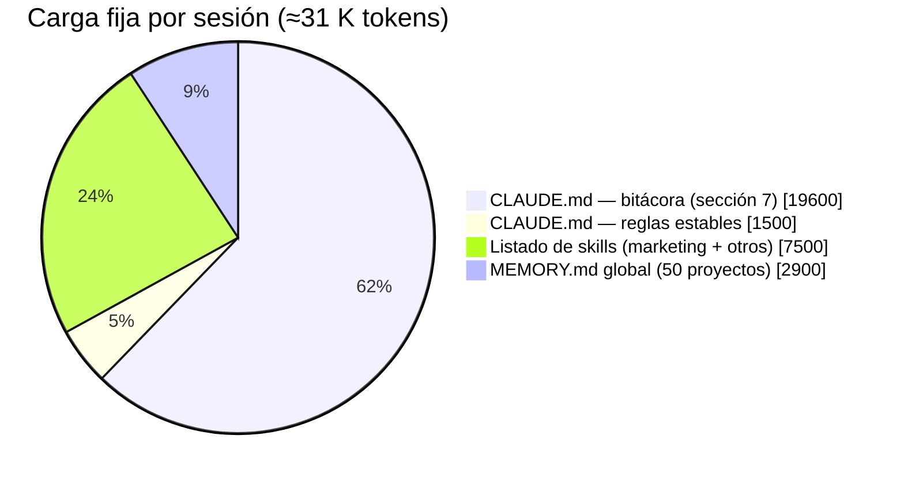

# 06 · Auditoría de contexto y de `CLAUDE.md`

> Fuentes: `CLAUDE.md` de `origin/main` (commit `3cad56a`) y de `origin/feat/direccion-clinica`; historia git del archivo; `docs/`, `README.md`, `DEPLOY.md`; `.claude/`; `.github/workflows/`; memoria del usuario (global y del repo); `~/.claude/settings.json`; transcripciones de sesiones (solo para contar cargas e invocaciones). No se leyó `.env`.
> Tokens ≈ caracteres / 4 (el español real cuesta un 10–20 % más).

---

## 1. El problema en una tabla

| Medida | Valor |
|---|---|
| `CLAUDE.md` en `main` | **85,7 KB · 1.089 líneas · ≈21.000 tokens** |
| `CLAUDE.md` en `feat/direccion-clinica` | 93,3 KB · 1.198 líneas · ≈23.300 tokens |
| Parte estable (secciones 1–6) | 6,2 KB ≈ 1.540 tokens (**7 %**) |
| Sección 7 "Plan por etapas" (bitácora, 46–48 ítems) | 78,4 KB ≈ 19.600 tokens (**93 %**) |
| Crecimiento | 16,5 KB (18 jun) → 85 KB (17 set): ×5,6; +31 KB solo entre el 13 y el 17 de setiembre |
| Commits que tocan `CLAUDE.md` | 40 (casi todos los `feat`/`fix` lo editan junto al código) |
| `MEMORY.md` global | ≈2.900 tokens, se carga en toda sesión lanzada desde `C:\Users\mirai` (todas desde el 19 set) |
| Listado de skills por sesión | ≈7.500 tokens (50 skills de marketing + personales + plugin cloudflare) |
| **Carga fija antes del primer mensaje** | **≈31.000 tokens** |
| Relevante para una tarea típica ("arreglar un botón de la agenda") | ≈1.000–1.500 tokens → **5–7 %**. Entre el 93 y el 95 % es irrelevante, y parte de lo "relevante" está desactualizado |

---

## 2. Hallazgos

### F1 · `CLAUDE.md` es un changelog, no un archivo de reglas

- **EVIDENCE:** el 93 % del archivo son 46 ítems narrativos ("✓ 15. Ficha de paciente completa (estilo Medlink)…"). Hay 33 fechas, 16 "Verificado", 12 menciones a ESLint, 11 a "build de Vite". Los ítems 39–41 son casi literales a los cuerpos de los commits `825296d`, `e136667`, `2e88580`.
- **WHY IT MATTERS:** cada sesión paga ~20 K tokens por historia que ya está en git y en los PR. Y cada PR edita el mismo archivo: con 4 worktrees activos, `CLAUDE.md` es el **punto de conflicto garantizado** (el ítem 46 es "Email" en `main` y "Dirección Clínica" en la rama).
- **PROPOSED MECHANISM:** `CLAUDE.md` ≤ 5 KB con reglas permanentes; prohibir la bitácora en él; el registro de cambios sale de `git log` y de las descripciones de PR.
- **EXPECTED BENEFIT:** −19 K tokens por sesión; desaparece una clase entera de conflictos de merge; desaparece el patrón 6 de [13-recurrent-errors.md](13-recurrent-errors.md).

### F2 · Información obsoleta que un agente podría obedecer

- **EVIDENCE (verificado contra el código):**
  - Ruta `C:\projects\clinica-saas`, "Estado: arranque", "clínicas médicas multiespecialidad".
  - "Despliegue: a definir" (es Railway, push a `main` despliega).
  - Referencia de diseño `clinica-mvp.jsx` (**no existe**) con paleta verde salvia `#4F8A77` (la real es turquesa `#0A7D92`, `App.jsx:1184`).
  - Cuentas demo `@sanrafael.pe` (las reales son `@itaca.pe`).
  - "Sin tests automatizados" (hay ≈1.043 tests y CI).
  - **"Fuera de alcance: Finanzas, Marketing, IA"**, contradicho por los ítems 6, 11 y 27.
  - 6 ítems "⏳ SIN desplegar" que están en `main` (32, 35, 41, 43, 44, 45) y el 46 (Email) ya mergeado.
  - Ítem 5: "identidad real: Mont' Sinai - Centro Médico" (es otro cliente).
  - No menciona `faro`, `espacios`, `core/respaldo.py` ni la separación de dominios.
- **WHY IT MATTERS:** una instrucción falsa es peor que ninguna. Un agente que lea §4 puede aplicar la paleta del prototipo a la agenda; uno que lea "Fuera de alcance" puede negarse a tocar finanzas.
- **PROPOSED MECHANISM:** eliminar §1 (reescribir), §2c, §4, §5 y los ítems obsoletos; lo generable (apps, roles, endpoints, paleta) se produce con scripts, no se escribe a mano.
- **EXPECTED BENEFIT:** menos decisiones equivocadas difíciles de detectar.

### F3 · Contradicciones internas

| Tema | Versión A | Versión B |
|---|---|---|
| Puerto del backend | §3a: 8000 | Ítem 22: `--noreload`, 8001 |
| Historia clínica | Ítem 7: append-only | Ítem 25: editable con `EdicionAtencion` auditada |
| Quién consolida duplicados | Ítem 38: solo admin | Ítem 44: admin + asistente (vigente) |
| Sesiones sin cerrar | Ítem 42: 676 / 610 en Piura | Ítem 44: 678 / 617 |
| Python | Ítem 27: 3.14 | Dockerfile y CI: 3.12 |
| Repo de GitHub | `DEPLOY.md`: `mirainishimura-maker/itaca-conversemos` | `git remote`: `conversemositaca-tech/itaca-conversemos` |
| Mover una cita | `CLAUDE.md`: "por confirmar" | Código: queda `reprogramada` |
| Continuidad del psicólogo | `CLAUDE.md`: el médico la gestiona | `core/permisos.py:49`: no |

### F4 · Datos de personas y secretos débiles dentro del contexto

- **EVIDENCE:** nombres del equipo y de psicólogos inactivos; 3 teléfonos; rutas de backups locales con PII (`C:\projects\db-itaca-backup-2026-06-19-pre-*.sqlite3`); nombres de Excel con datos de pacientes; contraseña demo `demo1234`. El repo ya tuvo que limpiar un celular personal (`d3680f0`, `dfa7257`).
- **WHY IT MATTERS:** Ley 29733 y riesgo reputacional; además ese contexto se envía en cada sesión y en cada ejecución del GitHub Action `claude.yml`.
- **PROPOSED MECHANISM:** regla "ningún dato de persona en archivos de contexto"; hook que avise al escribir teléfonos o nombres de archivos de pacientes en `CLAUDE.md`, `docs/` o `.claude/`.

### F5 · 50 skills de marketing cargadas en todas las sesiones de ingeniería

- **EVIDENCE:** `.claude/skills/` del repo contiene 50 skills de `coreyhaines31/marketingskills` (3,3 MB), ignoradas por git e **idénticas** a las instaladas globalmente en `~/.agents/skills` (doble instalación). Se invocaron **7 veces en total** en todas las transcripciones. El listado inyectado (~30 K caracteres) ya excede su presupuesto: ~25 skills aparecen sin descripción, lo que degrada la elección de las útiles.
- **PROPOSED MECHANISM:** activarlas solo en una carpeta de marketing (p. ej. `C:\marketing\.claude\skills`); quitar el plugin `cloudflare` del perfil global si no se usa.
- **EXPECTED BENEFIT:** −7 K tokens por sesión en **todos** los proyectos de la agencia, no solo en Conversemos.

### F6 · No existe ninguna pieza de ingeniería en `.claude/`

- **EVIDENCE:** no hay `.claude/settings.json` de proyecto, ni `hooks`, ni `agents/`, ni `commands/`, ni `rules/`. Global: un único hook `Stop` de texto a voz; `allow: []`, `defaultMode: auto`.
- **WHY IT MATTERS:** todo lo que hoy se "recuerda" (correr el build antes de la suite, añadir la app al respaldo, no tocar `main`, no escribir PII) depende de que Claude lea 85 KB y lo aplique bien.
- **PROPOSED MECHANISM:** ver [08-skills.md](08-skills.md), [10-hooks-and-scripts.md](10-hooks-and-scripts.md) y [15-claude-architecture.md](15-claude-architecture.md).

### F7 · La memoria del repo ya no se carga, y la global está contaminada

- **EVIDENCE:** desde el 19 set todas las sesiones arrancan en `C:\Users\mirai`. Por eso la memoria propia del repo (`arbol-compartido-sesiones.md`, `railway-cli-vinculada.md`), que es justo la operativa, **no se carga**. De sus 7 entradas, 4 son de otros proyectos. El `MEMORY.md` global (50 líneas, 50 proyectos) tiene una línea corrupta (Vibery duplicada) y la entrada de Email 1.0 desactualizada (dice PR abiertos; están mergeados).
- **PROPOSED MECHANISM:** lanzar Claude desde la carpeta del repo para trabajo de ingeniería; mover lo operativo de la memoria del repo a `.claude/rules/` versionado; limpiar las entradas ajenas.

### F8 · Procedimientos importantes enterrados en ítems de bitácora

| Procedimiento | Dónde está hoy | Debería ser |
|---|---|---|
| Correr la suite en Windows (build del front si cambió, sin `--parallel`, `--noinput`, salida a archivo, no usar `\| tail`) | Ítem 42 + memoria del repo | `scripts/test.ps1` |
| "Verificado: check, makemigrations --check, tests, build, ESLint igual a main (106 avisos)" | Repetido en ~16 ítems | `scripts/verificar.ps1` + job de ESLint en CI |
| QA con Playwright contra base demo aislada en scratchpad | Ítems 30, 31, 41, 43, 46–48 | Skill `qa-navegador` + script de arranque |
| Auditoría de navegación | Ítem 36; el script vive en un **scratchpad temporal**, fuera del repo | `scripts/` versionado o test e2e |
| Orden de la fusión de duplicados | Ítem 38 | Rule por ruta `pacientes/fusion.py` |
| Rutas del sitio (`SITE_ROUTES`) y no tapar `/gestion` | Ítems 34 y 36 | Rule por ruta `frontend/src/main.jsx`, `rutas.js` |
| Lectura de producción por `railway ssh` | Memoria del repo (no cargada) | Skill `prod-solo-lectura` |
| Crear worktree con `node_modules` y `.venv` compartidos | Memoria | Script `nuevo-worktree.ps1` |

---

## 3. Clasificación sección por sección (FASE 7)

| Sección | Líneas | ≈Tokens | Veredicto | Razón |
|---|---|---|---|---|
| Título "Clínica SaaS" | 1–5 | 45 | **REDUCIR** (renombrar) | Resto del rebrandeo |
| §1 Qué es | 6–17 | 140 | **REDUCIR** + reescribir | Ruta, estado y rubro obsoletos; menciona NOWA |
| §2a Multitenant desde el día uno | 20–27 | 120 | **MANTENER** | Invariante transversal; lo más valioso del archivo |
| §2b Ritmo de trabajo | 28–33 | 80 | **MANTENER** | Regla de colaboración vigente (mostrar esquema antes de migrar) |
| §2c Fuera de alcance | 34–40 | 50 | **ELIMINAR** | Contradice el producto real |
| §3 Stack | 41–49 | 90 | **REDUCIR** + corregir | Deploy "a definir" obsoleto |
| §3a Cómo correr | 50–55 | 85 | **MANTENER** + añadir tests vía script | No dice cómo correr tests |
| §3b Auth y roles | 56–69 | 240 | **MANTENER** (roles) / **ELIMINAR** (cuentas demo y contraseña) | Roles coinciden con `usuarios/models.py` |
| §3c Mensajería Evolution | 70–79 | 175 | **MOVER A RULE** (`mensajes/**`) | Solo relevante al tocar mensajería |
| §3d Decisión multitenant | 80–83 | 70 | **MANTENER** (fusionar con §2a) | Está fuera de su sección |
| §4 Diseño `clinica-mvp.jsx` | 85–116 | 340 | **ELIMINAR** | El archivo no existe; paleta falsa. La marca vive en `docs/marca-exportables.md` |
| §5 Especialidades médicas | 117–120 | 50 | **ELIMINAR** | Ítaca es psicología; son datos del catálogo |
| §6 Español | 121–124 | 46 | **MANTENER** | Corto y transversal |
| Ítems 1–6, 10, 12–19, 37 | — | ≈3.000 | **ELIMINAR** | Changelog puro; queda en git |
| Ítem 7 (historia clínica) | 135–148 | 265 | **MOVER A RULE** (`pacientes/**`) lo invariante | "Sin URL pública de media", auditoría de ediciones |
| Ítem 8 (agenda) | 149–157 | 190 | **MOVER A RULE** (agenda) | Dato de diseño vigente |
| Ítems 9, 11, 20–23, 26–33 | — | ≈6.000 | **MOVER A DOCUMENTACIÓN** (`docs/<dominio>.md`) | Narrativa de dominio útil solo bajo demanda |
| Ítems 24–25 | 319–351 | 700 | **MOVER A RULE** ("atención: PATCH solo médico/admin, toda edición auditada") + eliminar resto | Invariante legal enterrado |
| Ítem 30 (continuidad) | 424–462 | 900 | **MOVER A DOC** (`docs/continuidad.md` ya existe en la rama) + RULE con 5 invariantes | Duplica `docs/auditoria-continuidad.md` |
| Ítems 34, 36 (rutas) | — | 950 | **MOVER A RULE** (`frontend/src/main.jsx`, `rutas.js`) | Invariante crítico |
| Ítem 38 (duplicados) | 690–764 | 1.540 | **MOVER A DOC** + RULE (`pacientes/fusion.py`) | Mezcla diseño, auditoría y cifras que caducan |
| Ítems 39–41 (atribución, SEO, embudo) | — | 2.600 | **MOVER A DOC**; reglas de privacidad → RULE `leads/**` | Duplican commits |
| Ítem 42 (aviso de entorno de tests) | 899–954 | 1.050 | **MOVER A SCRIPT** (`scripts/test.ps1`) | El procedimiento más útil del archivo, escondido en el ítem 42 |
| Ítems 43–45 | — | 2.200 | **MOVER A DOC** + reglas cortas a RULE | Estados falsos (⏳) |
| Ítem 46 (Email) | 1075–1089 | 260 | **MANTENER solo el puntero** a `docs/email-1.0*.md` | Es el único ítem bien hecho: corto y remite a docs |
| Ítems 46–48 de la rama (Dirección Clínica) | — | 2.200 | **MOVER A DOC** (ya existen) | Duplicación inmediata |

### `CLAUDE.md` objetivo (≈4–5 KB)

1. Qué es Ítaca Conversemos (3 líneas) y mapa de apps.
2. Invariantes: multitenant, Ley 29733 (sin URL pública de media, sin PII en repo ni en chat), historia clínica auditada, siempre PR (push a `main` = deploy).
3. Cómo correr app y tests: `scripts/dev.ps1`, `scripts/test.ps1`, `scripts/verificar.ps1`.
4. Mapa de `docs/` y de `.claude/rules/` (qué se carga y cuándo).
5. Ritmo de trabajo y regla "no escribir bitácora aquí".
6. Español peruano y zona `America/Lima`.

---

## 4. Clasificación del conocimiento (FASE 6)

| Tipo | Ejemplos concretos | Dónde debe vivir | Cuándo se carga |
|---|---|---|---|
| **PERMANENTE** (≤2 KB) | Multitenant `clinica_id`; Ley 29733; push a `main` = deploy; cómo correr; apps; español peruano | `CLAUDE.md` raíz | Siempre |
| **POR DOMINIO** | Continuidad (tramos, DP, cola); duplicados y fusión; mensajería (Evolution vs Meta, reintentos, "aceptado ≠ enviado"); atribución y embudo; sitio, SEO y rutas; finanzas (egresos solo admin) | `.claude/rules/<dominio>.md` con `paths:` | Al tocar archivos de ese dominio |
| **POR FEATURE** | Email 1.0, Dirección Clínica 1/1.5/2, biblioteca de imágenes, Faro | `docs/<feature>.md` | Bajo demanda (lo pide la skill de feature) |
| **TEMPORAL** | "SIN desplegar", PR abiertos, "pendiente", cifras de limpieza al 18 set, migraciones pendientes del sqlite local, certificado vencido | Issues / descripción de PR | Nunca en contexto fijo |
| **GENERABLE AUTOMÁTICAMENTE** | Lista de apps y modelos, endpoints, roles (`Usuario.Rol`), paleta (tokens CSS), estado de despliegue, changelog | Scripts (`scripts/mapa.py`, `git log`, `railway deployment list`) | Al pedirlo |
| **NO NECESARIO** | Ítems 1–6, 10, 12–19, 37; prototipo `clinica-mvp.jsx`; especialidades médicas; NOWA; Medlink; rutas de backups de junio; nombres de personas | Eliminar (queda en git) | — |

---

## 5. Conocimiento duplicado entre fuentes

| Hecho | Dónde aparece |
|---|---|
| Push a `main` despliega; trabajar por PR | Memoria global, `DEPLOY.md`, comentario de `tests.yml`, memoria del repo |
| Cómo correr la suite (tiempo, `--noinput`, build antes) | `CLAUDE.md` ítem 42; memoria ("811 pruebas, ~22 min"); ninguno en README |
| Worktrees y "nunca dos agentes en la misma carpeta" | Tres archivos de memoria (uno no se carga) |
| Email 1.0 | `CLAUDE.md` ítem 46; 3 docs; memoria (desactualizada); 7 cuerpos de commit |
| Dirección Clínica / continuidad | `CLAUDE.md` rama 46–48; `docs/direccion-clinica.md`, `docs/continuidad*.md`; `docs/auditoria-continuidad.md`; memoria; `.claude/product-marketing.md` §13 |
| Embudo y atribución | `CLAUDE.md` 39–41 ≈ cuerpos de commit casi literales |
| Paleta e identidad | `CLAUDE.md` §4 (falsa) e ítem 35; `docs/marca-exportables.md`; tokens en `App.jsx` |
| Stack y cómo levantar | `CLAUDE.md` §3; `README.md` (obsoleto: "Clínica SaaS", 3 apps); `DEPLOY.md` (ruta `clinica-saas`) |
| Cuentas demo y contraseñas | `CLAUDE.md` §3b; `DEPLOY.md`; `seed_demo.py`; memoria de Faro |
| Respaldo: toda app nueva entra | `core/respaldo.py`, `RespaldoTests`, commits — **ausente de `CLAUDE.md`** (bien: lo enforce un test) |

**Regla que se desprende:** si un hecho lo puede verificar un test o generarlo un script, no se escribe en ningún archivo de contexto. El respaldo es el ejemplo de que funciona: no está en `CLAUDE.md` y aun así el CI lo protege.

---

## 6. Ahorro estimado

| Acción | Tokens ahorrados por sesión | Alcance |
|---|---|---|
| `CLAUDE.md` 85 KB → 5 KB | ≈19.500 | Conversemos (y cada ejecución de `claude.yml`) |
| Mover skills de marketing fuera del perfil de ingeniería | ≈7.000 | Todos los proyectos |
| Rules por ruta en vez de texto global | Se cargan 0,5–2 K solo cuando aplican | Conversemos |
| Lanzar desde el repo / limpiar memoria | ≈2.000 + memoria operativa que hoy falta | Todos |
| **Total** | **≈28 K de ≈31 K (−90 %)** | — |

El ahorro de tokens es lo menos importante. Lo importante es la **precisión**: un contexto corto y verdadero produce menos decisiones equivocadas que uno largo con un 7 % útil y partes falsas.
