# 07 · Core reutilizable

> Pregunta que responde: **¿qué partes de Conversemos jamás deberían volver a diseñarse, programarse o descubrirse desde cero en el próximo sistema?**
> Fuentes: inventario del backend y frontend de `origin/main`, rama `feat/direccion-clinica`, y la comparación con 8 sistemas hermanos de la agencia (ver [12-repeatability-matrix.md](12-repeatability-matrix.md)).

---

## 1. Punto de partida: hoy se reutiliza copiando, y ya mostró su costo

```mermaid
flowchart LR
    CS[clinica-saas<br/>jun 2026<br/>Django 4,8 k LOC] -->|copia 18 jun<br/>7 % de Conversemos| IC[Ítaca Conversemos<br/>41 k LOC backend<br/>App.jsx 16 k]
    IC -->|copia 15 jul<br/>75 % de su backend| MS[Mont' Sinai<br/>12,9 k LOC]
    LW[life-wellness<br/>Next+Supabase] -->|fork| BD[bonos-descuentos]
    IC -. "lib/itaca.ts<br/>reescrito en TS" .-> LW
    IC -. "ojito: 8 PR en 3 min" .-> MS
    IC -. .-> BS[beauty-spa-saas<br/>Next+Prisma]
    IC -. .-> MR[mirai-saas<br/>Next+Supabase]
```

| Síntoma del modelo "copiar el repo" | Evidencia |
|---|---|
| Drift en ambas direcciones | Mont' Sinai sigue con el cliente de Evolution de 71 líneas (igual byte a byte al de `clinica-saas`); Conversemos tiene 448 + webhook + monitor + 1.021 líneas de tests. La caja de Mont' Sinai (cierre, cobranza, ticket) no volvió a Conversemos |
| Seguridad resuelta dos veces | Límite de login: Mont' Sinai el 29 ago, Conversemos el 9 set, implementaciones distintas |
| Parches que no se propagan | Django 5.2.16 solo en Mont' Sinai; `clinica-saas` y Conversemos en 5.2.15 |
| Piezas críticas que faltan en una copia | Mont' Sinai **no tiene respaldo** |
| Documentación heredada que despista | El `CLAUDE.md` de Conversemos todavía habla de Mont' Sinai y Medlink |
| Cada arreglo universal cuesta N PR | Ojito: 8 repos + Apps Script a mano. Funciona para 41 líneas; no para Evolution o el respaldo |

**Conclusión:** el próximo sistema no debe nacer de copiar Conversemos. Debe nacer de un **core versionado** del que Conversemos también dependa.

---

## 2. Las cuatro capas

```mermaid
flowchart TB
    subgraph U[CORE UNIVERSAL — cualquier SaaS]
      U1[auth + throttle + ojito]
      U2[tenant por fila]
      U3[RBAC declarativo]
      U4[auditoría append-only]
      U5[respaldo + restaurar]
      U6[fecha de negocio del servidor]
      U7[UI base: Modal, Campo, Toast, Confirm, useRecurso, Tabla, Filtros]
      U8[CI + scripts + hooks + smoke post-deploy]
    end
    subgraph B[CORE BUSINESS OPS — negocio de servicios con mostrador]
      B1[sedes como dato]
      B2[agenda + slots + bloqueos + reserva pública]
      B3[persona / cliente + identidad + fusión]
      B4[catálogo + paquetes + caja + liquidación]
      B5[mensajería WhatsApp — una puerta]
      B6[correo con consentimiento]
      B7[captación de leads + embudo + atribución]
      B8[recordatorios]
      B9[exportes]
    end
    subgraph C[CORE CLÍNICO — salud y salud mental]
      C1[historia clínica auditada]
      C2[consentimiento informado por token]
      C3[adjuntos privados]
      C4[escalas e instrumentos]
      C5[máquina de proceso de continuidad]
      C6[reglas Ley 29733 / menores / tutor]
    end
    subgraph P[CORE CONVERSEMOS — específico]
      P1[DP-01…16, bloque de 6, S3]
      P2[Dirección Clínica KPIs]
      P3[Faro tamizaje escolar]
      P4[Brújula, Mentalidad Ítaca, gamificación]
      P5[espacios / alquiler de consultorios]
      P6[gerencia, mi_panel, reportes a medida]
    end
    U --> B --> C --> P
```



---

## 3. Inventario por pieza

Formato: **PIEZA** · capa · estado actual en Conversemos · acoplamiento (B/M/A) · qué hay que limpiar antes de extraerla · veces reconstruida en la agencia.

### 3.1 CORE UNIVERSAL

| Pieza | Estado en Conversemos | Acopl. | Limpieza previa | Reconstruida |
|---|---|---|---|---|
| **Tenant por fila** (`core/tenant.py`, `TenantActualMiddleware`, `ModeloTenant`, `TenantQuerySet`) | Funciona; el manager por defecto **no filtra**; integraciones cruzan tenants | B | Manager por defecto que filtre; mixin de ViewSet que lo imponga; test de aislamiento | 5+ (Django, Prisma Business→Branch, RLS Supabase) |
| **Auth** (sesión + CSRF, email, throttle `LoginPorIP`/`LoginPorCuenta`, ojito `InputClave.jsx`) | Sólida | B | Ninguna relevante | 8 de 8 sistemas |
| **RBAC declarativo** (`core/permisos.py`) | Mezclado con 12 helpers copiados y 57 comparaciones en línea; fugas confirmadas | M | `RolPermission(roles, acciones)`; roles como datos; **matriz endpoint × rol generada como test** | 8 |
| **Auditoría append-only** (`EdicionAtencion`, `RegistroFusionPaciente`, eventos de `continuidad`) | Parcial: no audita ediciones de Paciente ni de Cobro; sin registro de lecturas de historia clínica | M | Un modelo `Evento` genérico + decorador | 4 |
| **Respaldo + restaurar** (`core/respaldo.py`) | Lista de apps a mano; incluye hashes y tokens; no incluye archivos; en memoria | B | Derivar de `apps.get_models()`; excluir secretos; streaming; archivos | 5 distintos; Mont' Sinai sin respaldo |
| **Fecha de negocio** (reloj del servidor, `America/Lima`) | Resuelto tras 3 intentos | B | Helper único en backend y frontend | — |
| **Rangos de periodo** (`_rango`) | 2 copias divergentes | B | Una función | 2+ |
| **HTTP Range para medios privados** (`core/rangos.py`) | Bien | B | Ninguna | — |
| **SPA servida por Django + SEO + dominios** (`core/seo.py`, `core/dominios.py`) | Bien, pero el bundle es único (sitio descarga el sistema) | B–M | Dos entradas de Vite | 3 |
| **UI base** (Modal, Campo, Toast, Confirm, useRecurso, BotónGuardar, Tabla, BarraFiltros, tokens) | **No existe**; 40 modales, 286 falsas etiquetas, 1.927 estilos inline | — | Extraer desde `DireccionClinica.jsx` / `ContinuidadFicha.jsx` (rama), que ya lo hacen bien | Cada sistema tiene los suyos |
| **Tooling** (CI, `verificar`, `test`, hooks, smoke post-deploy, `.env.example` completo) | CI sí; el resto no; 23 de 56 variables documentadas | B | Ver [10-hooks-and-scripts.md](10-hooks-and-scripts.md) | Solo Conversemos tiene CI de tests |

### 3.2 CORE BUSINESS OPS

| Pieza | Estado | Acopl. | Limpieza previa | Reconstruida |
|---|---|---|---|---|
| **Sedes** | 9 enums `Sede` + `espacios.Sede` + LIMA/PIURA escrito en settings | A | Sede como modelo de datos por tenant; normalización en el borde | 6 (Mont' Sinai arrastra Lima sin tenerla) |
| **Agenda + slots + bloqueos + reserva pública por token** (`pacientes/agendamiento.py`) | Funciona; `Cita` sin máquina de estados (acepta cualquier transición) | M | Máquina de estados de cita; separar "consulta" como tipo | ≥7 |
| **Persona + identidad + duplicados + fusión** (`leads/identidad.py`, `pacientes/duplicados.py`, `pacientes/fusion.py`) | La pieza más cara de descubrir (≥10 PR); fusión auditada de 700 líneas | M–A | Separar persona / contacto / tutor; `resolver_identidad()` única; regla de 9 dígitos parametrizada por país | Todos los sistemas, ninguno con fusión |
| **Catálogo + paquetes + caja + liquidación** (`finanzas/`) | Básico; liquidación por nombre de servicio; `porcentaje_liquidacion` muerto | M | Tomar como referencia el modelo de Aldanna (CashShift, Commission, Refund) y la caja de Mont' Sinai | ≥7 |
| **Mensajería WhatsApp — una puerta** (`mensajes/services.py`, `evolution.py`, `cloud_api.py`, webhook, monitor) | La versión más madura de la agencia (448 líneas + 1.021 de tests); un desvío en Faro; Meta puede enviar por la sede equivocada (`cloud_api.py:38`) | M | Quitar FKs a `Paciente`/`Cita`; "aceptado ≠ entregado" como contrato | **~17** |
| **Correo con consentimiento** (`correo/`) | La app mejor diseñada del repo: servicio central, flujos, preferencias, baja, webhooks Brevo, idempotencia | B–M | `ConIdentidad` genérico (hoy apunta a Paciente, Lead y Autorización de Faro) | 1 (ventaja: está hecho) |
| **Captación + embudo + atribución** (`leads/`) | Completo (token, `EventoSitio`, utm/gclid/fbclid) | M | `Fuente` con 21 valores de Ítaca; distritos escritos a mano | 3 |
| **Recordatorios** | Disparados por un cron externo (kira-bot) | M | Scheduler propio o cron de Railway; plantilla configurable | ≥8 |
| **Exportes** | Todos en el cliente (`exportGerencia.js`, 901 líneas); API sin paginación | M | Exportes server-side con paginación | 5 |
| **Consentimiento por token** (`pacientes/consentimiento.py`) | Bien; el token se expone al médico (fuga) | B | Modelo genérico "documento a firmar" | 4 |
| **Manual de recepción** | No en Conversemos; hecho a mano para Mont' Sinai y Aldanna el mismo día | — | Generador a partir de capturas + guion | 2 en un día |

### 3.3 CORE CLÍNICO

| Pieza | Estado | Acopl. | Limpieza previa |
|---|---|---|---|
| **Historia clínica auditada** (`Atencion` + `EdicionAtencion`: PATCH solo médico/admin, create/destroy 405) | Bien | M | Añadir registro de lecturas |
| **Adjuntos privados** (sin URL pública, descarga por endpoint autenticado) | Regla correcta, **fuga de alcance** (`AdjuntoViewSet` no acota por rol) | M | Alcance por rol + test |
| **Escalas e instrumentos** (escalas de Conversemos, PHQ/GAD/ASQ/EBIPQ/ECIP-Q de Faro) | Dos implementaciones (ficha y Faro) | M | Motor de instrumentos con puntos de corte como datos |
| **Máquina de proceso de continuidad** (`continuidad/` en la rama: proceso + eventos append-only + transiciones idempotentes con `select_for_update` + motivos) | **El mejor servicio de dominio del repo** | M | La semántica DP-xx es de Conversemos; el patrón es genérico |
| **Reglas de menores y tutor** | Parciales: menor sin fecha de nacimiento = adulto; recordatorio manual y NPS ignoran el teléfono del tutor | A | Especificar en la pieza de identidad |
| **Exclusión clínica de comunicaciones** | `Paciente.riesgo` decide la exclusión de correo, **y Eli lo escribe con un LLM** | A | `riesgo` solo lo escribe un humano (ver [03-business-processes.md](03-business-processes.md) §6) |

### 3.4 CORE CONVERSEMOS (no extraer)

DP-01…16, bloque de 6 sesiones y S3; Dirección Clínica; Faro completo; Brújula; "Mentalidad Ítaca" y gamificación; `espacios` (alquiler de consultorios); `core/gerencia.py`, `mi_panel.py`, `ocupacion.py`, `reportes.py` (KPIs a medida, acoplamiento **A**: reescribir sobre una capa de métricas común antes de pensar en reutilizarlos).

---

## 4. Lo que vale más que el código: conocimiento de dominio ya pagado

Estas decisiones costaron semanas de producción y PR. Deben viajar como **especificación + tests** a cualquier sistema futuro, aunque cambie el stack:

| Conocimiento | Costo de descubrirlo | Formato para la fábrica |
|---|---|---|
| El teléfono no identifica a una persona (19 % de fichas comparten número) | ≥10 PR, historias mezcladas | Spec `identidad.md` + batería de casos de prueba |
| "Sesión N" se deriva, nunca se guarda; la consulta no es sesión | ≥8 PR, liquidación errónea | Spec + test de propiedad |
| "Aceptado por el proveedor" ≠ "entregado" | 4 PR | Contrato del cliente de mensajería |
| La fecha de negocio viene del servidor | 3 intentos | Helper + regla |
| Toda tabla nueva entra al respaldo | 3 olvidos + 11 tablas | Test derivado |
| La sede es un filtro de trabajo, no una puerta | `6cfcf60` | Regla de RBAC |
| Ningún dato clínico va a calendarios ni logs externos | #63, webhook de Meta | Rule + hook de PII |
| Rutas del sitio en una sola fuente (`SITE_ROUTES`) | #81, `b5a8333`, #119 | Template de sitio |
| Un LLM no escribe campos clínicos sin revisión humana | Hallazgo de esta auditoría | Rule ALWAYS BLOCK |

---

## 5. Recomendación de empaquetado (sin implementar)

| Opción | Pros | Contras | Veredicto |
|---|---|---|---|
| Seguir copiando repos | Cero inversión inicial | Drift probado; N PR por arreglo | **Descartar** |
| Monorepo con todos los clientes | Un solo lugar | Mezcla datos y despliegues de clientes distintos; riesgo Ley 29733 | Descartar |
| **Paquetes versionados del core** (p. ej. `itaca-core` Python + `itaca-ui` React) instalados en cada sistema | Arreglo una vez, propagación por versión; cada cliente sigue siendo su repo | Requiere disciplina de versionado y tests del paquete | **Recomendado para backend y UI** |
| **Template repo** (Copier/cookiecutter) que genera el esqueleto y depende de los paquetes | El proyecto nace con CI, hooks, `.claude/`, scripts | El template también envejece; necesita "update" (Copier lo soporta) | **Recomendado para el bootstrap** |
| **Specs de dominio** (markdown + tests de contrato) independientes del stack | Sirven en Django y en Next | No son código ejecutable en otro stack sin portar los tests | **Recomendado siempre** |

**Decisión que es de Max (no de Claude):** ¿la fábrica se construye sobre Django o sobre Next.js? La evidencia de ambos lados está en [16-system-factory.md](16-system-factory.md). El diseño de capas de este documento vale para cualquiera de las dos; lo que cambia es qué se empaqueta como código y qué solo como spec.

---

## 6. Respuesta corta

Lo que **jamás** debería volver a hacerse desde cero:

1. Auth, throttle, tenant, RBAC con test de matriz por rol, auditoría, respaldo.
2. Los 8 componentes UI base y sus reglas de factores humanos.
3. La identidad de la persona atendida (persona, contacto, tutor, duplicados, fusión).
4. La agenda con slots, bloqueos, reserva pública y máquina de estados.
5. Una sola puerta de WhatsApp y una de correo con consentimiento.
6. Caja, paquetes y liquidación (tomando lo mejor de Conversemos, Mont' Sinai y Aldanna).
7. El patrón "proceso + eventos append-only + transiciones validadas" de `continuidad`.
8. El tooling: CI, scripts de verificación, hooks, smoke post-deploy, `.claude/` mínimo.
9. Las nueve lecciones de dominio de la sección 4, como specs con tests.
