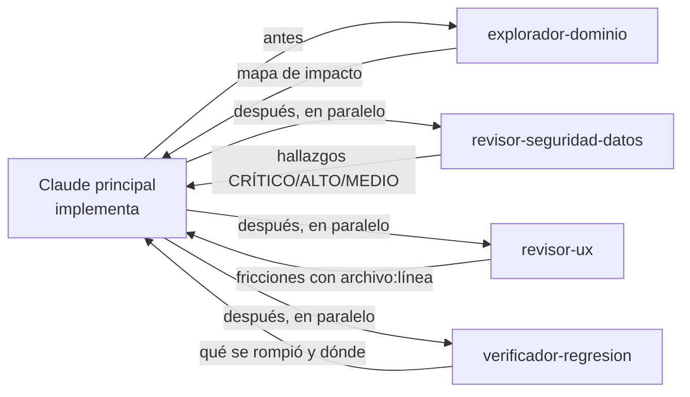

# 09 · Subagentes candidatos

> Criterio: un subagente se justifica solo si un **contexto separado** mejora el resultado. Eso pasa cuando (a) la tarea exige leer mucho para devolver poco (discovery), (b) conviene una mirada sin el sesgo de quien implementó (revisión adversarial) o (c) puede correr en paralelo con la implementación.
> Evidencia de que ya funciona en este repo: la "revisión adversarial de 3 agentes" encontró fugas reales (`6e82ec2`, `2424a89`), y esta auditoría usó 7 subagentes en paralelo. Pero hoy se usan **a mano y de forma puntual**; no hay ninguno definido en `.claude/agents/`.

## Organización propuesta: 4 subagentes, no más

| Subagente | Fase | Corre en paralelo | Modelo sugerido |
|---|---|---|---|
| `explorador-dominio` | Discovery | Sí, con la redacción del brief | Sonnet (lectura masiva, salida corta) |
| `revisor-seguridad-datos` | Revisión | Sí, con los otros dos revisores | Opus (juicio sobre riesgo) |
| `revisor-ux` | Revisión | Sí | Sonnet |
| `verificador-regresion` | Revisión | Sí | Sonnet |

---

### `explorador-dominio`

| Campo | Valor |
|---|---|
| **RESPONSIBILITY** | Antes de implementar: localizar todo lo que toca una noción o pantalla (modelos, serializers, vistas, componentes de `App.jsx`, tests, docs, rules) y devolver un mapa de impacto de ≤40 líneas |
| **WHY SEPARATE CONTEXT HELPS** | `App.jsx` tiene 16.075 líneas y 134 componentes; `core/` tiene 22 módulos. Leerlos en el contexto principal lo llena de código que no se va a tocar. El subagente lee mucho y devuelve solo el mapa |
| **INPUT** | Noción o pantalla ("sesión N", "agenda del psicólogo", "cobro") + salida de `scripts/mapa.py` |
| **OUTPUT** | Lista de archivos:línea por capa, consumidores de la noción, tests existentes, reglas del dominio aplicables, riesgos (fuente de verdad duplicada) |
| **TOOLS** | Read, Grep, Glob, Bash solo lectura |
| **CAN RUN IN PARALLEL?** | Sí: varios exploradores sobre nociones distintas |
| **WHEN CALLED** | Inicio de `feature` y de `fuente-unica`; bugfix que toque más de una capa |
| **WHEN NOT CALLED** | Cambio de un solo archivo ya identificado; texto o estilo |

### `revisor-seguridad-datos`

| Campo | Valor |
|---|---|
| **RESPONSIBILITY** | Revisar el diff contra: alcance por rol y por tenant, campos sensibles visibles por rol, PII en logs y repo, endpoints públicos y throttle, tokens, envíos a terceros (OpenAI, Calendar, WhatsApp), menores y tutor, migraciones peligrosas |
| **WHY SEPARATE CONTEXT HELPS** | Quien implementó tiende a validar su propio diseño. Las fugas encontradas en esta auditoría (adjuntos, cobros, tokens de firma, token de integración) pasaron 121 PR sin revisión humana |
| **INPUT** | Diff del PR + `docs/permisos.md` (matriz esperada) + rules de privacidad |
| **OUTPUT** | Hallazgos con severidad (CRÍTICO bloquea el merge), archivo:línea y escenario de explotación concreto |
| **TOOLS** | Read, Grep, Bash solo lectura (tests) |
| **CAN RUN IN PARALLEL?** | Sí |
| **WHEN CALLED** | Todo PR que toque `api.py`, `serializers.py`, `permisos.py`, modelos con datos de persona, integraciones, `settings.py` |
| **WHEN NOT CALLED** | Cambios solo de estilo, textos del sitio o docs |

### `revisor-ux`

| Campo | Valor |
|---|---|
| **RESPONSIBILITY** | Revisar pantallas nuevas o cambiadas contra el checklist de factores humanos ([04-human-factors.md](04-human-factors.md) §6): destructivos con confirmación, modales que no pierden datos, toasts con tipo, bloqueo al guardar, estados vacío/carga/error, URL por pantalla, teclado, contraste, densidad para jornada larga |
| **WHY SEPARATE CONTEXT HELPS** | Mirada de "operadora a las 6 de la tarde" sin el contexto técnico de la implementación. Hoy la UX se valida en producción con el equipo (aviso arreglado 3 veces, resumen de agenda 4) |
| **INPUT** | Diff de frontend + capturas de `qa-navegador` + rol principal de la pantalla |
| **OUTPUT** | Fricciones con formato FRICCIÓN → CAUSA → IMPACTO → SOLUCIÓN y severidad |
| **TOOLS** | Read, Grep; ver imágenes de capturas |
| **CAN RUN IN PARALLEL?** | Sí |
| **WHEN CALLED** | Toda pantalla nueva o flujo modificado |
| **WHEN NOT CALLED** | Backend puro; sitio público de marketing (lo cubre `criterio-de-diseno`) |

### `verificador-regresion`

| Campo | Valor |
|---|---|
| **RESPONSIBILITY** | Ejecutar `scripts/verificar.ps1` + matriz por rol + smoke de navegación, y si algo falla, aislar la causa y proponer el arreglo mínimo |
| **WHY SEPARATE CONTEXT HELPS** | La suite tarda ~22 min; los logs son largos. El subagente absorbe la salida y devuelve 10 líneas. Libera al principal para seguir con documentación o el PR |
| **INPUT** | Rama |
| **OUTPUT** | Verde/rojo; por cada fallo: test, causa probable, archivo:línea |
| **TOOLS** | Bash (scripts de test), Read, Grep |
| **CAN RUN IN PARALLEL?** | Sí, en segundo plano |
| **WHEN CALLED** | Antes de abrir el PR; tras resolver conflictos de rebase |
| **WHEN NOT CALLED** | Si el hook Stop ya corrió `verificar` y está verde sin cambios posteriores |

---

## Candidatos evaluados y descartados

| Candidato | Por qué no |
|---|---|
| Agente "arquitecto" permanente | Las decisiones de arquitectura son pocas y de Max; un brief + `explorador-dominio` bastan |
| Agente "frontend" y agente "backend" separados que implementen | El paralelismo útil es por **contrato de API** dentro de una feature, y se logra con dos sesiones en worktrees, no con agentes permanentes. Ver [14-future-workflow.md](14-future-workflow.md) §paralelización |
| Agente "documentador" | La documentación útil es corta y la hace quien implementa; el registro de cambios es un script |
| Agente "accesibilidad" separado | Cabe en `revisor-ux` |
| Agente "datos/migraciones" | Cabe en `revisor-seguridad-datos` + hook post-edit de `makemigrations --check` |
| Agente "QA" que escriba tests | Los tests los escribe quien implementa, con el template de factories; el verificador solo los corre |

**Regla anti-burocracia:** si un subagente no encontró nada útil en 10 PR seguidos, se apaga para ese tipo de cambio.
