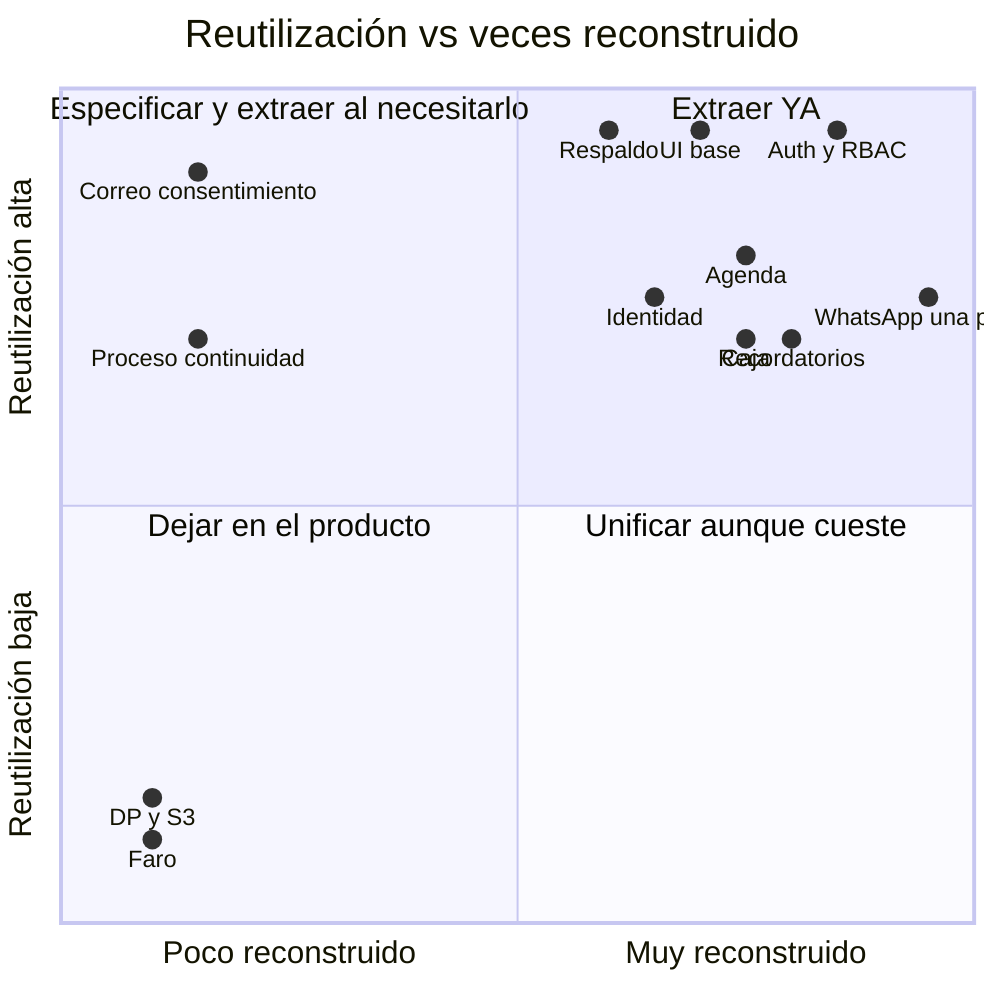

# 12 · Matriz de reutilización

> Cómo leerla: cada fila es un módulo o patrón **encontrado en Conversemos**. Cada columna, un tipo de producto futuro. La celda dice cuánto de lo construido en Conversemos se reutilizaría **por su naturaleza funcional**, no por cómo está escrito hoy (el estado del código y la limpieza necesaria están en [07-reusable-core.md](07-reusable-core.md)).
>
> **HIGH** = se reutiliza casi entero · **MEDIUM** = la estructura sí, las reglas cambian · **LOW** = solo la idea · **PS** = específico del producto.
>
> Evidencia de la columna "Reconstruido en la agencia": conteo sobre 8 sistemas y 14 bots en `C:\projects` (1 oct 2026).

| Módulo / patrón | Ítaca Conversemos | Sistema clínico (consultorio, Mont' Sinai, Dr. Maraví) | Sistema comercial (estética, gym: Aldanna, Life) | SaaS de profesionales (Notaluma) | Universal | Reconstruido en la agencia |
|---|---|---|---|---|---|---|
| Auth + throttle + ojito | HIGH | HIGH | HIGH | HIGH | **HIGH** | 8/8 sistemas |
| Tenant por fila / aislamiento | HIGH | HIGH | HIGH | HIGH | **HIGH** | 5+ en 3 stacks |
| RBAC declarativo + test de matriz por rol | HIGH | HIGH | HIGH | MEDIUM (1 rol principal) | **HIGH** | 8/8 |
| Auditoría append-only | HIGH | HIGH | MEDIUM | HIGH | **HIGH** | 4 |
| Respaldo + restaurar | HIGH | HIGH | HIGH | HIGH | **HIGH** | 5 distintos; falta en Mont' Sinai |
| Fecha de negocio del servidor / zona horaria | HIGH | HIGH | HIGH | HIGH | **HIGH** | — |
| UI base (Modal, Campo, Toast, Confirm, carga, Tabla, Filtros, tokens) | HIGH | HIGH | HIGH | HIGH | **HIGH** | cada sistema la suya |
| CI + scripts + hooks + smoke post-deploy | HIGH | HIGH | HIGH | HIGH | **HIGH** | CI de tests solo en Conversemos |
| Sedes como dato | HIGH | HIGH | HIGH | LOW | MEDIUM | 6 |
| Agenda + slots + bloqueos | HIGH | HIGH | HIGH | HIGH | MEDIUM | ≥7 |
| Reserva pública por token | HIGH | HIGH | HIGH | HIGH | MEDIUM | 5 |
| Persona / cliente + identidad + duplicados + fusión | HIGH | HIGH | HIGH | MEDIUM | MEDIUM | todos; ninguno con fusión salvo Conversemos |
| Persona con tutor (menores) | HIGH | MEDIUM | LOW | MEDIUM | LOW | 1 |
| Catálogo de servicios + paquetes | HIGH | HIGH | HIGH | MEDIUM | MEDIUM | ≥6 |
| Caja / cobros / egresos | HIGH | HIGH | HIGH | MEDIUM | MEDIUM | ≥7 |
| Liquidación / comisiones a profesionales | HIGH | HIGH | HIGH | LOW | LOW | 4 |
| WhatsApp — cliente Evolution + bitácora + una puerta | HIGH | HIGH | HIGH | MEDIUM | MEDIUM | **~17** |
| Correo con consentimiento y baja (Brevo) | HIGH | HIGH | HIGH | HIGH | **HIGH** | 1 |
| Recordatorios de cita | HIGH | HIGH | HIGH | HIGH | MEDIUM | ≥8 |
| Captación de leads + embudo + atribución | HIGH | MEDIUM | HIGH | MEDIUM | MEDIUM | 3 |
| Sitio público + SEO + dominios separados | HIGH | MEDIUM | HIGH | HIGH | MEDIUM | 4 |
| Exportes CSV/Excel/PDF | HIGH | HIGH | HIGH | HIGH | **HIGH** | 5 |
| Consentimiento firmado por token | HIGH | HIGH | MEDIUM | HIGH | MEDIUM | 4 |
| Historia clínica auditada (`Atencion` + `EdicionAtencion`) | HIGH | HIGH | LOW (ficha estética) | HIGH | LOW | 4 |
| Adjuntos privados sin URL pública | HIGH | HIGH | MEDIUM | HIGH | MEDIUM | 3 |
| Escalas / instrumentos con puntos de corte | HIGH | MEDIUM | LOW | MEDIUM | LOW | 2 (ficha y Faro) |
| Máquina de proceso + eventos + transiciones validadas (`continuidad`) | HIGH | HIGH | MEDIUM (membresías, tratamientos) | HIGH | MEDIUM | 1 |
| Cola de seguimiento priorizada (reactivación) | HIGH | MEDIUM | HIGH | MEDIUM | LOW | 1 |
| NPS | HIGH | HIGH | HIGH | MEDIUM | MEDIUM | 3 |
| Notas por voz (Whisper) + estructuración por IA | HIGH | MEDIUM | LOW | HIGH | LOW | 2 |
| Panel de gerencia / KPIs | HIGH | MEDIUM | MEDIUM | LOW | LOW (solo la capa de métricas) | cada sistema |
| Manual de recepción generado | HIGH | HIGH | HIGH | MEDIUM | MEDIUM | 2 a mano el 1 oct |
| Espacios / alquiler de consultorios | PS | MEDIUM | LOW | LOW | LOW | 1 |
| DP-01…16, bloque de 6, S3 | PS | LOW | — | LOW | — | 1 |
| Dirección Clínica (KPIs de continuidad) | PS | MEDIUM | LOW | LOW | — | 1 |
| Faro (tamizaje escolar B2B) | PS | LOW | — | LOW | — | 1 |
| Brújula, Mentalidad Ítaca, gamificación | PS | — | — | — | — | 1 |

---

## Lectura

1. **Extraer ya** (alta reutilización y ya reconstruido muchas veces): auth + RBAC, UI base, respaldo, WhatsApp, agenda, recordatorios, caja. Es donde la agencia pierde más tiempo hoy.
2. **Especificar y extraer cuando el siguiente proyecto lo necesite** (alta reutilización, hecho una sola vez): correo con consentimiento, máquina de proceso de `continuidad`. Ya existen bien hechos; basta con no volver a diseñarlos.
3. **Dejar en el producto:** Faro, DP/S3, Dirección Clínica, Brújula, gamificación.

### Porcentaje conceptual de un próximo producto que ya sabemos construir

Estimación por tipo, contando módulos de la matriz con HIGH o MEDIUM ponderados por tamaño típico (**HIPÓTESIS razonada**, no medición):

| Próximo producto | Ya resuelto conceptualmente | Lo que queda por descubrir |
|---|---|---|
| Consultorio / sistema clínico | **≈70–80 %** | Reglas clínicas propias, procesos de la especialidad, reportes |
| Centro estético / gym / servicios | **≈60–70 %** | Inventario, membresías, comisiones finas, campañas |
| SaaS de profesionales | **≈55–65 %** | Facturación por suscripción, onboarding self-service, multi-tenant real con alta automática |
| Sistema empresarial no clínico | **≈35–45 %** | Casi todo el dominio; se reutilizan core universal y tooling |

Hoy ese conocimiento existe pero **no está empaquetado**: vive en código acoplado, en un `CLAUDE.md` de 85 KB y en la memoria de Max. Por eso cada sistema nuevo lo vuelve a pagar.
