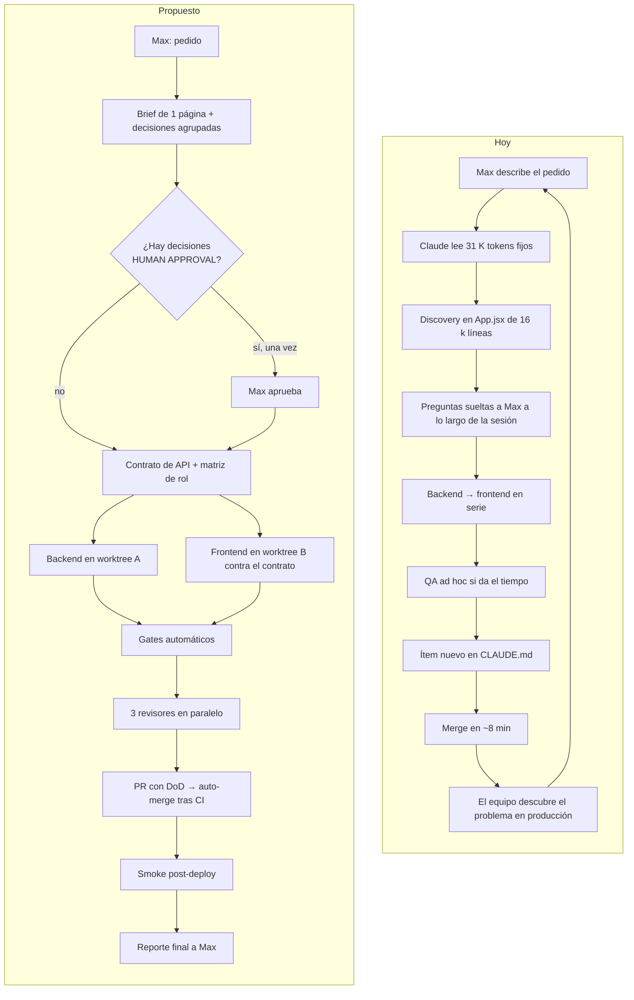
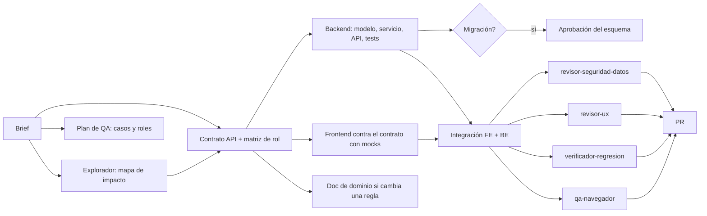
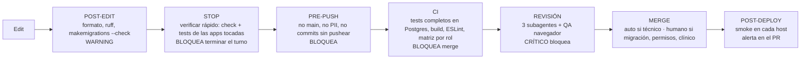

# 14 · Workflow futuro: de requerimiento a producción

> Este documento cubre las fases 10 (paralelización), 17 (shift left), 18 (autonomía), 19 (workflow), 20 (Definition of Done) y 21 (quality gates) del encargo.
> Punto de partida medido: ~16 PR por semana, mediana de 8 minutos de PR abierto a merge, ~31 % de PR que son correcciones, ningún gate fuera del CI, `CLAUDE.md` como bitácora (ver [02-evolution.md](02-evolution.md)).

---

## 1. Workflow actual vs propuesto

---

## 2. Etapas, actores y artefactos (FASE 19)

| # | Etapa | Actor | Artefacto | Gate de salida |
|---|---|---|---|---|
| 1 | **Requirement intake** | HUMAN (Max) → MAIN CLAUDE | Pedido (texto o audio transcrito) | — |
| 2 | **Discovery** | SUBAGENT `explorador-dominio` + SCRIPT `mapa.py` | Mapa de impacto ≤40 líneas | Lista de archivos y consumidores |
| 3 | **Impact analysis** | MAIN CLAUDE (skill `feature`) | Brief `docs/features/<slug>.md` con criterios de aceptación, matriz de rol, datos sensibles, decisiones pendientes | Brief completo; decisiones clasificadas |
| 4 | **Aprobación** | HUMAN, **solo si** hay decisiones de la columna HUMAN APPROVAL (§5) | Respuesta única de Max | Decisiones cerradas |
| 5 | **Architecture** | MAIN CLAUDE | Contrato de API (request, response, permisos) y esquema de datos si cambia | Esquema aprobado si hay migración (regla de `CLAUDE.md` §2b) |
| 6 | **UX** | MAIN CLAUDE + skill `criterio-de-diseno` si es visual | Estados de UI en el brief (vacío, carga, error, mucho dato, móvil), destructivos identificados | Checklist de [04-human-factors.md](04-human-factors.md) §6 marcado en el brief |
| 7 | **Implementation** | MAIN CLAUDE en worktrees (backend y frontend en paralelo si hay contrato) + HOOKS post-edit | Código + tests | Hooks verdes |
| 8 | **Testing** | MAIN CLAUDE escribe; SCRIPT `verificar.ps1` corre; SUBAGENT `verificador-regresion` aísla fallos | Tests unitarios + matriz por rol + transiciones | `verificar` verde |
| 9 | **Regression** | SKILL `qa-navegador` + SUBAGENT `revisor-ux` + SUBAGENT `revisor-seguridad-datos` (en paralelo) | Reporte de QA con capturas; hallazgos con severidad | 0 CRÍTICO; ALTO resuelto o justificado |
| 10 | **Documentation** | MAIN CLAUDE | `docs/<dominio>.md` solo si cambió una regla; rule por ruta si nace un invariante. **No** `CLAUDE.md` | — |
| 11 | **Release readiness** | SKILL `pr` + CI + HOOK pre-push | PR con DoD marcado, migración y rollback descritos | CI verde, sin commits sin pushear |
| 12 | **Merge y deploy** | Auto-merge (técnico) o HUMAN (migraciones, datos clínicos, permisos) | Merge → Railway | — |
| 13 | **Post-deploy** | SCRIPT `smoke.ps1` (o job de CI) | 200 en cada host y endpoints clave | Si falla: alerta en el PR, nunca por WhatsApp (decisión vigente de Max) |
| 14 | **Final report** | MAIN CLAUDE | 10 líneas: qué cambió, qué se verificó, qué queda, qué decidió Claude solo | — |

---

## 3. Paralelización (FASE 10)

### 3.1 Mapa de dependencias de una feature típica

### 3.2 Clasificación

| Trabajo | Clasificación | Condición |
|---|---|---|
| Brief, plan de QA, explorador | **PARALLEL SAFE** | Solo leen |
| Backend y frontend de la misma feature | **PARALLEL WITH CONTRACT** | Contrato de API escrito y congelado antes; frontend con mocks del contrato |
| Doc de dominio y código | **PARALLEL WITH CONTRACT** | La doc describe el contrato, no la implementación |
| Los tres revisores + QA de navegador | **PARALLEL SAFE** | Sobre el mismo commit |
| Dos features en apps distintas | **PARALLEL SAFE** | Worktrees separados; **sin** editar `CLAUDE.md` (hoy es el punto de conflicto garantizado) |
| Dos features que tocan `App.jsx` | **PARALLEL WITH CONTRACT** hoy (conflictos casi seguros); **SAFE** cuando `App.jsx` esté partido por módulo |
| Dos features que tocan el mismo modelo | **MUST BE SEQUENTIAL** | Migraciones encadenadas |
| Migración → datos → pantalla que depende de los datos | **MUST BE SEQUENTIAL** | — |
| Cambios en `respaldo.py`, `settings.py`, `urls.py` | **MUST BE SEQUENTIAL** hoy (listas a mano, hotspots) | Pasan a SAFE si se derivan |
| PR apilados (Email 1.0) | Revisión **paralela**, merge **secuencial** | Hoy se mergean en serie sin revisión; el valor del apilado se pierde |

### 3.3 Lo que hoy impide el paralelismo

1. `App.jsx` (16.075 líneas, tocado en el 60 % de los commits).
2. `CLAUDE.md` editado en cada PR.
3. Listas a mano: `core/respaldo.py` (`APPS`), `config/urls.py` (61 cambios).
4. Sin contrato de API escrito: el frontend descubre el backend al integrarse (#125: "el panel no mostraba lo que la API ya devolvía").
5. Coordinación de worktrees por memoria (que no se carga) en vez de por script.

---

## 4. Shift left (FASE 17)

| Problema | Hoy se detecta | Debería detectarse | Mecanismo |
|---|---|---|---|
| UX con fricción (destructivos, modales, toasts) | Producción, con el equipo | Brief | Checklist de estados en el brief + `revisor-ux` |
| Permisos rotos o fugas | Un rol ve 500; o nunca | Editar `api.py` | Test de matriz por rol + `revisor-seguridad-datos` |
| Migración incompatible | CI | Editar `models.py` | Hook post-edit `makemigrations --check` |
| Tabla fuera del respaldo | CI | Crear el modelo | Lista derivada |
| Fuente de verdad duplicada | Producción (cifras raras) | Discovery | `fuente-unica` + guard |
| Host / proveedor | Producción caída | Minuto 1 tras deploy | Smoke post-deploy |
| PII en archivo | Revisión posterior | Al escribir | Hook PreToolUse |
| Desfase API ↔ pantalla | Producción | Contrato | Contrato + test del payload |
| Documentación falsa | Semanas después | No existe | Registro generado; `CLAUDE.md` sin bitácora |
| Commits que no llegan a `main` | Días después | Al pedir merge | Hook pre-merge + auto-merge |
| N+1 / payload pesado | Queja del equipo | Test | `assertNumQueries` en listas + paginación por defecto |

---

## 5. Autonomía (FASE 18)

| Nivel | Decisiones | Ejemplos de este repo |
|---|---|---|
| **CLAUDE CAN DECIDE** (técnicas, reversibles) | Nombres, estructura interna, refactor local, tests, extraer componente, índices, arreglar un bug con test, mensajes de error, estilos dentro de los tokens, orden de commits, crear worktree, correr scripts | Partir un componente de `App.jsx`; crear `useRecurso`; añadir `assertNumQueries`; arreglar el toast |
| **CLAUDE DECIDES + REPORTS** (reversibles, con impacto visible) | Cambios de UX dentro del checklist; nuevos endpoints de lectura; dependencias de desarrollo; agregar confirmación a un destructivo; deprecar un campo legado sin borrarlo; abrir PR apilados | Añadir confirmación a cancelar cita; bloquear el botón de cobro mientras guarda |
| **HUMAN APPROVAL** (negocio, arquitectura crítica, riesgo) | Migraciones de esquema; cambiar la matriz de permisos; reglas de negocio (qué es sesión, alta, abandono, precios, liquidación); cualquier cosa con datos clínicos o de menores; textos legales y consentimientos; integraciones nuevas con terceros; enviar comunicaciones a pacientes; merge a producción de lo anterior; elegir stack de la fábrica | Fase 2 de continuidad; DP-xx; Faro e informes a familias; Email 1.0 activado |
| **ALWAYS BLOCK** (destructivo o peligroso) | Push directo a `main`; `--force` a ramas compartidas; escribir en la BD de producción; borrar datos de pacientes; fusionar pacientes en masa; leer `.env`; escribir PII en repo, docs o chat; mandar WhatsApp o correo real desde desarrollo; que un LLM escriba campos clínicos (`riesgo`, DP, alta) sin revisión humana; desactivar hooks o tests para que pase el CI | `fusionar_por_telefono` masivo; datos reales en seeds; Eli escribiendo `Paciente.riesgo` |

**Cómo reduce el ping-pong:** todas las preguntas de HUMAN APPROVAL se juntan en el brief y se hacen **una vez**. Todo lo demás se ejecuta y se reporta al final. Hoy las preguntas aparecen a lo largo de la sesión.

---

## 6. Definition of Done (FASE 20)

### FEATURE
- [ ] Brief con criterios de aceptación cumplidos uno por uno.
- [ ] Tests: servicio, API, **matriz por rol** del endpoint nuevo, transiciones si hay estados.
- [ ] `verificar.ps1` verde (check, migraciones, tests, build, lint sin avisos nuevos).
- [ ] `qa-navegador` en 390 y 1366 px, por cada rol afectado, consola limpia.
- [ ] Checklist de factores humanos: destructivos confirmados, modales que no pierden datos, toasts con tipo, guardado bloqueado, estados vacío/carga/error.
- [ ] Accesibilidad mínima: labels asociados, Escape y foco en modales, contraste ≥4,5:1 en texto.
- [ ] Listas con paginación o `assertNumQueries`.
- [ ] `revisor-seguridad-datos` sin CRÍTICO.
- [ ] Doc de dominio actualizado **solo si** cambió una regla; nada en `CLAUDE.md`.
- [ ] PR con DoD marcado, cómo probar y capturas.

### BUGFIX
- [ ] Test que reproduce el bug y falla antes del arreglo.
- [ ] `fuente-unica`: si la causa es una noción duplicada, se listan **todos** los consumidores y se arreglan juntos (lección de "sesión N").
- [ ] `verificar.ps1` verde.
- [ ] Si fue reportado por alguien del equipo, el PR cita a quién avisar.

### NEW MODULE
- [ ] Creado desde el template T1 ([11-templates.md](11-templates.md)).
- [ ] Aislamiento por tenant probado.
- [ ] Matriz de rol declarada en `docs/permisos.md` y probada.
- [ ] En el respaldo (automático si la lista es derivada).
- [ ] `docs/<app>.md` ≤1 página + `.claude/rules/<app>.md` ≤30 líneas.
- [ ] Variables de entorno nuevas en `.env.example`.

### DATABASE CHANGE
- [ ] Esquema aprobado por Max antes de migrar.
- [ ] `makemigrations --check` limpio; migración probada en **Postgres** (hoy CI usa SQLite).
- [ ] Migraciones de datos con `RunPython` reversible o explicación de por qué no.
- [ ] Rollback descrito en el PR.
- [ ] Respaldo de producción previo verificado.

### UX CHANGE
- [ ] Checklist de factores humanos completo.
- [ ] Capturas antes/después en el PR.
- [ ] `revisor-ux` sin severidad alta abierta.
- [ ] Manual operativo actualizado si cambia una tarea frecuente.

### RELEASE
- [ ] CI verde en `main`.
- [ ] Smoke post-deploy verde en todos los hosts.
- [ ] Banderas (feature flags) documentadas: qué está apagado y quién lo enciende.
- [ ] Reporte final con lo que el equipo debe saber.

---

## 7. Quality gates (FASE 21)

| Gate | Bloquea automáticamente | Costo estimado |
|---|---|---|
| Post-edit | No (aviso) | segundos |
| Stop | Sí (no se declara terminado) | 1–3 min con tests de las apps tocadas |
| Pre-push | Sí | segundos |
| CI | Sí (protección de rama) | ~25 min hoy (suite completa); bajar con tests en paralelo cuando se estabilicen |
| Revisión | Solo CRÍTICO | minutos, en paralelo |
| Merge | Humano en los casos de §5 | — |
| Post-deploy | No bloquea; alerta | segundos |

Detalle de cada hook y script en [10-hooks-and-scripts.md](10-hooks-and-scripts.md).
