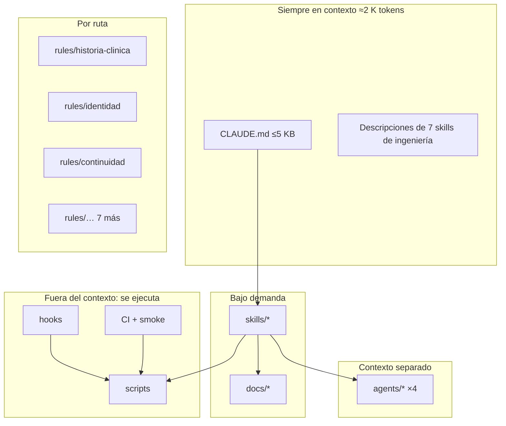

# 15 · Arquitectura propuesta de Claude Code (`.claude/` y alrededores)

> Estado actual verificado: `.claude/` del repo contiene **50 skills de marketing** (ignoradas por git, duplicadas en el perfil global) y `product-marketing.md` (40,8 KB). No hay `settings.json` de proyecto, ni hooks, ni agentes, ni comandos, ni rules. El único hook global es texto a voz. `CLAUDE.md` pesa 85,7 KB y el 93 % es bitácora. Las sesiones se lanzan desde `C:\Users\mirai`, así que la memoria del repo no se carga.
> Nada de esto se implementa en esta fase.

---

## 1. Principio de diseño

**Cada tipo de conocimiento va al mecanismo que lo carga solo cuando hace falta, y lo que puede verificarse no se escribe: se ejecuta.**

| Tipo de conocimiento ([06-context-audit.md](06-context-audit.md) §4) | Mecanismo | Cuándo entra al contexto |
|---|---|---|
| Permanente | `CLAUDE.md` ≤5 KB | Siempre |
| Por dominio | `.claude/rules/<dominio>.md` con `paths:` | Al tocar archivos del dominio |
| Por feature | `docs/<dominio>.md`, `docs/features/<slug>.md` | Cuando la skill lo pide |
| Procedimiento con juicio | `.claude/skills/<nombre>/SKILL.md` | Al invocar la skill (solo su descripción está siempre) |
| Procedimiento determinista | `scripts/*` | Nunca: se ejecuta y devuelve el resultado |
| Comprobación obligatoria | Hooks en `.claude/settings.json` + CI | Nunca: bloquea o avisa |
| Revisión con mirada independiente | `.claude/agents/<nombre>.md` | En su propio contexto |
| Temporal | Issues, PR | Nunca |

---

## 2. Estructura propuesta

```text
itaca-conversemos/
├── CLAUDE.md                      ≤5 KB · permanente
├── .claude/
│   ├── settings.json              hooks + permisos del proyecto (versionado)
│   ├── rules/                     conocimiento por dominio, cargado por ruta
│   │   ├── historia-clinica.md    paths: pacientes/**  (auditoría, sin URL pública, quién edita)
│   │   ├── identidad.md           paths: leads/identidad.py, pacientes/duplicados.py, pacientes/fusion.py
│   │   ├── continuidad.md         paths: core/continuidad*.py, continuidad/**
│   │   ├── mensajeria.md          paths: mensajes/**, core/whatsapp_cloud.py
│   │   ├── correo.md              paths: correo/**
│   │   ├── sitio-rutas.md         paths: frontend/src/main.jsx, frontend/src/rutas.js, frontend/src/Sitio.jsx, core/seo.py
│   │   ├── finanzas.md            paths: finanzas/**
│   │   ├── faro.md                paths: faro/**
│   │   ├── permisos.md            paths: **/api.py, **/serializers.py, core/permisos.py
│   │   └── frontend-ui.md         paths: frontend/src/**  (componentes base, tokens, checklist de factores humanos)
│   ├── skills/
│   │   ├── feature/SKILL.md
│   │   ├── qa-navegador/SKILL.md
│   │   ├── pr/SKILL.md
│   │   ├── nueva-app/SKILL.md
│   │   ├── permisos-por-rol/SKILL.md
│   │   ├── fuente-unica/SKILL.md
│   │   └── prod-solo-lectura/SKILL.md
│   ├── agents/
│   │   ├── explorador-dominio.md
│   │   ├── revisor-seguridad-datos.md
│   │   ├── revisor-ux.md
│   │   └── verificador-regresion.md
│   └── hooks/                     scripts que llaman los hooks de settings.json
│       ├── bloquear-main.ps1
│       ├── bloquear-pii.ps1
│       ├── post-edit.ps1
│       └── stop-verificar.ps1
├── scripts/                       determinista, sin IA
│   ├── dev.ps1  test.ps1  verificar.ps1  qa-entorno.ps1
│   ├── mapa.py  matriz-permisos.py  env-check.py  smoke.ps1
│   ├── changelog.py  nuevo-worktree.ps1
├── docs/
│   ├── glosario.md                nociones de dominio y su función única
│   ├── permisos.md                matriz esperada endpoint × rol
│   ├── identidad.md               persona, contacto, tutor, duplicados
│   ├── <dominio>.md               continuidad, correo, faro, mensajeria, sitio…
│   └── features/<slug>.md         briefs
└── .github/
    ├── workflows/tests.yml        + Postgres, ESLint, matriz por rol
    ├── workflows/smoke.yml        post-deploy
    └── pull_request_template.md   Definition of Done
```

**Fuera del repo** (perfil del usuario y fábrica):

```text
~/.claude/
├── CLAUDE.md                      reglas personales transversales: tuteo peruano, "la Psicóloga Mirai", no leer .env, no alertas por WhatsApp
├── skills/                        solo método personal: criterio-de-diseno, listo-para-produccion, cuidar-uso-semanal
└── (marketing → carpeta propia, p. ej. C:\marketing\.claude\skills)

itaca-factory/                     repo de la fábrica (ver 16-system-factory.md)
├── template/                      Copier template del proyecto (incluye la .claude/ de arriba con huecos)
├── packages/core-py, core-ui      paquetes versionados
└── specs/                         identidad, agenda, mensajería, consentimiento… + tests de contrato
```

---

## 3. Ficha de cada pieza

| Pieza | PURPOSE | WHY IT EXISTS (evidencia) | WHAT IT CONTAINS | WHEN LOADED | WHO USES IT |
|---|---|---|---|---|---|
| `CLAUDE.md` | Invariantes y cómo trabajar | Hoy 85 KB, 7 % útil, partes falsas | ≤5 KB: qué es, apps, invariantes, comandos, mapa de docs/rules, "no bitácora aquí" | Siempre | Toda sesión y el Action `claude.yml` |
| `settings.json` | Hooks y permisos versionados | 0 hooks de ingeniería; `allow: []` global | Hooks de §4; permisos `allow` para scripts de lectura y tests, `deny` para `git push origin main`, lectura de `.env` | Al iniciar | Harness |
| `rules/*.md` | Reglas por dominio | 46 ítems de bitácora contienen ~20 invariantes reales enterrados | ≤30 líneas cada una: invariantes, trampas conocidas, comando de test del dominio, puntero a `docs/` | Al tocar las rutas declaradas | Claude principal y subagentes |
| `skills/feature` | Flujo de feature | Secuencia reinventada; ~31 % de arreglos | Ver [08-skills.md](08-skills.md) | Al invocar | Claude principal |
| `skills/qa-navegador` | QA reproducible | Receta en 6 ítems + script fuera del repo | Ídem | Al invocar | Claude, `feature` |
| `skills/pr` | Cierre consistente | 87/339 commits con convención; #71 | Ídem | Al invocar | Claude |
| `skills/nueva-app` | Esqueleto de app | 3 olvidos del respaldo | Ídem | Al invocar | Claude |
| `skills/permisos-por-rol` | Auditar acceso | Fugas confirmadas | Ídem | Al invocar o al tocar `api.py` | Claude, `revisor-seguridad-datos` |
| `skills/fuente-unica` | Una noción, una función | "Sesión N" ×8 PR | Ídem | Al invocar | Claude |
| `skills/prod-solo-lectura` | Consultar producción sin riesgo | Receta en memoria no cargada | Ídem | Al invocar, con aprobación | Claude |
| `agents/*` | Contexto separado | Ver [09-agents.md](09-agents.md) | Prompt, herramientas permitidas, formato de salida | Al delegar | Claude principal |
| `hooks/*` | Comprobaciones que no dependen de memoria | Ver [10-hooks-and-scripts.md](10-hooks-and-scripts.md) | Scripts PowerShell cortos | Eventos del harness | Harness |
| `scripts/*` | Razonamiento que no necesita IA | Ritual "Verificado: …" en 16 ítems | Ver doc 10 | Al ejecutarse | Claude, hooks, CI, Max |
| `docs/glosario.md` | Definición única de cada noción | "Realizada" en 11 lugares; 4 representaciones de continuidad | Noción → función que la calcula → test | Bajo demanda | Claude, `fuente-unica` |
| `docs/permisos.md` | Matriz esperada | 3 mecanismos mezclados | Tabla endpoint × rol × acción | Bajo demanda, y la lee el test | CI, `permisos-por-rol` |
| `.github/pull_request_template.md` | DoD visible | 129 PR sin plantilla | DoD de [14-future-workflow.md](14-future-workflow.md) §6 | Al abrir PR | Claude, Max |

---

## 4. Hooks del harness (resumen; detalle en doc 10)

| Evento | Hook | Bloquea |
|---|---|---|
| `PreToolUse` (Bash) | `bloquear-main.ps1`: rechaza `git push` a `main`, `--force`, `git checkout` en la carpeta principal si hay otro agente | Sí |
| `PreToolUse` (Write/Edit/Bash) | `bloquear-pii.ps1`: rechaza `.xlsx`, `datos_pacientes_reales*`, exportes de pacientes, teléfonos o DNI en `docs/`, `.claude/`, `CLAUDE.md`; rechaza leer `.env` | Sí |
| `PreToolUse` (Edit en `CLAUDE.md`) | Aviso: "¿es una regla permanente? si es registro, va al PR" | No |
| `PostToolUse` (Edit en `*.py`) | `ruff format` + `ruff check` del archivo; si es `models.py`, `makemigrations --check --dry-run` | No (avisa) |
| `PostToolUse` (Edit en `frontend/src/**`) | ESLint del archivo | No |
| `Stop` | `stop-verificar.ps1`: `manage.py check` + tests de las apps tocadas | Sí, si hay cambios sin verificar |

---

## 5. Diagrama



---

## 6. Migración desde lo actual (orden sugerido, sin implementar)

1. Lanzar Claude desde `C:\projects\itaca-conversemos` para trabajo de ingeniería (recupera la memoria del repo).
2. Mover las skills de marketing a una carpeta de marketing; quitar el plugin `cloudflare` si no se usa.
3. Escribir `scripts/test.ps1` y `scripts/verificar.ps1` (lo que hoy está en el ítem 42 y en 16 "Verificado").
4. Hooks `bloquear-main` y `bloquear-pii`.
5. Reescribir `CLAUDE.md` a ≤5 KB; mover ítems a `docs/<dominio>.md` y los invariantes a `rules/`. **Hacerlo después de mergear #127/#139**, que también editan `CLAUDE.md`.
6. Skills `pr`, `qa-navegador`, `feature`, en ese orden (cada una usa la anterior).
7. Agentes de revisión.
8. Extraer `.claude/` + `scripts/` + CI como parte del template de la fábrica.
