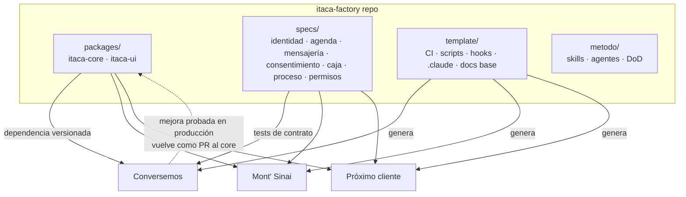
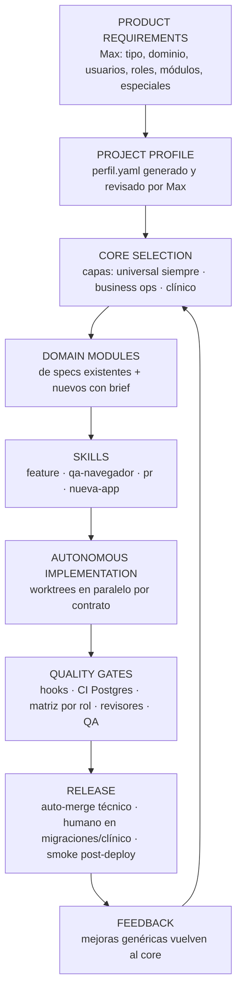
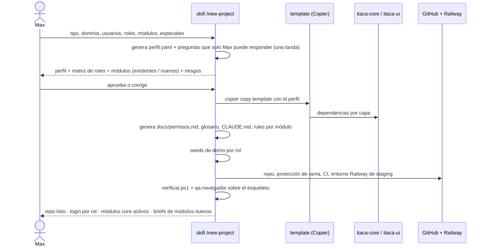

# 16 · ITACA SOFTWARE FACTORY V1 (diseño conceptual)

> No se implementa nada en esta fase. Este documento responde dos preguntas: **cómo debería nacer el próximo sistema** y **qué debe vivir fuera de Conversemos**.
> Evidencia de partida: 8 sistemas y 14 bots en `C:\projects`, construidos en 3 stacks; reutilización por copia de repos con drift medido ([07-reusable-core.md](07-reusable-core.md)); 0 piezas de ingeniería en `.claude/`; un único proyecto con CI de tests.

---

## 1. Qué es la fábrica

No es un framework. Son **cuatro artefactos versionados** más un procedimiento:

| Artefacto | Contenido | Formato |
|---|---|---|
| **1. Core** | Paquetes con las piezas de las capas Universal, Business Ops y Clínica | Paquete Python (`itaca-core`) y paquete React (`itaca-ui`), o los equivalentes del stack elegido |
| **2. Specs de dominio** | Identidad, agenda, mensajería, consentimiento, caja, proceso con eventos, permisos, glosario. Cada una con su batería de tests de contrato | Markdown + tests, independientes del stack |
| **3. Template de proyecto** | Esqueleto del repo con CI, scripts, hooks, `.claude/` mínimo, plantilla de PR, `docs/` base | Copier (permite traer mejoras del template a proyectos existentes) |
| **4. Método** | Skills `feature`, `qa-navegador`, `pr`, `nueva-app`, `permisos-por-rol`, `fuente-unica`; agentes de revisión; Definition of Done | Dentro del template y en el perfil de Max |
| **Procedimiento** | `/new-project` (ver §5) | Skill |

---

## 2. Flujo de la fábrica

| Paso | Qué produce | Quién decide |
|---|---|---|
| PRODUCT REQUIREMENTS | Formulario de 10 preguntas | Max |
| PROJECT PROFILE | `perfil.yaml`: stack, capas, roles, módulos, sedes, integraciones, datos sensibles, idioma, zona horaria, marca | Claude propone, **Max aprueba** |
| CORE SELECTION | Dependencias y apps activadas | Determinista desde el perfil |
| DOMAIN MODULES | Por cada módulo: ¿hay spec? → se instala; ¿no hay? → brief nuevo | Claude; Max aprueba los nuevos |
| SKILLS | Ya vienen en el template | — |
| AUTONOMOUS IMPLEMENTATION | Features según [14-future-workflow.md](14-future-workflow.md) | Claude dentro de los niveles de autonomía |
| QUALITY GATES | Ver [10-hooks-and-scripts.md](10-hooks-and-scripts.md) | Automático |
| RELEASE | Deploy + smoke + manual operativo generado | Max en lo de HUMAN APPROVAL |

---

## 3. Qué vive dónde

### Fuera de Conversemos (en la fábrica)

| Pieza | Destino | Por qué |
|---|---|---|
| Auth, throttle, ojito, tenant, RBAC declarativo + test de matriz, auditoría, respaldo derivado, fecha de negocio | `itaca-core` | Reconstruido en 8 de 8 sistemas |
| Componentes UI base (Modal, Campo, Toast, Confirm, useRecurso, BotónGuardar, SelectorPersona, Tabla, BarraFiltros, tokens) | `itaca-ui` | No existen hoy en ningún sistema como paquete; 40 modales a mano solo en Conversemos |
| Cliente de mensajería WhatsApp (Evolution + Meta) con "aceptado ≠ entregado" | `itaca-core.mensajeria` | ~17 clientes distintos |
| Correo con consentimiento (Brevo) | `itaca-core.correo` | La mejor app del repo; nadie más la tiene |
| Agenda + slots + bloqueos + reserva pública | `itaca-core.agenda` | ≥7 reconstrucciones |
| Persona + identidad + duplicados + fusión | `itaca-core.identidad` + spec | La lección más cara |
| Caja, paquetes, liquidación | `itaca-core.caja` (fusionando lo mejor de Conversemos, Mont' Sinai y el modelo de Aldanna) | ≥7 |
| Máquina de proceso con eventos | `itaca-core.proceso` | Patrón de `continuidad` |
| Historia clínica auditada, adjuntos privados, consentimiento informado, instrumentos | `itaca-core.clinico` | Capa clínica |
| Template, scripts, hooks, `.claude/`, CI | `itaca-factory/template` | 8 arranques distintos |
| Specs + glosario | `itaca-factory/specs` | Sirven a cualquier stack |

### Se queda en Conversemos

DP-01…16, bloque de 6 y S3, Dirección Clínica, Faro, Brújula, Mentalidad Ítaca, gamificación, `espacios`, KPIs de gerencia a medida, textos, marca, contenido del sitio, configuración de sedes y psicólogos.

### Template vs paquete

| Va al **template** (se copia una vez y el proyecto lo adapta) | Va al **paquete** (se instala y se actualiza por versión) |
|---|---|
| `CLAUDE.md` base, rules de ejemplo, CI, scripts, plantilla de PR, `docs/` base, estructura de carpetas, `settings_test.py`, seeds de demo | Lógica con reglas de negocio genéricas que **debe** recibir arreglos: auth, RBAC, tenant, respaldo, mensajería, correo, agenda, identidad, caja, componentes UI |

**Regla:** si un arreglo en una pieza debería llegar a todos los clientes (seguridad, bugs de dominio), es paquete. Si cada proyecto la va a modificar a su gusto, es template.

---

## 4. Decisión de stack (de Max, no de Claude)

| A favor de **Django + React** | A favor de **Next.js** |
|---|---|
| El sistema más maduro de la agencia es Django: Conversemos, 41 k LOC, 1.043 tests, CI, respaldo con restauración | Los 4 sistemas más nuevos (Aldanna, Life, Bonos, Notaluma, ago–set 2026) son Next |
| Tres sistemas en producción con datos clínicos dependen de Django | El modelo de datos más genérico de negocio de servicios es el Prisma de Aldanna (Business→Branch, RBAC Role/Permission, CashShift, Commission, AuditLog, IdempotencyKey) |
| Admin, migraciones con `--check`, ORM con aislamiento: auditables | La familia Next ya practica "motor + piel" (`lib/marca.ts`) |
| La lógica clínica (auditoría, Ley 29733) está probada ahí | `listo-para-produccion` y `criterio-de-diseno` están escritas pensando en Next |
| En contra: frontend monolítico; React sin componentes compartidos | En contra: dos sub-stacks (Prisma y Supabase); casi sin tests formales; Life y Bonos ya se copiaron entre sí |

**Lo que no depende de la decisión:** las specs, el template de método (`.claude/`, DoD, skills, agentes), los scripts de verificación (con su equivalente por stack) y los componentes de UI (React en ambos casos).

**Recomendación de proceso:** elegir **un** stack para clínico/back-office y congelar el otro para proyectos existentes. Mantener dos cores duplica exactamente el problema que la fábrica quiere resolver.

---

## 5. `/new-project` (FASE 24, diseño)

### Input humano

| Pregunta | Ejemplo |
|---|---|
| Tipo de producto | back-office clínico / centro de servicios / SaaS de profesionales |
| Dominio | estética, gastroenterología, gimnasio, psicología |
| Usuarios y roles | dueña, recepción, profesional, caja, analista |
| Sedes | 1 / varias |
| Módulos | agenda, caja, clientes, historia clínica, campañas… |
| Integraciones | WhatsApp (Evolution / Meta), correo, pagos, calendario |
| Datos sensibles | clínicos, menores, financieros |
| Requerimientos especiales | facturación electrónica, membresías, tamizajes |
| Marca | colores, tipografía, tono |
| Despliegue | Railway / Vercel / VPS |

### Output

| Producto | Contenido |
|---|---|
| Arquitectura | `docs/arquitectura.md` generado desde el perfil + diagrama |
| Stack inicial | Del template elegido |
| Roles y auth | Matriz en `docs/permisos.md` + tests generados |
| Estructura | Apps del core activadas + apps vacías desde template T1 para módulos nuevos |
| DB base | Migraciones del core |
| Componentes | `itaca-ui` + tokens con la marca |
| QA | Seeds por rol, `qa-entorno`, matriz de permisos, smoke |
| Documentación | `CLAUDE.md` ≤5 KB, rules, glosario, briefs de módulos nuevos |
| Configuración Claude | `.claude/` completo del template |

### Qué NO genera

Reglas de negocio nuevas, textos legales, decisiones clínicas, precios. Esos quedan como **briefs pendientes de Max**.

---

## 6. Cómo llegar desde hoy (sin romper lo que funciona)

1. **No** reescribir Conversemos. Extraer piezas **cuando el siguiente proyecto las necesite**, empezando por las más reconstruidas (mensajería, auth+RBAC, UI base, respaldo).
2. Cada pieza extraída se instala de vuelta en Conversemos (y en Mont' Sinai) como dependencia, con sus tests.
3. El template nace del `.claude/` + `scripts/` + CI que primero se prueben en Conversemos (fase P0 del roadmap).
4. Las specs se escriben a partir de las lecciones caras (identidad, sesión N, aceptado ≠ entregado), **antes** que el código.

---

## 7. Respuesta a la pregunta principal

> *Si mañana Max empieza otro sistema, ¿qué partes del trabajo de Conversemos jamás deberían volver a diseñarse, explicarse, programarse, descubrirse, probarse o documentarse desde cero?*

| Verbo | Qué no se repite | Cómo se garantiza |
|---|---|---|
| **Diseñar** | Capas, modelo de tenant, RBAC, identidad, agenda, proceso con eventos, caja | Specs + core |
| **Explicar** | Cómo trabajar, invariantes, Ley 29733, convenciones | `CLAUDE.md` base + rules del template |
| **Programar** | Auth, permisos, respaldo, mensajería, correo, agenda, UI base | Paquetes |
| **Descubrir** | El teléfono no identifica; sesión N se deriva; aceptado ≠ entregado; fecha del servidor; sede es filtro; nada clínico a terceros | Specs con tests de contrato |
| **Probar** | Matriz por rol, aislamiento por tenant, respaldo completo, smoke, QA por rol | Tests del core + scripts + skills |
| **Documentar** | Manual de recepción, permisos, glosario, changelog | Generadores (`manual-operativo`, `changelog.py`, `mapa.py`) |
