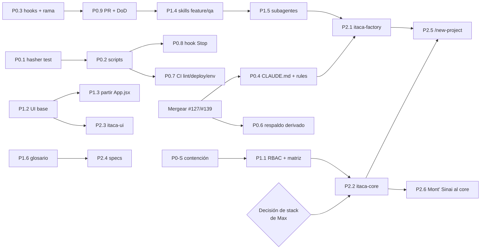

# 18 · Roadmap P0 / P1 / P2

> Criterios. **P0**: máximo impacto con riesgo bajo o medio; casi todo es tooling y no toca lógica de negocio. **P1**: impacto alto, requiere diseño. **P2**: optimización avanzada.
> **Principio anti-sobreingeniería:** cada iniciativa tiene que mover una métrica de [17-metrics.md](17-metrics.md) en dos meses; si no, se retira.
> **Antes de todo:** hay riesgos vivos en producción que no son de "fábrica" pero que no pueden esperar. Van como **P0-S (contención)** y requieren aprobación de Max porque tocan código productivo.

---

## P0-S · Contención en producción (decisión de Max, esta semana)

| # | Iniciativa | Evidencia | IMPACT | EFFORT | RISK | DEPENDENCIES | EXPECTED BENEFIT |
|---|---|---|---|---|---|---|---|
| S1 | Mergear #138 (`ALLOWED_HOSTS` con el dominio de Railway) | El host `.up.railway.app` respondía 400 tras separar dominios (1 oct) | Alto | Muy bajo | Bajo | — | Sistema accesible por todos los hosts |
| S2 | Acotar `AdjuntoViewSet` por rol | Psicólogo y comercial pueden descargar adjuntos clínicos de cualquier paciente (`pacientes/api.py:935`) | **Crítico** | Bajo | Bajo | Test por rol | Cierra fuga de historia clínica |
| S3 | Ocultar tokens de firma de consentimiento y contacto a roles sin contacto | `pacientes/consentimiento.py:92`, `leads/serializers.py:66`, `mensajes/api.py:21` | **Crítico** | Bajo | Bajo | — | Nadie firma en nombre del paciente |
| S4 | Separar el token de integración por uso y compararlo en tiempo constante | Un solo `ITACA_INTEGRACION_TOKEN` abre volcado completo, escritura clínica y envíos; comparado con `==` | **Crítico** | Medio | Medio (coordinar con Eli/kira-bot) | Despliegue coordinado | Reduce el radio de una filtración |
| S5 | Que Eli deje de escribir `Paciente.riesgo` con salida de LLM | `core/integraciones.py:151-171, 514-516`; ese campo decide la exclusión de correo | **Alto (clínico)** | Bajo | Bajo | Decisión clínica de quién marca riesgo | Ningún campo clínico escrito por IA sin revisión |
| S6 | `CobroViewSet` con alcance por rol; webhook de Meta con verificación de firma y sin PII en log | `finanzas/api.py:120`; webhook de Meta | Alto | Bajo | Bajo | — | — |
| S7 | Mergear #118 (sede normalizada en `instancia_para`) | Alerta de Faro con sede "Lima" sale por la línea de respaldo | Medio | Muy bajo | Bajo | — | Alertas por la línea correcta |
| S8 | Confirmación al cancelar una cita desde el desplegable | `App.jsx:7647, 8119`; la confirmación se perdió en `ed5c439` | Alto (operación diaria) | Bajo | Bajo | — | Evita cancelaciones accidentales |

---

## P0 · Fábrica: máximo impacto, bajo riesgo (2–3 semanas)

| # | Iniciativa | IMPACT | EFFORT | RISK | DEPENDENCIES | EXPECTED BENEFIT |
|---|---|---|---|---|---|---|
| P0.1 | **Hasher de contraseñas rápido solo en tests** | **Muy alto**: suite de >55 min a 112 s; habilita hooks y verificación continua | Muy bajo (1 archivo) | Muy bajo | — | Verificar deja de ser caro; CI ~8 → ~3 min (HIPÓTESIS) |
| P0.2 | `scripts/test.ps1` + `scripts/verificar.ps1` (con ESLint contra baseline) | Alto | Bajo | Bajo | P0.1 | Fin del ritual "Verificado: …" en 16 ítems; resultado binario |
| P0.3 | Hooks `bloquear-main` + `bloquear-pii` + protección de rama `main` + auto-merge tras CI | Alto | Bajo | Bajo | — | Producción y Ley 29733 protegidas sin depender de memoria; fin de commits que no llegan a `main` |
| P0.4 | `CLAUDE.md` ≤5 KB + `.claude/rules/` por dominio + ítems a `docs/<dominio>.md` | **Muy alto** en contexto (−19 K tokens por sesión) y precisión | Medio | Bajo | Mergear antes #127/#139 (también editan `CLAUDE.md`) | Contexto verdadero; fin del conflicto de merge garantizado |
| P0.5 | Sacar las 50 skills de marketing del perfil de ingeniería; lanzar Claude desde el repo; limpiar memoria | Alto (−7 K tokens en **todos** los proyectos) | Muy bajo | Muy bajo | — | Selección de skills útil; memoria del repo vuelve a cargarse |
| P0.6 | Respaldo derivado de `apps.get_models()` | Medio | Bajo | Bajo | Resolver el conflicto `APPS` con la rama DC | Fin de "tablas fuera del respaldo" |
| P0.7 | ESLint, `check --deploy` y `env-check` en CI | Medio | Bajo | Bajo | P0.2 | `DEBUG` y `SECRET_KEY` inseguros detectados; 56 vs 23 variables |
| P0.8 | Hook `Stop` con `verificar -Rapido` | Alto | Bajo | Bajo | P0.1, P0.2 | "Terminado" = verificado |
| P0.9 | Plantilla de PR con Definition of Done + skill `pr` | Medio | Bajo | Bajo | P0.3 | Done explícito; registro fuera de `CLAUDE.md` |
| P0.10 | Smoke post-deploy (job de CI) | Medio | Bajo | Bajo | — | Caídas como la del 1 oct detectadas en minutos |

---

## P1 · Impacto alto, requiere diseño (1–2 meses)

| # | Iniciativa | IMPACT | EFFORT | RISK | DEPENDENCIES | EXPECTED BENEFIT |
|---|---|---|---|---|---|---|
| P1.1 | **RBAC declarativo + test de matriz endpoint × rol** (`docs/permisos.md` como fuente) | Muy alto | Medio | Medio (puede cambiar comportamiento visible) | P0-S; aprobación de la matriz por Max | Fin de las fugas y de los 500 por rol; pieza de core |
| P1.2 | **Componentes UI base** (Modal, Campo, Toast, Confirm, useRecurso, BotónGuardar, SelectorPaciente, Tabla, BarraFiltros, tokens), partiendo de `DireccionClinica.jsx` | Muy alto (UX y velocidad) | Medio | Medio | — | Las 8 fricciones graves de [04-human-factors.md](04-human-factors.md) se corrigen una vez para todas las pantallas |
| P1.3 | **Partir `App.jsx` por módulo** + router con URL por pantalla | Muy alto (discovery, paralelismo, conflictos) | Alto | Medio | P1.2 (extraer componentes primero) | El hotspot nº 1 (255 cambios) deja de serlo |
| P1.4 | Skills `feature`, `qa-navegador` (+ `qa-entorno.ps1` y seeds versionados) | Alto | Medio | Bajo | P0.2, P0.9 | Fin del QA ad hoc y de "ajustes tras el QA" |
| P1.5 | Subagentes `revisor-seguridad-datos`, `revisor-ux`, `verificador-regresion`, `explorador-dominio` | Alto | Bajo | Bajo | P1.4 | Revisión independiente en cada PR |
| P1.6 | **Glosario ejecutable + `fuente-unica`**: una función por noción (realizada, sesión N, activo, riesgo, retención, sede, teléfono) y guard sobre campos legados | Alto | Medio | Medio | — | Fin de los patrones 1 y 2 de [13-recurrent-errors.md](13-recurrent-errors.md) |
| P1.7 | Postgres en CI | Medio | Bajo | Bajo | — | Se prueba en lo que se despliega |
| P1.8 | Serializers de entrada (`is_valid()`) en endpoints nuevos y en los que se toquen | Medio | Continuo | Bajo | Template T2 | Fin de 282 lecturas a mano |
| P1.9 | Máquina de estados de `Cita` y `Lead` con el patrón de `continuidad` | Alto | Medio | Medio | Mergear #139 | Fin de transiciones arbitrarias |
| P1.10 | Dos entradas de Vite (sitio / sistema) | Medio (rendimiento del sitio público) | Bajo | Bajo | — | La landing deja de descargar el sistema interno |

---

## P2 · Optimización avanzada (trimestre)

| # | Iniciativa | IMPACT | EFFORT | RISK | DEPENDENCIES | EXPECTED BENEFIT |
|---|---|---|---|---|---|---|
| P2.1 | **Repo `itaca-factory`**: template (Copier) con `.claude/`, scripts, CI, docs base | Muy alto para proyectos futuros | Medio | Bajo | P0 completo + P1.4/P1.5 probados en Conversemos | Próximo proyecto nace con todo |
| P2.2 | Paquete `itaca-core` empezando por mensajería (≈17 clientes), auth+RBAC y respaldo | Muy alto | Alto | Medio | Decisión de stack de Max; P1.1 | Arreglo una vez, propagación por versión |
| P2.3 | Paquete `itaca-ui` | Alto | Medio | Bajo | P1.2 | UI consistente entre sistemas |
| P2.4 | Specs de dominio con tests de contrato (identidad, agenda, mensajería, consentimiento, caja, proceso) | Alto | Medio | Bajo | P1.6 | Conocimiento caro portable entre stacks |
| P2.5 | Skill `/new-project` | Alto | Medio | Bajo | P2.1, P2.2 | Bootstrap en horas, no semanas |
| P2.6 | Volver a conectar Mont' Sinai al core (respaldo, Evolution, throttle) | Medio | Medio | Medio | P2.2 | Fin del drift |
| P2.7 | `scripts/metricas.py` + tablero mensual | Medio | Bajo | Bajo | — | Saber si funciona |
| P2.8 | Skills `importador`, `manual-operativo`, `integracion-externa` | Medio | Medio | Bajo | P1.4 | Onboarding de clientes más rápido |
| P2.9 | Cola de tareas propia (reemplazar el cron de kira-bot) y observabilidad (LOGGING, Sentry) | Medio | Medio | Medio | — | Menos dependencia de un bot externo; errores visibles |

---

## Dependencias

---

## Qué NO automatizar (FASE 28)

Diferencia fundamental: **automatización del flujo de software** (sí, agresivamente) vs **toma de decisiones de negocio o clínicas** (no, o solo asistida).

| Decisión | Por qué no automatizar | Qué sí se puede automatizar alrededor |
|---|---|---|
| Marcar riesgo clínico, DP, alta, abandono | Decisión clínica con consecuencias para la persona; hoy Eli escribe `riesgo` con un LLM (riesgo real) | Mostrar señales, ordenar la cola, recordar que falta decidir |
| Fusionar fichas de pacientes | Error irreversible: mezcla historias clínicas (ya pasó) | Detectar candidatos y preparar el dry-run |
| Activar alertas o informes de Faro a familias y colegios | Menores, datos de salud mental, posible violencia intrafamiliar | Generar el borrador y la lista para revisión |
| Enviar comunicaciones reales a pacientes (WhatsApp, correo) desde desarrollo | Irreversible y con datos sensibles | Simular en staging; registrar |
| Cambiar la matriz de permisos | Política de privacidad | Generar la matriz real y el diff |
| Precios, liquidación a psicólogos, reglas de cobro | Negocio | Calcular y mostrar |
| Textos legales, consentimientos, avisos de privacidad | Responsabilidad legal | Detectar que faltan (`CORREO_RAZON_SOCIAL` vacío) |
| Migraciones destructivas, borrados, escritura en producción | Irreversible | Dry-run, respaldo previo verificado |
| Elegir stack de la fábrica | Estrategia de la agencia | Reunir la evidencia (ya está en [16-system-factory.md](16-system-factory.md)) |
| Reportes de producción con nombres de pacientes al chat | Ley 29733 | Reportes agregados |

**Regla general:** Claude automatiza todo lo que es **verificable y reversible**. Lo que afecta a una persona atendida, a dinero o a la ley pasa por una persona, aunque el resto del flujo sea automático.
