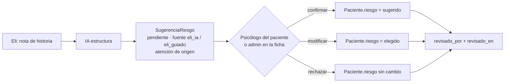

# 02 · Riesgos P0-S: diagnóstico, cambio y estado

> Base: `origin/main` `ae759b8` (= SHA auditado). Rama `chore/software-factory-phase-0`. **Nada está desplegado**: todo lo marcado FIXED está corregido en la rama, con tests, y entra a producción solo cuando Max mergee.
> Regresión automatizada: `core/tests_seguridad_p0.py` (24 tests) + `core/tests_matriz_permisos.py` (168 celdas). Las dos corren en el job `seguridad` del CI y en `verificar.ps1` (todos los modos).

## Resumen

| # | Riesgo | Estado | Commit | Acción pendiente fuera del código |
|---|---|---|---|---|
| P0-S1 | Adjuntos clínicos fuera de alcance | **FIXED** (en rama) | `83674fc` | Ninguna. Decidir si coordinación y analista deben seguir viendo todos los adjuntos (ver residual) |
| P0-S2 | Tokens de firma de consentimiento expuestos | **FIXED** (en rama) | `d25157a` | Recomendado: regenerar los tokens de consentimientos **pendientes** después del despliegue |
| P0-S3 | Token de integración único con acceso amplio | **MITIGATED** · cierre total **BLOCKED** por configuración externa | `d6332b4` | Crear `ITACA_TOKEN_RESPALDO`, `ITACA_TOKEN_TAREAS`, `ITACA_TOKEN_ELI` en Railway y en kira-bot / Eli |
| P0-S4 | Eli escribe `Paciente.riesgo` con salida de IA | **FIXED** (en rama) | `f49302f` | Ajustar el texto de Eli para que diga "riesgo sugerido, pendiente de revisión" |
| P0-S5 | Dirección de Railway en 400 (PR #138) | **FIXED** (en rama; reemplaza a #138) | `f1a29a6` | Desplegar; después cerrar #138 y, si se quiere, quitar las variables puestas a mano |

---

## P0-S1 · Adjuntos clínicos

**Caminos de acceso revisados**

| Camino | Antes | Ahora |
|---|---|---|
| `GET /api/adjuntos/` (lista) | Todos los adjuntos de la clínica, a cualquier rol | Comercial: ninguno. Psicólogo: solo de sus pacientes. Admin, coordinación y analista: todos (igual que la historia clínica) |
| `GET /api/adjuntos/<id>/` y `/descargar/` | Cualquier id de la clínica | Mismo alcance → 404 fuera de él |
| `DELETE /api/adjuntos/<id>/` | Médico/admin sobre cualquier adjunto | Médico solo sobre los de sus pacientes |
| `POST /api/adjuntos/` | Cualquier rol, cualquier paciente; la atención podía ser de otro paciente | Comercial: 403. Psicólogo: solo sus pacientes. La atención tiene que ser del mismo paciente |
| Ficha del paciente (`adjuntos` anidados) | Ya acotada por `PacienteViewSet` | Sin cambio |
| URL pública de media | No existe (`MEDIA_URL` no se sirve; la ruta SPA excluye `media/`) | Sin cambio |
| Exportaciones | No incluyen archivos | Sin cambio |
| Respaldo (`/api/integraciones/respaldo/`) | Incluye la metadata de `Adjunto`, no los archivos | Ver P0-S3 |

**Cambio:** `AdjuntoViewSet.get_queryset` y `create` usan la misma regla que `AtencionViewSet` (`pacientes/api.py`).

**Prueba de mutación:** con el código anterior, 4 de los 5 tests de `AdjuntosClinicosTests` fallan, y la matriz reporta 3 celdas de escalamiento.

**Riesgo residual:** coordinación (`asistente`) y `analista` ven todos los adjuntos clínicos, igual que hoy ven la historia clínica. Es la política vigente, no un error, pero mínimo privilegio sugiere revisarla. **Decisión de Max** (fase 1).

## P0-S2 · Tokens de consentimiento

**Caminos de exposición revisados**

| Camino | Antes | Ahora |
|---|---|---|
| `GET /api/consentimientos/` | Psicólogo: token oculto. Comercial: **todos los tokens**. Analista: nada | Comercial: nada. Psicólogo: solo de sus pacientes, sin token. Admin/coordinación: con token (son quienes envían el enlace) |
| `POST /api/consentimientos/` (crear/reusar) | Respondía **sin contexto**: el psicólogo recibía el token en claro | La respuesta pasa por el mismo enmascarado |
| `POST /api/consentimientos/<id>/marcar-aceptado/` | Idem | Idem |
| Bitácora `GET /api/mensajes/` | El texto del WhatsApp enviado incluye `/consentimiento/<token>`; lo veían todos menos la analista, con teléfono | `/consentimiento/[enlace oculto]` salvo admin/coordinación; el psicólogo solo ve los mensajes de sus pacientes y sin teléfono |
| Logs del servidor | No se registra el token | Sin cambio |
| Tablas y exportes | El token vive en `Consentimiento.token`; entra al respaldo | Ver P0-S3 |

**Flujo legítimo intacto:** coordinación genera el enlace desde la plantilla de WhatsApp (`App.jsx`, `crearConsentimiento`) y lo recibe con token. El paciente firma por `/consentimiento/<token>` (público, sin cambios).

**Riesgo residual:**
- Los tokens que ya se expusieron siguen siendo válidos. **Recomendación:** tras desplegar, regenerar los tokens de los consentimientos **no aceptados**. Es una operación de datos en producción, así que requiere aprobación de Max.
- Los endpoints públicos de consentimiento siguen sin throttle (fase 1).

## P0-S3 · Token de integración

**Qué abría el token compartido (`ITACA_INTEGRACION_TOKEN`, cabecera `X-Integracion-Token`)**

| Endpoint | Consumidor legítimo | Datos |
|---|---|---|
| `/api/integraciones/psicologo|pacientes|contexto|consulta|resumen-dia|nota-voz/` | Eli (bot de WhatsApp de psicólogos) | Agenda, contexto clínico, **escritura** de historia clínica |
| `/api/integraciones/recordatorios/` | kira-bot (cron) | Dispara WhatsApp a pacientes |
| `/api/correo/tareas/procesar-pendientes/` | Cron externo | Despacha correos |
| `/api/integraciones/respaldo/` | kira-bot (cron diario) | **Volcado completo de la base**: pacientes, historia clínica, hashes de contraseñas, tokens de Meta |

Además se comparaba con `==` (no en tiempo constante) y no tenía límite de peticiones.

**Mitigación mínima compatible (sin IAM nuevo)**
- Tres alcances: `eli`, `tareas`, `respaldo`. Cada uno acepta su token propio (`ITACA_TOKEN_ELI`, `ITACA_TOKEN_TAREAS`, `ITACA_TOKEN_RESPALDO`).
- **Compatibilidad:** si el token propio está vacío, el alcance sigue aceptando el compartido. Desplegar no corta a Eli ni a los crones.
- En cuanto se configura un token propio, **el compartido deja de abrir ese alcance**. Configurar `ITACA_TOKEN_RESPALDO` cierra el volcado para quien solo tenga el token de Eli.
- `hmac.compare_digest`, y throttle `integracion` de 120/min por IP.

**Estado:** MITIGATED en código. El cierre real está **BLOCKED** por configuración externa:

1. Generar 3 secretos largos (p. ej. `python -c "import secrets; print(secrets.token_urlsafe(48))"`).
2. En Railway: `ITACA_TOKEN_RESPALDO`, `ITACA_TOKEN_TAREAS`, `ITACA_TOKEN_ELI`.
3. En kira-bot: usar `ITACA_TOKEN_RESPALDO` para el respaldo y `ITACA_TOKEN_TAREAS` para recordatorios y correo.
4. En Eli: `ITACA_TOKEN_ELI`.
5. Cuando los tres estén configurados, rotar o vaciar `ITACA_INTEGRACION_TOKEN`.

**Riesgo residual documentado**
- Hasta completar el paso 2, el token compartido sigue abriendo todo.
- `_psicologo_por_telefono` busca psicólogos en **todas** las clínicas (relevante solo si hubiera más de una clínica en la base).
- La identidad del psicólogo en Eli la da el teléfono que manda el cliente: quien tenga el token de Eli puede hacerse pasar por cualquier psicólogo. Esto exige rediseñar la autenticación de Eli (fase 1).
- El respaldo incluye hashes de contraseñas y tokens de Meta (fase 1: excluir secretos).

## P0-S4 · Eli y `Paciente.riesgo`

**Antes:** `NotaVozView` → `_autoalimentar_perfil` → `paciente.riesgo = <salida de la IA>` (también en el registro "guiado", donde Eli transcribe lo que dice el psicólogo). Ese campo decide, entre otras cosas, la exclusión de correos (`correo/services/elegibilidad.py`).

**Ahora:**

- Modelo `pacientes.SugerenciaRiesgo` (migración aditiva `0039`; entra sola al respaldo).
- API `GET /api/sugerencias-riesgo/?paciente=&estado=` y `POST /api/sugerencias-riesgo/<id>/resolver/` (`pacientes/riesgo.py`). Ver: el mismo alcance que la historia clínica. Resolver: solo el psicólogo del paciente o un admin; coordinación, analista y comercial reciben 403, y otro psicólogo, 404.
- Una sugerencia nueva marca la pendiente anterior como `reemplazada` (no se borra).
- UI: aviso en la tarjeta "Riesgo actual" de la ficha (`frontend/src/SugerenciaRiesgo.jsx`), con Confirmar / Otro nivel / Descartar.
- Eli recibe `riesgo_pendiente_de_revision: true`.

**No se inventaron decisiones clínicas:** la escala (bajo/moderado/alto), quién decide (el psicólogo tratante) y el campo oficial son los que ya existían.

**Riesgo residual:** Eli sigue escribiendo `resumen_clinico`, `objetivo_principal` y objetivos terapéuticos desde la IA. Son textos clínicos, pero no deciden automatismos. Se recomienda el mismo patrón en la fase 1. También conviene ajustar el mensaje de Eli (repo aparte) para que no presente el riesgo como oficial.

## P0-S5 · Railway / PR #138

**Diagnóstico**
- Al agregar dominios propios, Railway cambió `RAILWAY_PUBLIC_DOMAIN` al dominio nuevo, y `itaca-conversemos-production.up.railway.app` quedó fuera de `ALLOWED_HOSTS`: 400 en todo el sistema (1 oct).
- Según el propio PR #138, **producción funciona hoy** gracias a `DJANGO_ALLOWED_HOSTS` y `DJANGO_CSRF_ORIGINS` puestas a mano en Railway.
- El PR #138 propone `ALLOWED_HOSTS += ".up.railway.app"` y `CSRF_TRUSTED_ORIGINS += "https://*.up.railway.app"`. El segundo convierte en origen de confianza cualquier app de **cualquier** cliente de Railway.
- Proxy: `SECURE_PROXY_SSL_HEADER` con `X-Forwarded-Proto` y `NUM_PROXIES=1` en DRF ya estaban bien. Sin cambios.

**Cambio:** `RAILWAY_DOMINIO_SERVICIO` (por defecto `itaca-conversemos-production.up.railway.app`, confirmado en `DEPLOY.md` y en el código de un consumidor) entra **exacto** en hosts y CSRF. Sin comodines.

**Tests:** cargan la configuración en un proceso aparte. Verifican que Railway se acepta aunque la variable apunte al dominio propio, que `atacante.up.railway.app` se rechaza, y que los dominios del sitio y del sistema se aceptan.

**Acción pendiente (externa, no se desplegó nada):**
1. Desplegar esta rama (o un PR desde ella).
2. Verificar `https://itaca-conversemos-production.up.railway.app/api/hora/` → 200.
3. Cerrar #138 como reemplazado.
4. Opcional: retirar las variables puestas a mano.
